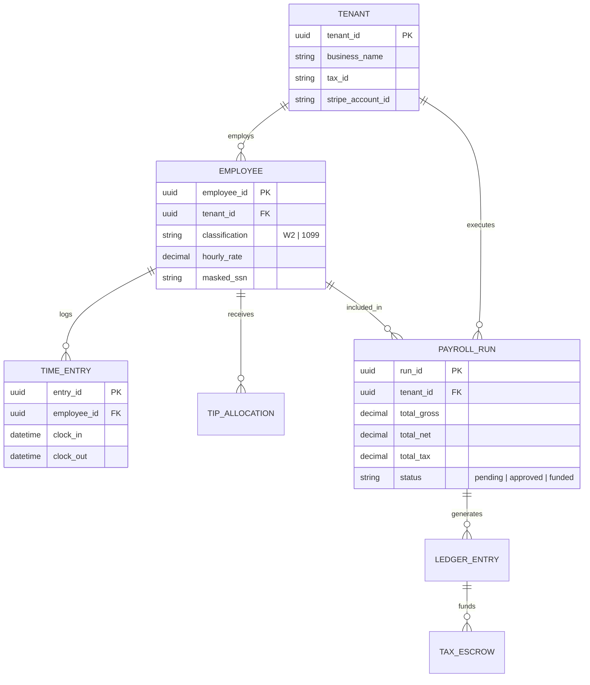
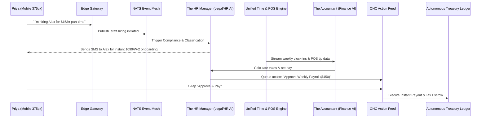

# [Architecture] Zero-Config Autonomous Payroll & Contractor Compliance Engine

## 1. Title
**Zero-Config Autonomous Payroll & Contractor Compliance Engine**

## 2. Problem Statement
For OneHumanCorp (OHC)’s core personas—like **Priya (boutique owner, 35)** and **Fatima (food cart, 50)**—managing staff and payroll is the most legally risky and administratively heavy part of scaling a business. As Priya hires part-time sales associates and Fatima hires a delivery driver, they suddenly face the daunting world of contractor classifications (W-2 vs. 1099), hourly tracking, tip distribution, local tax compliance, and multi-state wage laws.
Legacy solutions like Gusto or Quickbooks require an extensive onboarding flow, linking bank accounts, understanding tax ID configurations, and manual monthly processing. We need a zero-friction, mobile-first approach where adding a staff member takes under 60 seconds, and payroll processing, tax withholding, and compliance are handled invisibly by OHC's AI agents.

## 3. Research Report
### Competitive Landscape
*   **Gusto:** Excellent features but very form-heavy. Not mobile-first; requires a desktop for the initial company configuration and complex tax setup.
*   **Quickbooks Payroll:** Deeply tied to accounting software. High learning curve. Highly manual tip and commission adjustments.
*   **Square Payroll:** Good POS integration, but still requires significant manual review before running payroll each cycle.

### Market Data
*   **SMBs spend an average of 5 hours per pay period** processing payroll and managing compliance.
*   **Over 30% of small businesses** incur penalties from the IRS for payroll tax errors.
*   The "Gig Economy" blur: Many small businesses incorrectly classify workers as contractors due to the complexity of W-2 payroll, risking massive liabilities.

### Opportunity
By integrating a unified Autonomous Payroll Engine directly into the OHC platform, we can leverage our existing tap-to-pay POS and unified inbox context to completely automate tip distribution, time-tracking, and commission payouts. Our "Zero-Config" approach uses AI to conversationalize the onboarding of a new hire, completely abstracting away the complex legal and tax forms into simple chat prompts.

## 4. Design Doc

### Architecture Diagrams (Mermaid.js)

**1. Data Model & Invariants (Entity-Relationship Diagram)**

*   **Invariants:** Hard multi-tenant isolation. No read or write operation on an `EMPLOYEE` or `PAYROLL_RUN` can occur without a strictly validated `tenant_id` context passed from the Edge Gateway.

**2. Execution Flow (Sequence Diagram)**

### UI Wireframes (375px Mobile-First) & Mobile UX Flow
**Screen 1: The Magic Hire Button (Team Tab)**
*   Clean, macOS-style Translucent Glass dashboard card.
*   A single, prominent primary button: `[ + Add Team Member ]`
*   Conversational Input: "Who are you hiring and what's the deal?" (e.g., "Alex, part time, $15/hr").

**Screen 2: The Invisible Setup (HR Agent)**
*   Simple skeleton UI with a shimmer.
*   Plain language status: *"Sending Alex a secure text to get their payment details..."*
*   The OHC HR Agent securely texts the new hire a 1-tap link to collect W-4/W-9 and bank details directly, bypassing the employer completely.

**Screen 3: 1-Tap Payroll Approval (Action Feed)**
*   A unified summary card for the week:
    *   **Total Payroll:** $450.00
    *   **Breakdown:** 30 hrs @ $15/hr + $50 Tips (Auto-imported from POS).
    *   **Taxes:** $45 withheld & safely escrowed by OHC.
*   Primary Button: `[ Approve & Pay ]`
*   No spreadsheets. No complex tax forms. Just one tap on payday.

**Grandmother Test Verification:** If Fatima can hire her nephew to help at the food cart by typing "Adding my nephew Sam, $100 for today" and he gets paid instantly without her touching a tax form, the feature is a success.

### AI Agent Integration Points
*   **The HR Manager (Legal/HR AI):** Handles worker classification, automatically generates required compliance documents, and texts employees directly for onboarding.
*   **The Accountant (Finance AI):** Reconciles time-tracking data with POS tip pools. Automatically calculates tax withholdings and net payouts.
*   **The Vigilant Manager (Ops AI):** Surfaces the final payroll summary to the Action Feed on the user's mobile device, requesting a 1-tap approval.

### Key Design Decisions and Why
*   **Employee Self-Onboarding via SMS:** To reduce employer friction, the platform texts the new hire directly to collect sensitive tax and bank info. The employer never sees a W-4.
*   **Integrated POS Tip Pooling:** Because OHC handles the tap-to-pay POS, we natively auto-calculate and distribute tips, a major pain point for food/beverage and service personas.
*   **Escrow Tax Withholding:** OHC acts as the employer-of-record or automates treasury escrow, ensuring the small business owner never accidentally spends money owed to the IRS.

### Performance & Offline Targets
*   **Offline-First POS Tolerance:** If the mobile device loses connectivity during a shift, time entries and tip distributions must be logged locally via IndexedDB/SQLite and synced immediately upon reconnection, without blocking the local POS checkout flow.
*   **Latency Target:** Reading the current payroll summary for the Action Feed must complete in `< 150ms` at the p95 percentile from edge caching.
*   **Payload Size:** The initial dashboard payload for the payroll summary must be `< 20kb` gzipped to ensure rapid load times on low-end 3G Android devices.

### Zero Trust & Security (SPIFFE/SPIRE)
*   **Multi-Tenant Isolation:** All data access is strictly segmented via Row-Level Security (RLS) policies keyed by `tenant_id`.
*   **Service-to-Service Authentication:** The HR Agent and Finance Agent must mutually authenticate using short-lived SPIFFE/SPIRE certificates before exchanging employee tax data or ledger commands.
*   **PII Vaulting:** Sensitive fields like SSNs and bank routing numbers are immediately tokenized by a dedicated secure vault service. The core application database only stores the tokenized reference, ensuring that even a database dump cannot leak PII.

## 5. Implementation Prompt
**To the Implementer:**
Your task is to build the "Zero-Config Autonomous Payroll Engine." The Core User Journey (CUJ) is as follows:
A small business owner on a 375px mobile device adds a new team member by providing a name, phone number, and a simple compensation string (e.g., "$15/hr"). The system autonomously sends an SMS to the new hire to collect payment/tax info. Once set up, the system uses POS data to generate a weekly payroll summary in the owner's Action Feed, requiring only a single tap to approve payouts and escrow taxes.

**Acceptance Criteria:**
*   **Mobile-First UX:** The UI must adhere to the 375px constraint, utilizing macOS glassmorphism and UniFi modular cards.
*   **Conversational Hiring:** The employer must not be forced to fill out complex tax or I-9 forms; the HR Agent handles this via direct SMS to the employee.
*   **1-Tap Payroll:** Payroll approval must be surfaced as a simple card in the Action Feed, summarizing hours, tips, and taxes.
*   **Zero-Trust Security:** Employee bank and tax details must be securely collected and isolated; the employer should never have direct access to the employee's SSN or routing numbers.
*   **Grandmother Test:** A non-technical user must be able to add a staff member in under 60 seconds using plain language. Technical terms like "W-4", "FUTA", and "Tip Reconciliations" must be hidden behind an "Advanced Settings" toggle.

*(Note: You are free to design the exact database schemas, ledger integrations, and API endpoints required to fulfill this CUJ. Ensure strict multi-tenant isolation and secure identity validation are maintained throughout.)*

## 6. Priority
`P0` (Critical - Solves a massive legal/financial liability and heavily drives retention)

## 7. Estimated Scope
Large
