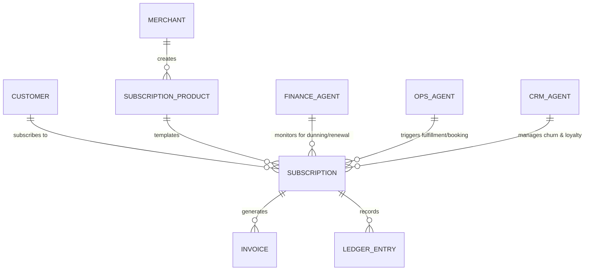
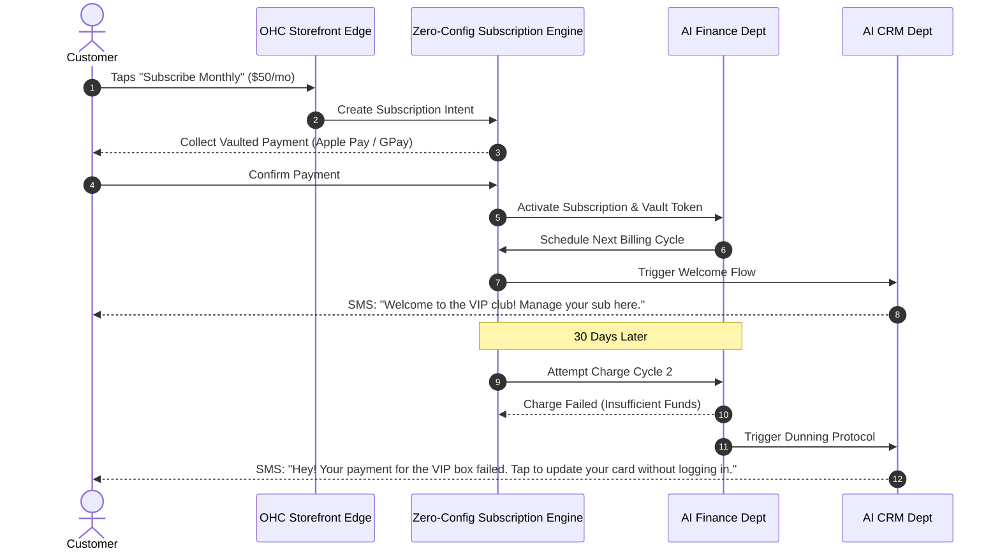

# Zero-Configuration AI-Powered Subscription & Membership Billing Engine

## Title
Architect and Implement the Zero-Configuration AI-Powered Subscription & Membership Billing Engine

## Problem Statement
Small business owners like Leo (a music tutor offering weekly lesson packages) and Priya (a boutique owner launching a monthly VIP style box) need a way to offer recurring subscriptions and memberships. However, they hit a wall when trying to set this up on existing platforms. They are forced to navigate complex third-party app stores, figure out Stripe webhooks, manage failed payment retry logic, and deal with "subscription hell" where their base platform fee balloons from $29 to $200+ just to add basic recurring billing functionality. They don't know what "dunning" or "proration" means, and they shouldn't have to. They just want to tap "Make this a monthly subscription" on their phone and have the system handle everything invisibly.

## Research Report
### The Small Business "Subscription Gap"
Recurring revenue is the holy grail for small businesses, increasing lifetime value (LTV) and business resilience. Yet, offering subscriptions remains highly technical.
- **Shopify**: Does not support native subscriptions out of the box without relying on external apps (like Recharge, Appstle, or Skio), which add monthly fees and require complex configuration.
- **Wix**: Offers native subscriptions, but the setup is buried in complex desktop-first dashboard settings. It struggles with hybrid models (e.g., booking a service + a product subscription).
- **Squarespace**: Supports subscriptions, but only on the highest-tier Advanced Commerce plan. The mobile management for merchants is severely lacking.
- **GoDaddy**: Basic subscription options exist, but lack AI-driven churn management or flexible pause/resume flows for customers.

### OneHumanCorp Differentiation
Our platform must provide an **invisible, native subscription engine**. A merchant should be able to toggle a switch on any product, service, or digital good to make it recurring. The AI Finance and Operations departments handle all the backend complexity: dunning (failed payment retries), customer notifications, automated pause/resume actions via SMS, and ledger reconciliation—with absolutely zero configuration from the user.

## Design Doc

### Architecture Diagram (Mermaid.js)

### UI Wireframes & Screen Flow (375px Mobile-First)
Adhering to the macOS-style Translucent Glass and UniFi modular dashboard aesthetics.

**Screen 1: The Merchant Product Setup (Leo's View)**
- **Header**: "Edit Piano Lesson Package"
- **Card Layout**: Standard product details (Name, Price, Photo).
- **The "Magic" Toggle**: A simple, prominent toggle switch labeled "Make this a recurring subscription."
- **Expanded Options (Appears on Toggle)**:
  - "How often?" (Carousel picker: Weekly, Monthly, Yearly).
  - "Allow customers to pause?" (Toggle, default ON).
  - *No complex settings.* "Save & Publish" button fixed at the bottom.

**Screen 2: The Customer Experience (Customer's View)**
- **Product Page**: Clean image, bold price "$50 / month".
- **Action Button**: "Subscribe with Apple Pay" (1-tap checkout).
- **Post-Purchase Sheet**: "You're in! We'll text you a magic link to manage your subscription anytime."

**Screen 3: AI Dunning & Management (Merchant Dashboard View)**
- **Dashboard Card**: "Subscription Health"
- **AI Insight Chip**: "Leo, 2 subscriptions failed this week. The Finance Agent already texted them a 1-tap update link. 1 has already recovered."

### Mobile UX Flow
1. **Creation**: Merchant creates a product/service and taps a single toggle to make it recurring. They set the frequency. Done.
2. **Checkout**: Customer views the product on the edge-cached storefront. They use digital wallets (Apple/Google Pay) for frictionless vaulting.
3. **Management (Customer)**: Customers receive SMS notifications before renewals with a passwordless magic link to skip a month, pause, or update payment methods.
4. **Management (Merchant)**: The merchant's mobile dashboard shows a simple MRR (Monthly Recurring Revenue) widget and active subscriber count. The AI handles the rest.

### AI Agent Integration Points
- **Finance Department**: Automatically handles prorations, grandfathering pricing, and dunning (payment retries) using smart retry algorithms.
- **CRM/Marketing Department**: Sends proactive, conversational SMS messages for upcoming renewals, payment failures, or churn prevention (e.g., offering a discount if a user clicks 'Cancel').
- **Operations Department**: Automatically generates fulfillment tickets for physical boxes (Priya) or adds recurring calendar slots (Leo) when a subscription renews successfully.

### Key Design Decisions
- **Zero-Config Dunning**: Merchants are not asked to define retry schedules. The Finance AI optimizes retry days based on industry best practices and automated learning.
- **Passwordless Customer Management**: To eliminate friction, customers manage subscriptions via SMS magic links rather than forcing them to create and remember portal passwords.
- **Universal Subscription Protocol**: The engine must treat physical goods, digital downloads, and booked services identically at the core data layer to allow hybrid subscriptions.
- **Strict Multi-Tenant Isolation**: Payment tokens and subscription ledgers are strictly isolated per tenant using Zero-Trust principles, ensuring Carlos cannot access Maya's customer vaults.

## Implementation Prompt
**To Implementer Agent:**
Implement the core Zero-Configuration Subscription & Membership Billing Engine.
- **User Journey (CUJ)**: A merchant (non-technical) must be able to toggle "recurring" on any product, service, or digital good and define a billing interval (e.g., monthly). A customer must be able to subscribe via a 1-tap checkout and manage their subscription via a passwordless magic link.
- **Acceptance Criteria**:
  1. The engine supports creating recurring billing intents for any asset type.
  2. The Finance AI automatically intercepts failed renewals and triggers the dunning protocol.
  3. All customer management (pause, resume, cancel, update card) must be accessible via passwordless magic links.
  4. The solution must integrate seamlessly with our edge storefront and hybrid event mesh, enforcing strict multi-tenant data isolation.
  5. Provide a 375px mobile-first UI for both merchant setup and customer checkout.
- **Constraint**: Do not expose any configuration for webhooks, API keys, or manual retry schedules to the merchant. The system must be "Zero-Config".

## Priority
P0 (Critical to unlocking recurring revenue and maximizing LTV for all core personas).

## Estimated Scope
Large
