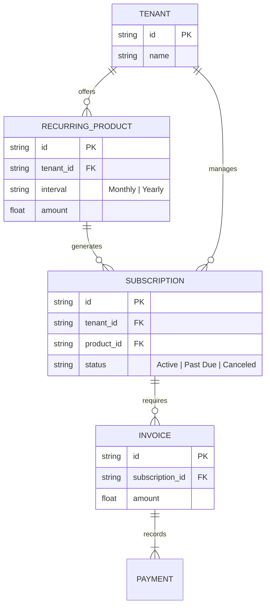
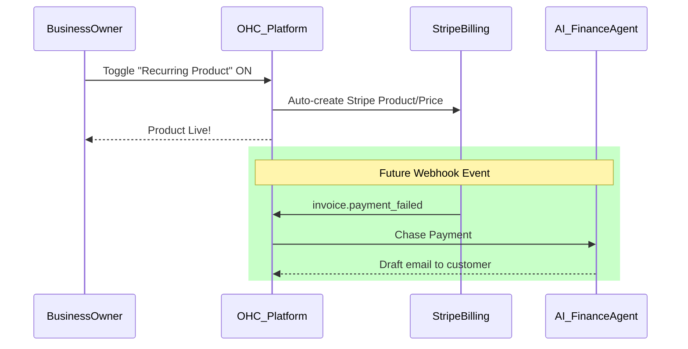

# Architecture Brief: Zero-Config Subscription Billing Engine

## Problem Statement
For business personas like Leo the Music Tutor, creating recurring revenue is essential, but the technical setup is extremely confusing. The traditional setup requires the user to integrate Stripe Billing or Chargebee, manage webhooks for failed payments, and handle customer cancellation portals themselves. If Leo cannot easily offer "Monthly Guitar Lessons" without a technical degree, he will stay on legacy platforms like Patreon or handle cash manually.

## Research Report
- **The "Subscription Friction":** Analysis of the SMB market shows that setting up subscription products requires 5x more clicks and API knowledge than setting up a one-time product on standard builders.
- **Competitor Gaps:** Shopify requires third-party apps for subscriptions (e.g., Recharge, Skio) which adds immediate monthly overhead ($50-$300/mo) and fragmentation. Wix provides basic recurring payments but lacks robust self-serve cancellation and upgrade/downgrade portals.
- **The OHC Opportunity:** Since OHC manages the unified data layer, it can provide an embedded "Zero-Config" subscription engine. The user defines a recurring product ("Monthly Guitar Lessons - $100/mo"); OHC automatically sets up the Stripe Billing plans, creates the customer portal for self-serve management, and provides an AI Finance Agent to chase failed payments via natural language emails.

## Design Doc

### Architecture Diagram

### Mobile UX Flow (375px First)
1. **Product Creation:** In the "Products & Services" tab, Leo selects "Add Service". A prominent toggle says "Make this a recurring subscription?".
2. **Pricing Setup:** He selects the interval ("Every Month") and price. No mention of API keys, webhooks, or Stripe dashboard.
3. **Active Subscribers View:** A new "Subscribers" module appears on the dashboard, showing Active, Paused, and Failed subscriptions.
4. **Agent Action:** When an invoice fails, Leo gets a notification on the home screen: "1 payment failed. Drafted recovery email to Sarah."

### AI Agent Integration Points
- **Finance & Payments Agent ("The Accountant"):** Automatically monitors subscription health. Sends the business owner a weekly brief: "You gained 2 new subscribers this week. 1 payment failed, but I already emailed them a link to update their card."

### Key Design Decisions
- **Complete Abstraction:** The user never interacts with the Stripe dashboard. OHC handles all Stripe object provisioning invisibly.
- **Embedded Portals:** Customers must be able to cancel or update their cards themselves without contacting the business owner, managed via the Stripe Customer Portal embed.
- **Native 375px Flow:** Building subscription items must work fluently on mobile without complex sidebars or multi-page wizards.

## Implementation Prompt
**To Implementer Agent:**
Implement the "Zero-Config Subscription Engine" within the OHC backend and UI. Extend the `Product` schema to support `is_recurring` and `interval` properties. Integrate with Stripe Billing to automatically provision the corresponding Stripe Plans when a recurring product is created. Update the checkout flow to support subscription creation. Finally, implement a webhook handler for failed recurring payments that triggers a task for the AI Finance Agent to draft a recovery email. Ensure the UI for creating a recurring product passes the "grandmother test" (no technical jargon, optimized for 375px).

## Priority
P0

## Estimated Scope
Large
