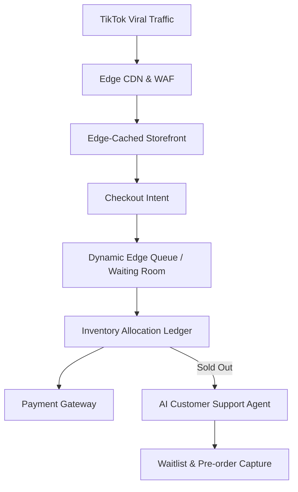

# [Architecture] Zero-Config Viral Flash Sale Surge Protection

## Problem Statement
When Maya (baker, 28) posts a custom cake video on TikTok that unexpectedly goes viral, she might receive thousands of concurrent visitors and order attempts within minutes. She doesn't know what "server capacity," "rate limiting," or "edge caching" mean, nor should she have to. If her store crashes, she loses revenue and brand reputation. Small business owners need an infrastructure that invisibly and elastically absorbs massive traffic spikes, implements fair-queuing for limited inventory, and prevents overselling, all with zero manual configuration.

## Research Report
### Competitor Analysis
*   **Shopify**: Requires "Shopify Plus" (starting at $2,000/month) for their advanced "Launchpad" and bot-protection flash sale features. Standard tiers handle traffic okay, but inventory overselling during high concurrency is a known pain point for high-demand drops without Plus.
*   **Wix & Squarespace**: Prone to sluggish performance during sudden viral spikes. No built-in virtual waiting rooms. Inventory locking during checkout is often rudimentary, leading to frustrating customer experiences (items disappearing from carts).
*   **OneHumanCorp Opportunity**: We can democratize "Enterprise Grade Flash Sale" tech. By leveraging edge-caching and a dynamic virtual queue, we can protect the core database while keeping the storefront fast. If inventory is highly constrained (e.g., 50 limited edition cakes), the system should automatically gracefully handle the overflow without turning away potential future customers.

## Design Doc

### Architecture Diagram

### Mobile-First UI/UX Flow (375px)
*   **Normal State**: Storefront loads instantly with no queue.
*   **Surge State (User View)**:
    *   If traffic exceeds capacity or inventory is highly contested, the user sees a beautiful, smooth "Translucent Glass" waiting room card on their mobile screen.
    *   Message: "Maya's Bakery is blowing up! You're in line. Estimated wait: 2 mins."
    *   The page updates dynamically without refreshing.
*   **Sold Out State**:
    *   If the item sells out while in queue, the waiting room smoothly transitions to an AI-driven chat: "Oh no, we sold out! Want Maya's AI assistant to notify you when the next batch is ready?"
*   **Merchant View (Maya)**:
    *   A notification pops up on her phone: "🎉 You're going viral! We've activated Surge Protection. 5,000 visitors in line."
    *   A clean modular card in her dashboard shows live traffic and queue status, hidden behind simple, non-technical terms.

### Key Design Decisions & Why
1.  **Invisible Activation**: The surge protection and virtual queue must activate automatically based on traffic velocity and inventory contention. Maya should not need a "turn on flash sale mode" toggle.
2.  **Edge-First Virtual Queue**: The waiting room must be served at the edge to protect the central database from DDOS-like legitimate traffic.
3.  **Atomic Inventory Locking**: Once a user is let out of the queue to checkout, inventory must be temporarily locked for a short window to guarantee they can purchase, preventing "cart sniping".
4.  **Graceful Degradation to Waitlist**: When inventory is gone, traffic should be routed to a lead-capture flow (Waitlist) managed by the AI agent to maximize the viral event's long-term value.

### AI Agent Integration Points
*   **Operations Agent**: Monitors traffic velocity and autonomously scales database reads or engages the edge queue.
*   **Customer Support Agent**: Engages customers who missed out, offering pre-orders for the next batch or waitlist signups.

## Implementation Prompt
**Task**: Implement the Zero-Config Viral Surge Protection and Dynamic Waiting Room.
**User Journey**: When a product link goes viral, the system automatically detects the traffic spike. Shoppers exceeding the concurrency limit are placed in a branded, edge-hosted virtual waiting room. Once it's their turn, they are granted a 5-minute guaranteed checkout window where their inventory is locked. If inventory depletes, the waiting room converts into an AI waitlist capture.
**Acceptance Criteria**:
1. Storefront must remain fully responsive and cache-hit dominant during 100x traffic spikes.
2. The queue must enforce fair, FIFO access to the checkout flow.
3. No inventory overselling is possible under high concurrency.
4. Merchant (admin) dashboard shows real-time viral status via a simple macOS-style glass card on mobile.
5. All transitions (Queue -> Checkout, or Queue -> Sold Out) must be fluid, mobile-optimized, and pass the grandmother test for usability.

## Priority
P0

## Estimated Scope
Large
