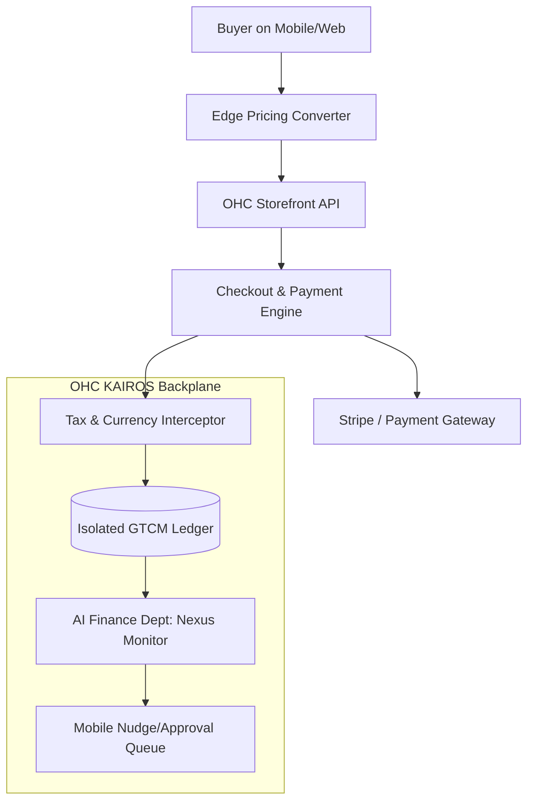

# Zero-Configuration Global Tax & Currency Mesh

## Problem Statement

Small business owners—like Priya who sells boutique clothing online and in-store, or Maya who takes custom cake orders from all over her region—often encounter massive friction when expanding beyond their immediate local footprint. They are hit with complex configuration requirements around:
- Calculating and remitting sales tax, VAT, or GST across different states/countries.
- Handling multi-currency pricing dynamically without opening specialized foreign bank accounts.
- Understanding liability boundaries—am I crossing a threshold in another jurisdiction?

**The User Pain:**
*"I just got a big order from Europe! ...Wait, how do I handle VAT? Do I have to pay customs? How do I even display the price in Euros without manually typing it out? I'm a baker, not an international tax accountant."*

Current platforms (Shopify, Wix) demand that merchants install third-party apps (like TaxJar or specialized multi-currency converters), configure complex "Tax Zones," and often upgrade to expensive enterprise tiers just to handle basic international or cross-state commerce correctly. This breaks the OHC core promise: *No code, no manuals, zero to live in under 10 minutes.*

## Research Report

**Competitor Analysis:**
- **Shopify:** Requires manual setup of "Markets" and often third-party apps for robust tax compliance (e.g., Shopify Tax is an add-on, TaxJar integration requires technical setup). Multi-currency requires Shopify Payments and explicit market configuration.
- **Wix:** Basic tax settings are manual. Automated tax requires Avalara integration, which is complex for beginners and has usage limits.
- **Stripe (as a baseline):** Stripe Tax and Stripe Elements handle this at the API level beautifully, but the OHC platform needs to abstract this entirely from the merchant.

**The Gap in OHC:**
Currently, OHC lacks a unified, invisible mesh that automatically intercepts transactions at the edge, calculates localized pricing and tax liabilities based on the buyer's IP/location and the seller's nexus, and records this into an immutable ledger—all without the merchant lifting a finger.

## Design Doc

### 1. Architectural Overview

We propose the **Global Tax & Currency Mesh (GTCM)**. This is a secure, multi-tenant edge layer combined with a background AI Legal/Finance department.

**Key Components:**
- **Edge Pricing Converter:** Intercepts storefront requests. Uses edge-caching to serve localized prices (respecting rounding rules like €19.99 instead of €20.14) based on the buyer's locale, with real-time FX rates.
- **Invisible Nexus Monitor:** An AI agent in the Finance/Legal department that continuously monitors a merchant's sales volume per jurisdiction. If a merchant is approaching an economic nexus threshold (e.g., $100k in sales to California), the agent handles the registration invisibly or issues a simple "Approve" nudge to the merchant.
- **Transaction Interceptor:** At checkout, dynamically calculates precise tax (Sales Tax, VAT, GST) using the buyer's address and the merchant's nexus profile.
- **Multi-Tenant GTCM Ledger:** An isolated ledger that records the base price, converted currency, FX rate used, and tax collected.

### 2. Architecture Diagram

### 3. Mobile-First UX Flow (375px Viewport)

**For the Merchant (Priya/Maya):**
1. **The "Grandmother Test":** The merchant sees *absolutely nothing* about configuration. There is no "Taxes" menu to configure.
2. **The Notification (Nudge):**
   - *UI:* A translucent glass card pops up on the OHC dashboard.
   - *Text:* "You've been selling a lot in the UK! 🇬🇧 You're close to needing a VAT registration. Tap 'Handle It' and your AI Finance agent will register you automatically."
   - *Action:* Primary button `[ Handle It ]`. Secondary button `[ Tell me more ]`.
3. **The Report:** The merchant’s daily plain-language briefing simply states: "You made $500 today. $40 of that was automatically set aside for taxes."

**For the Buyer:**
1. Browsing the catalog, prices automatically appear in their local currency, cleanly rounded (e.g., $25 USD becomes £20 GBP, not £19.83).
2. At checkout, tax is clearly itemized but calculated instantaneously without lag.

### 4. Technical & Security Integrity
- **Performance:** Edge pricing must cache currency conversions to hit a `<50ms` latency target. Tax calculations at checkout must be `<200ms`.
- **Zero Trust:** Multi-tenant boundaries must strictly isolate the GTCM Ledger. A merchant cannot query tax liabilities of another merchant. Identity context (SPIFFE) passes from the transaction to the ledger.
- **Offline Capabilities:** For offline/tap-to-pay (e.g., Carlos the handyman), the mobile app caches the latest tax rates for the local jurisdiction so offline transactions can still accurately estimate tax, syncing to the ledger upon reconnection.

## Implementation Prompt

**To the Implementer Swarm:**
Implement the core data models, edge routing logic, and AI department triggers for the **Zero-Configuration Global Tax & Currency Mesh**.

**User Journeys to Satisfy:**
1. When a buyer views a storefront from a foreign IP, they see prices in their local currency, cleanly rounded, with sub-50ms latency.
2. When a transaction occurs, the system automatically calculates the correct tax based on the seller's location and the buyer's destination, without the seller having configured any "tax zones."
3. The AI Finance Agent continuously queries the GTCM Ledger. If a merchant crosses 80% of a tax nexus threshold in a new jurisdiction, it must enqueue a simple "Handle It" approval nudge to the merchant's mobile dashboard.

**Acceptance Criteria:**
- No new manual configuration screens for tax or currency are added to the UI.
- The `GTCM Ledger` maintains strict multi-tenant isolation.
- The edge pricing logic falls back gracefully if FX APIs are unavailable.
- The AI Agent logic cleanly interfaces with the existing KAIROS orchestration queue.

**Note:** Do not prescribe specific database tables (e.g., Postgres vs. SQLite) or external tax APIs (e.g., TaxJar vs. Stripe Tax) in your initial PR; design the internal OHC interfaces and ledgers first.

---
**Priority:** P1
**Estimated Scope:** Large
