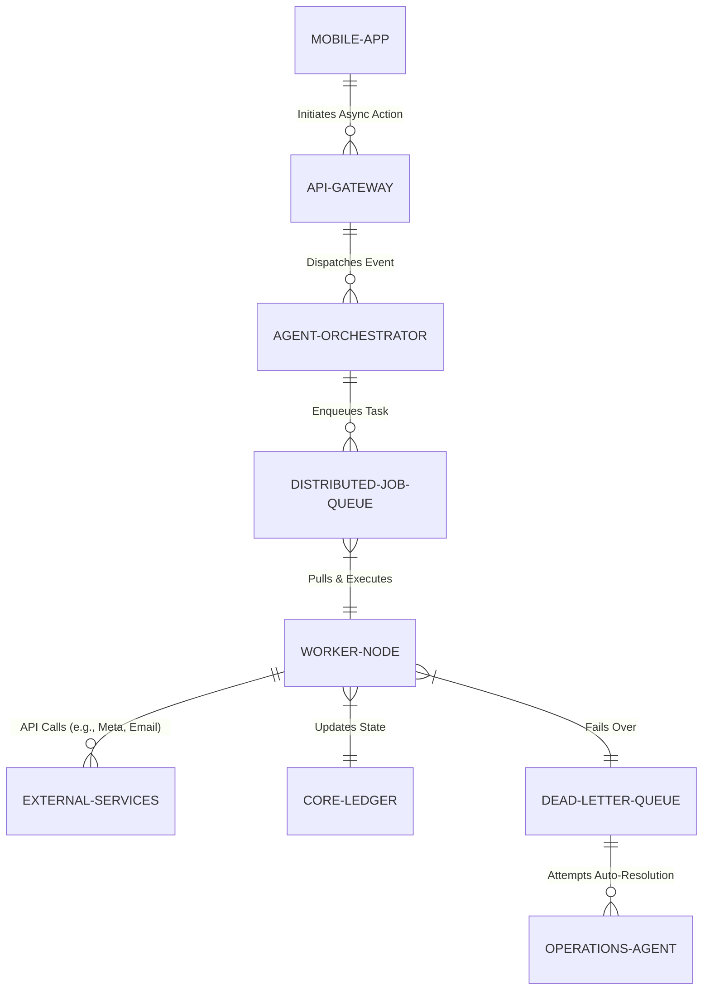

# Title: Zero-Drop Autonomous Operations & Task Orchestration Engine

## Problem Statement
Small business owners like Priya (boutique owner) and Carlos (handyman) execute operations that require complex, long-running, or delayed background tasks—such as bulk-syncing 1,000 product images to an Instagram Shop, or sending an automated follow-up SMS to a client 48 hours after a quote is sent. Current monolithic architectures or synchronous API calls cause the mobile app to freeze, drain battery, or lose tasks completely if the user's phone loses connection (e.g., Carlos driving through a dead zone). They need an invisible, highly resilient background operations engine that guarantees no task, message, or sync is ever dropped, regardless of their device's state.

## Research Report
*   **Current Architecture Limits:** OHC's current synchronous event handling or basic cron jobs lack robust retry mechanisms, dead-letter queues, and multi-tenant isolation for high-volume background tasks. If a third-party API (like Instagram or an email provider) rate-limits us, the task might silently fail, leading to unsent quotes or out-of-sync inventory.
*   **Competitor Analysis:**
    *   *Shopify:* Utilizes robust background job processing (Sidekiq/Kafka) but exposes too much complexity to developers when building apps. The native merchant experience doesn't autonomously resolve failed background syncs without manual intervention.
    *   *Wix:* Often experiences "silent failures" in app integrations where a user is unaware an inventory sync failed until a customer complains.
    *   *Stripe:* Sets the gold standard with idempotent webhooks and guaranteed delivery, but this is tailored for developers, not a non-technical SMB owner's operational tasks.
*   **Discovery:** OHC requires a high-throughput, distributed background job queue and orchestration engine designed specifically for AI Agents. When an Agent schedules a task (like "follow up in 2 days" or "sync catalog"), the engine must guarantee execution, handle exponential backoffs autonomously, and only alert the business owner if a human decision is strictly required.

## Design Doc

### Architecture Diagram

### UI Wireframes & Mobile UX Flow (375px)
*   **Customer/Merchant View (OHC Mobile App - 375px):**
    *   **Action:** Priya uploads 50 new dress photos. She instantly sees a success checkmark and can close the app.
    *   **Operations Center Card:** A clean, Unifi-style modular card on the dashboard titled "Background Tasks" or "Agent Activity". It shows a subtle progress ring: "AI is optimizing 50 images and syncing to Instagram Shop."
    *   **Error Resolution Flow (Grandmother Test):** If Instagram's API goes down, the app does NOT show a JSON error or "HTTP 500". Instead, a Translucent Glass notification appears: "Instagram is temporarily unavailable. Your Operations Agent will keep trying in the background and notify you when it's done." No action required from Priya.

### Key Design Decisions
*   **Event-Driven & Idempotent:** All background jobs must be idempotent to safely retry during network partitions or worker crashes without duplicating emails or ledger entries.
*   **Multi-Tenant Fairness:** The job queue must implement strict multi-tenant isolation and fair queuing. A single tenant uploading 10,000 products cannot starve the queue for other tenants needing instant quote generations.
*   **AI Auto-Resolution:** Failed jobs go to a Dead Letter Queue (DLQ) where the Operations Agent attempts to autonomously resolve the issue (e.g., refreshing an expired OAuth token) before alerting the merchant.
*   **Mobile-First Offline Tolerance:** The mobile client assumes success and writes locally first. It queues the sync request locally if offline, and the background engine guarantees execution once the connection is restored.

### AI Agent Integration Points
*   **Operations Agent:** Monitors the job queue health, scales worker nodes, and handles DLQ auto-resolution.
*   **Customer Success (CS) Agent:** If a customer-facing task fails permanently (e.g., invalid email address for a quote), the CS agent drafts a WhatsApp message to the merchant: "I couldn't email Carlos because his address bounced. Should I text him the quote instead?"

## Implementation Prompt
Implement a high-performance distributed background job queue and task orchestration engine tailored for AI agent operations. The engine must support scheduling, guaranteed exactly-once or at-least-once (with idempotency) execution, exponential backoff, and fair multi-tenant resource allocation. The user-facing outcome is that a merchant can initiate massive bulk actions or complex delayed workflows (like multi-channel syncs) from their mobile device, instantly close the app, and trust the operations will complete flawlessly without freezing their phone. Acceptance criteria include the ability to handle millions of queued jobs across diverse tenants without cross-tenant starvation, and a self-healing mechanism where the Operations Agent can intercept and attempt to fix failed jobs before they surface to the user.

## Priority
P0

## Estimated Scope
Large
