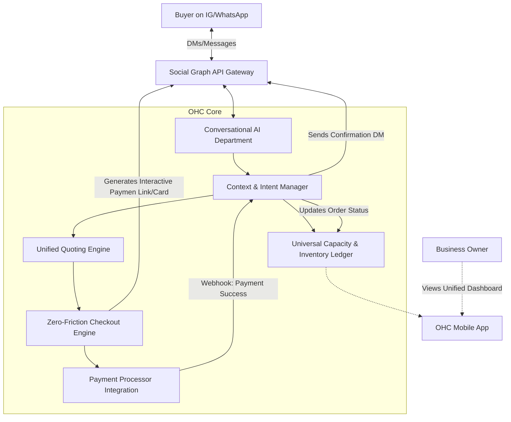

# [Architecture] Zero-Friction Social-Native Checkout & Conversational Commerce Engine

## Title
Zero-Friction Social-Native Checkout & Conversational Commerce Engine

## Problem Statement
Small business owners like Maya (baker) and Fatima (food cart operator) conduct a large portion of their business through social media platforms (Instagram, WhatsApp, TikTok). However, current solutions force buyers to leave the social platform, open a web browser, and navigate a clunky storefront to complete a purchase. This context switch creates massive friction, leading to abandoned carts, lost sales, and a poor user experience. Buyers want to tap, pay, and stay in their social feed. Business owners need a unified system that seamlessly integrates inventory, quoting, deposits, and final payments directly within the conversational interface without any manual data entry.

## Research Report
*   **Competitor Landscape:**
    *   **Shopify:** Relies heavily on redirecting users to web-based storefronts. While they offer basic social integrations, the checkout experience often feels disconnected and still relies on web views.
    *   **Wix/Squarespace:** Similar limitations to Shopify, primarily web-centric.
    *   **Stripe Payment Links:** Effective but impersonal and disjointed from the conversational context. It doesn't natively handle inventory or dynamic quoting well.
*   **User Pain Points:**
    *   Maya spends hours manually replying to DMs, generating quotes, creating Stripe links, and cross-referencing her inventory spreadsheet.
    *   Fatima loses pre-orders because customers find the multi-step checkout process confusing or get distracted before completing payment.
    *   Buyers experience "link fatigue" and drop off when forced to create accounts or navigate complex mobile web forms.
*   **Opportunity:**
    *   Leverage AI agents to understand the context of conversations across DMs.
    *   Dynamically generate personalized, interactive checkout cards directly within the messaging app (e.g., using WhatsApp interactive messages or rich media replies on IG).
    *   Process payments seamlessly using platform-native capabilities (e.g., WhatsApp Pay, Meta Pay) or highly optimized, tokenized zero-click flows.

## Design Doc

### Architecture Diagram

### UI Wireframes & Mobile UX Flow (375px)
*   **Buyer Flow (Instagram DM):**
    1.  **Buyer:** "Do you have the vegan chocolate cake for this Saturday?"
    2.  **OHC Agent (Maya's AI):** "Yes, we do! It's $45. Would you like me to hold one for you?"
    3.  **Buyer:** "Yes please!"
    4.  **OHC Agent:** Responds with a rich, interactive "Card" embedded in the chat. The card shows an image of the cake, the price ($45), and a prominent **"Tap to Pay & Reserve"** button.
    5.  **Buyer:** Taps the button. A native bottom sheet (e.g., Apple Pay / Meta Pay) slides up. No external browser opens.
    6.  **Buyer:** Authenticates with FaceID. Payment complete.
    7.  **OHC Agent:** "Confirmed! Your vegan chocolate cake is reserved for Saturday. See you then!"
*   **Business Owner Flow (OHC App - Dashboard):**
    *   The app displays a clean, macOS-style Translucent Glass card for the new order.
    *   **Card Details:** "New Order: Vegan Chocolate Cake (IG DM) - Paid: $45."
    *   No action required from Maya; inventory is auto-updated, and the order is added to her fulfillment queue.

### AI Agent Integration Points
*   **CS/Sales Agent:** Monitors incoming messages, understands intent (e.g., checking availability, requesting a quote), and responds naturally in the business owner's tone.
*   **Operations Agent:** Synchronizes with the Inventory Ledger to ensure real-time availability before a quote or payment card is generated.
*   **Finance Agent:** Handles the secure generation of the payment token/link and reconciles the transaction once complete.

### Key Design Decisions
*   **Zero-Click / In-Stream First:** The primary goal is to keep the user within the social platform. Web-based checkouts are only a fallback.
*   **Dynamic Card Generation:** Checkout experiences are generated contextually based on the conversation history, not static links.
*   **Unified Inventory Sync:** Crucial to prevent double-booking or overselling, requiring strict consistency between the Conversational Engine and the core Inventory Ledger.
*   **Strict Multi-Tenant Isolation:** All social integrations and payment data must be strictly segregated per business (`organization_id`).

## Implementation Prompt
**Objective:** Implement the Zero-Friction Social-Native Checkout Engine.
**User Journey (CUJ):** Maya connects her Instagram account to OHC. A customer DMs her asking for a product. The OHC AI agent understands the request, checks inventory, and replies with a direct, in-chat payment link/card. The customer taps, pays via Apple Pay/Meta Pay without leaving the app, and Maya sees the completed order appear instantly on her mobile dashboard.
**Acceptance Criteria:**
*   System can ingest webhooks from social platforms (IG, WhatsApp) and route them to the correct tenant's AI agent.
*   Agent can generate a secure, tokenized checkout session linked to a specific conversational context and inventory item.
*   Successful payment automatically updates the core inventory and triggers a confirmation message back to the buyer via the social platform.
*   All data flows must respect Zero-Trust security and multi-tenant isolation.
*   The UX must feel instantaneous and native to the mobile environment.

## Priority
P0 (Critical)

## Estimated Scope
Large
