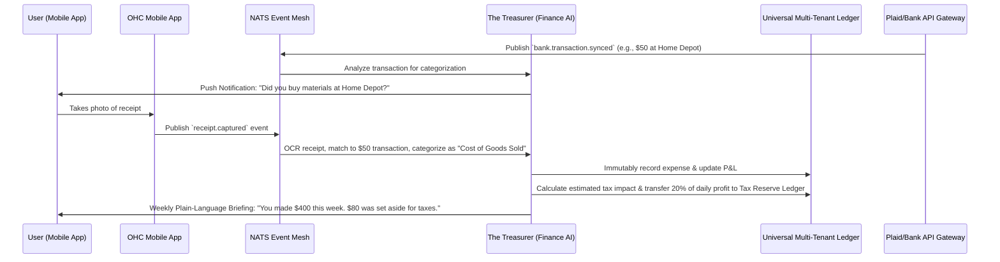

# [Architecture] Zero-Touch Autonomous Bookkeeping and Tax Engine

## Title
**Zero-Touch Autonomous Bookkeeping and Tax Engine**

## Problem Statement
For small business owners like **Maya (baker)** and **Carlos (handyman)**, managing finances is a massive source of stress and potential legal liability.
Maya spends hours manually matching receipts for flour and sugar against her bank statements, while Carlos constantly loses paper receipts for lumber and parts, missing out on crucial tax deductions. Come tax season, both are forced to either hire an expensive accountant or spend days untangling their personal and business finances, often resulting in inaccurate tax filings or missed quarterly estimated tax payments.

They need a system that completely eliminates manual bookkeeping. When Maya buys ingredients or Carlos buys parts, the system should automatically categorize the expense, capture the receipt, and instantly set aside the correct percentage for quarterly taxes without them ever touching a spreadsheet.

## Research Report
### Competitive Landscape
*   **QuickBooks / Xero:** Extremely powerful but built for accountants, not small business owners. The UI is desktop-heavy, full of complex jargon (reconciliation, chart of accounts, journal entries), and requires manual rule setup.
*   **Shopify / Wix:** Provide basic sales reports and sales tax calculation but do not handle full-cycle bookkeeping (expenses, profit & loss, income tax withholding). Users are forced to integrate with external tools like QuickBooks, paying another monthly fee.
*   **Stripe / Square:** Good at payment processing and basic tax collection but lack proactive, AI-driven receipt matching and automated tax set-aside for income (vs. just sales tax).

### Opportunity
OneHumanCorp (OHC) can fundamentally disrupt the SMB platform market by turning bookkeeping and tax compliance into an invisible background process. By leveraging the Finance AI Agent and deep integration with the Universal Ledger, OHC can automatically parse bank feeds, match digital and physical receipts via the mobile camera, categorize expenses, and dynamically withhold estimated taxes into a separate ledger account. This delivers absolute peace of mind to the business owner, turning tax season into a non-event.

## Design Doc

### Architecture Diagram (Mermaid.js)

### UI Wireframes & Mobile UX Flow (375px First)
**Screen 1: The Daily Financial Brief (Dashboard Card)**
*   Clean, macOS-style Translucent Glass dashboard card.
*   Header: "Your Financial Health"
*   Large typography: "Available Cash: $2,450"
*   Smaller text below: "Tax Reserve: $650 (You're on track for Q3!)"
*   Action Button: `[ Scan a Paper Receipt ]` (Floating Action Button).

**Screen 2: Receipt Scanner (Camera View)**
*   Full-screen camera view with a clean framing box.
*   Auto-capture technology (no need to press a button, it snaps when focused).
*   Instant loading skeleton -> "Receipt Captured! Matching to your bank..."

**Screen 3: AI Expense Confirmation (Bottom Sheet Modal)**
*   Triggered when the AI is 90% sure but wants confirmation, or on opening the app.
*   Card: "We saw a $120 charge at 'Sally's Beauty Supply'."
*   AI Suggestion: "Is this for salon supplies? [ Yes ] [ No, it's personal ]"
*   If "Yes", a playful animation confirms it's categorized and tax-deductible.

### AI Agent Integration Points
*   **The Treasurer (Finance AI):** Listens to `bank.transaction.synced` and `receipt.captured` events on the mesh. It uses LLMs to perform intelligent categorization (e.g., mapping "Uber" to "Travel" or "Home Depot" to "Materials") without requiring the user to set up complex rules. It continuously calculates real-time estimated tax liabilities based on local tax codes and user profiles, updating the tax reserve ledger asynchronously.
*   **The Business Advisor (CS/Advisory AI):** Sends the weekly financial briefing. It translates complex P&L statements into plain-language summaries (e.g., "You spent a lot on flour this week, but your cake sales are up 20%").

### Key Design Decisions and Why
*   **Zero Jargon:** Terms like "Reconciliation", "Chart of Accounts", or "Depreciation" are strictly banned from the standard UI. The system speaks in plain English: "Money In", "Money Out", "Tax Savings".
*   **Proactive Interception:** Instead of forcing the user to log in and categorize 100 transactions at the end of the month, the Finance AI proactively sends a push notification for ambiguous transactions immediately after they happen.
*   **Immutable Ledger Backend:** To ensure auditability and compliance, all automated categorizations and tax set-asides are recorded as immutable, cryptographically secure entries in the Universal Ledger.

## Implementation Prompt
**To the Implementer:**
Your task is to build the "Zero-Touch Autonomous Bookkeeping and Tax Engine" capability.

**Core User Journey (CUJ):**
Carlos uses his OHC-linked debit card to buy $150 of lumber at Home Depot. The system automatically detects the transaction via Plaid, categorizes it as a business expense ("Materials"), and sends Carlos a quick push notification to snap a photo of the receipt. Later that day, Carlos receives payment for a $500 job. The Finance AI automatically calculates his estimated income tax (e.g., 25%) and moves $125 into an invisible "Tax Reserve" ledger, updating his "Available to Spend" balance.

**Acceptance Criteria:**
*   **Mobile-First UX:** The receipt scanner and expense confirmation flows must feel native, fast, and completely fluid on a 375px screen.
*   **Agentic Categorization:** The Finance AI must be able to automatically categorize at least 80% of standard business expenses based on merchant name and transaction amount without user input.
*   **Automated Tax Reserve:** The Universal Ledger must accurately reflect a split between "Operating Funds" and "Tax Reserve Funds" following an income event, executed asynchronously by the AI.
*   **Plain Language Reporting:** The system must generate a weekly financial summary that contains zero traditional accounting jargon.

*(Note: You are free to design the exact database schemas, API endpoints, NATS event payloads, and function signatures required to fulfill this CUJ. Ensure complete mobile parity and operational safety.)*

## Priority
`P0`

## Estimated Scope
Large
