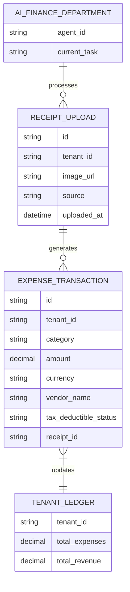

# Zero-Touch Autonomous Bookkeeping Engine

## Title
Zero-Touch Autonomous Bookkeeping Engine

## Problem Statement
Small business owners—like Carlos the handyman and Fatima the food cart operator—dread accounting. Managing receipts, categorizing expenses, and calculating tax liabilities requires manual data entry or expensive bookkeeping services. For Carlos, saving Home Depot receipts and remembering to write them down in a spreadsheet at the end of the week is painful. For Fatima, tracking daily ingredient purchases while managing orders is error-prone. The non-technical business owner needs an invisible process where taking a picture of a receipt or receiving an emailed invoice is enough to completely process and categorize the expense.

## Research Report
- **Market Context**: Most modern accounting solutions (QuickBooks, Xero) are designed for accountants or dedicated administrative staff, expecting manual matching and categorization.
- **Competitor Analysis**: Products like Shopify offer high-level revenue analytics, while Stripe provides basic tax and ledgering, but neither inherently act as a full, receipt-first automated bookkeeper for field and service workers without external integrations.
- **Opportunity**: Embedding a localized LLM/VLM agent to process images of receipts, invoices, and bank feed data to automatically categorize expenses against standard chart of accounts, predict tax deductions, and store them directly into our existing `Ledger` capability without user intervention.
- **Persona Alignment**:
    - **Carlos**: Takes a photo of a Home Depot receipt on his Android phone, the AI categorizes it as "Materials/Supplies," links it to a recent quote if applicable, and updates his monthly P&L instantly.
    - **Fatima**: Forwards an invoice from her meat supplier; the agent reads the PDF, logs the expense, and flags it if the cost per pound increased compared to last week.

## Design Doc

### Architecture Diagram

### UI Wireframes & Screen Flow (375px first)
1. **Camera / Quick Action (Mobile First)**: A persistent floating action button or home screen card labeled "Log Expense" or a camera icon.
2. **Camera Viewfinder**: Simple native-like camera view with a "Snap Receipt" button. Uses edge processing to auto-crop the receipt.
3. **Processing Overlay**: Translucent Glass material overlay saying "Processing..." while the AI extracts data in the background.
4. **Expense Card**: Returns a clean UniFi-style card showing the Vendor Name, Amount, and Category. The user can simply ignore it (auto-approved) or tap to edit if the AI got it wrong.
5. **Dashboard Analytics**: The main dashboard's "Profit" widget immediately updates.

### Mobile UX Flow
1. User taps "Log Expense" -> Camera opens.
2. User snaps picture of receipt.
3. User closes app.
4. Push notification arrives 5 seconds later: "Logged $45.20 for Materials at Home Depot."
5. If the user taps the notification, they see the expense card and original image.

### AI Agent Integration Points
- **Finance Agent (VLM)**: Triggered by new image uploads to the `ReceiptBucket`. Analyzes the image, extracts vendor, amount, date, line items, and categorizes based on the tenant's historical data and industry standard tax categories.
- **Operations Agent**: Cross-references the vendor and amount with active calendar bookings or quotes (e.g., matching the Home Depot purchase date with Carlos's current job).
- **Communication Agent**: If the VLM is unsure (e.g., a handwritten, smudged receipt), it sends a casual push notification or chat message: "Hey Carlos, I couldn't read the total on that last receipt. Was it $45 or $95?"

### Key Design Decisions
- **Zero-Touch Default**: All expenses are automatically approved and ledgered unless the AI confidence score is low. No manual review step required by default.
- **Edge Extraction vs Cloud**: Use lightweight edge models for crop/deskew and immediate feedback, then pass to the robust cloud VLM for extraction and categorization.
- **Immutable Ledger**: The expense engine writes directly to the immutable ledger system. Any user corrections to the AI's extraction result in a compensating transaction, not an overwrite, to maintain auditability.

## Implementation Prompt
Implement the backend capability for the Zero-Touch Autonomous Bookkeeping Engine.
1. Create the endpoint and storage mechanism for mobile clients to upload receipt images securely.
2. Integrate the VLM prompt pipeline to process uploaded images, extract structured data (Vendor, Amount, Tax, Date, Category), and handle errors or low-confidence extractions.
3. Connect the successful extraction event directly to the multi-tenant `Ledger` to automatically record the expense transaction.
4. Ensure all database interactions adhere strictly to our multi-tenant isolation rules.
5. Create the "Finance AI" worker queue to handle processing asynchronously so the mobile client isn't blocked waiting for the VLM response.

## Priority
P1

## Estimated Scope
Medium
