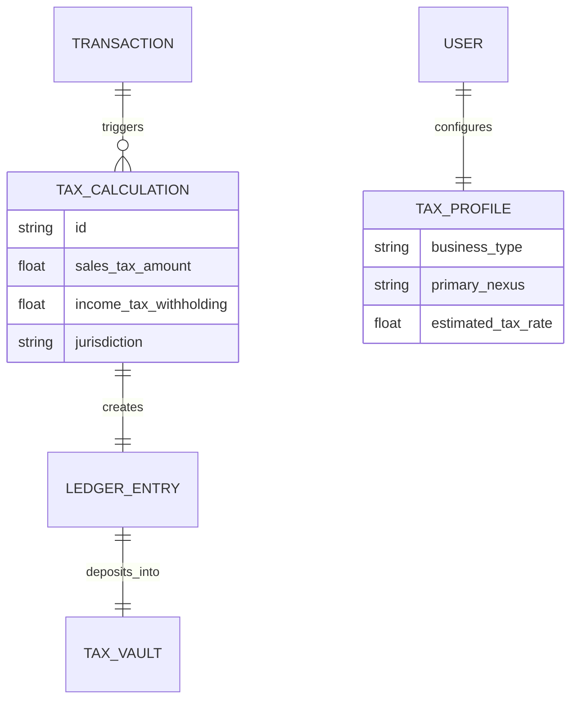
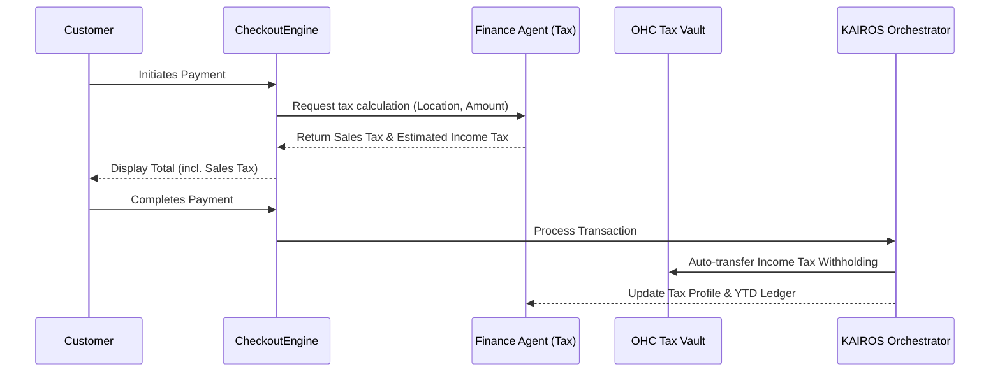

# [Issue Brief] Zero-Touch Autonomous Business Tax & Compliance Engine

## Problem Statement
Small business owners—like Maya the baker and Carlos the handyman—often struggle with the complexity of business taxes, self-employment tax estimations, and multi-state sales tax compliance. Current solutions require manual categorization of income, separate accounting software, and tedious calculations. They are non-technical and operate completely from their mobile devices, leaving them terrified of tax season and potentially facing fines or audits because they lack dedicated financial advisors or CPA integrations. They need a system that invisibly tracks, calculates, and sets aside the correct tax amounts automatically on every transaction.

## Research Report
*   **Shopify:** Uses Shopify Tax, but primarily focuses on sales tax for eCommerce. Requires manual configuration for complex nexus laws and does not handle general business income or self-employment tax.
*   **Wix & Squarespace:** Rely on third-party app integrations like Avalara or TaxJar, which have steep learning curves and additional monthly fees. No native income tax withholding mechanisms.
*   **GoDaddy:** Basic sales tax settings but no proactive tax strategy or autonomous withholding.
*   **Market Gap:** There is a lack of a unified engine that calculates both sales tax (for the customer) and estimated income tax (for the business owner), auto-deducting and stashing the estimated income tax into a secure digital "tax vault" on every transaction without user intervention.

## Design Doc

### Architecture Diagram

### UI Wireframes & Mobile UX Flow (375px First)
1.  **Onboarding (Progressive Profiling):** During initial setup, the user is asked simple, grandmother-friendly questions: "Are you the only owner?" and "Where do you sell most of your goods?". The AI Finance Agent maps this to tax profiles invisibly.
2.  **Transaction View (Optimistic UI):** A clean card on a 375px viewport showing a recent sale. Below the revenue amount, a small, subtle sub-text reads "✓ $X.XX stashed for taxes".
3.  **Tax Vault Dashboard:** A premium, translucent glass-morphism card showing the "Tax Vault" balance.
    *   **Primary Action:** "Pay Estimated Taxes Now" (1-tap to send to IRS/State via integration).
    *   **Secondary Action:** "View Tax Breakdown" (Slides up a bottom sheet with simple charts—no accounting jargon).
    *   **Visual Excellence:** Uses clean typography, soft green/blue gradients for safety, and clear, descriptive labels.

### AI Agent Integration Points
*   **Finance Agent:** Responsible for real-time calculation of tax liabilities based on current local and federal laws, adjusting withholding rates dynamically as the business grows.
*   **Business Advisory Agent:** Sends a plain-language SMS briefing near tax deadlines: "Hi Maya! Q2 estimated taxes are due next week. You have $1,200 saved in your Tax Vault, which perfectly covers it. Reply 'PAY' to send it to the IRS automatically."
*   **Operations Agent:** Syncs with the receipt and expense engine to reduce taxable income estimations in real-time.

### Key Design Decisions & Why
*   **Zero-Touch Withholding:** Business owners lack discipline to save for taxes. Auto-stashing money per transaction removes this cognitive load and prevents year-end panic.
*   **Unified Tax Vault:** Instead of mixing tax money with operating capital, a separate logical ledger (Tax Vault) enforces financial safety.
*   **Conversational Payment:** Allowing tax payments via simple SMS replies (handled by KAIROS) passes the Grandmother Test, avoiding complex IRS portals.

## Implementation Prompt
Build the Zero-Touch Autonomous Business Tax Engine. Design the core data models (`TaxProfile`, `TaxCalculation`, `TaxVault`) ensuring strict multi-tenant isolation. Implement the background service that intercepts transaction events from the event mesh to calculate and route funds to the Tax Vault. Expose mobile-first API endpoints for retrieving the Tax Vault balance and generating simple breakdown reports. Ensure the system integrates seamlessly with the existing KAIROS Orchestrator and Finance Agent, using optimistic UI principles to make the withholding process feel instant. Do not use complex accounting terminology in the user-facing responses.

## Priority
P0

## Estimated Scope
Large
