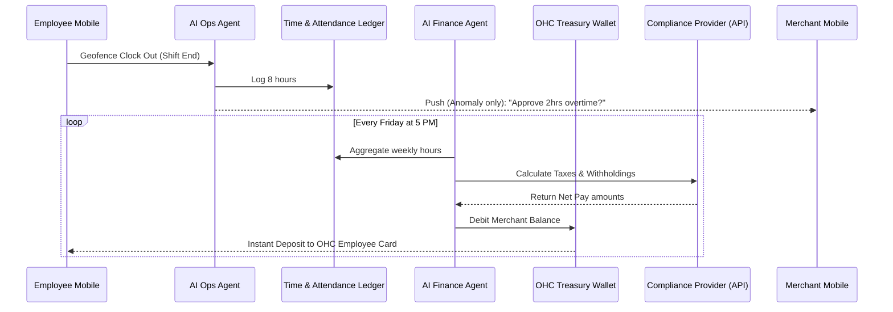

# Zero-Touch Autonomous Payroll Engine

## Title
Architectural Implementation of OHC Zero-Touch Autonomous Payroll Engine

## Problem Statement
Small business owners—like Carlos the handyman and Fatima the food cart operator—often hire part-time helpers, subcontractors, or hourly staff. However, running payroll is a massive burden. Traditional systems (like Gusto or ADP) are designed for mid-market companies with HR departments, requiring complex onboarding, manual timesheet approvals, tax compliance configurations, and manual fund transfers. Fatima cannot spend her Sunday nights calculating hours and withholding taxes for her two weekend helpers. She needs a system where staff clock in on their phones, and on Friday, the money simply arrives in their accounts, with all taxes and compliance handled invisibly by AI.

## Research Report
**Market Context & Competitor Analysis:**
- **Gusto / ADP / QuickBooks Payroll:** Powerful but incredibly complex. They require the business owner to understand tax IDs, worker classifications (W-2 vs. 1099), and manual payroll runs. They fail the "grandmother test."
- **Square Payroll:** Integrates with Square POS timesheets, which is a step forward, but still requires the merchant to manually review, approve, and click "Run Payroll."
- **The Gap:** There is no platform that fully automates the payroll lifecycle from time-tracking to instant direct deposit without manual intervention. OHC can bridge this by utilizing the embedded treasury (OHC Wallet) and an AI Legal/Finance Agent to fully automate the process.

**Data & Feasibility:**
By combining geolocation-based or POS-based automated time tracking with our embedded treasury (Stripe Treasury / Unit) and an API-first payroll compliance provider (like Check or Gusto Embedded), we can build a completely "zero-touch" payroll system. The AI Operations Agent verifies hours, the AI Finance Agent calculates taxes and debits the OHC Wallet, and funds are instantly pushed to employee virtual cards or external bank accounts.

## Design Doc

### Key Design Decisions and Why
1. **Invisible "Run Payroll" Button:** The concept of "running payroll" is eliminated. Payroll is a continuous background process. Why? Because Carlos wants to build houses, not act as a payroll administrator. The system automatically finalizes and pays out on the configured cadence.
2. **AI-Driven Anomaly Detection (1-Tap Approvals):** Instead of manually reviewing every timesheet, the AI flags anomalies (e.g., "John worked 15 hours on Tuesday, his normal is 6"). The merchant gets a push notification to approve just the anomaly. Why? Exception-based management saves hours of busywork.
3. **Instant Payouts via OHC Wallet:** Because the merchant already uses the OHC Wallet (Embedded Treasury), we can instantly move funds to employees' OHC-issued digital wallets, allowing them to get paid immediately after a shift instead of waiting two weeks.

### Architecture Diagram

### UI Wireframes & Mobile UX Flow (375px first)
- **Staff Roster View:** A clean, glassmorphic card layout showing active staff. Each staff member has a status indicator (e.g., "🟢 Clocked In").
- **1-Tap Anomaly Resolution:** A floating "Action Needed" bubble appears only if an employee forgot to clock out or worked unusual overtime. Tapping it shows a conversational prompt: "John forgot to clock out on Tuesday. He usually leaves at 5 PM. Adjust to 5 PM?" with "Yes" and "Edit" buttons.
- **Continuous Payroll Dashboard:** A simple progress bar at the top of the "Team" tab showing "Upcoming Friday Payout: ~$450" that live-updates as employees work.
- **The 30-Second Grandmother Test:** Fatima hires a new helper. She hands them her phone, they type their name and phone number. The AI sends the helper an SMS with a link to securely add their bank details/OHC wallet. Fatima never sees a tax form.

### AI Agent Integration Points
- **AI Operations Agent:** Monitors real-time POS activity or geofence data to automatically clock employees in/out or verify self-reported timesheets. Triggers anomaly alerts.
- **AI Finance/Legal Agent:** Interfaces with the underlying payroll compliance API (e.g., Check) to ensure correct local/state tax withholdings based on the employee's and merchant's location. Automatically moves funds from the merchant's OHC Wallet to a tax reserve and the employee's payout account.

## Implementation Prompt
**To the Implementer Agent:**
Your mission is to build the backend architecture and mobile UI for the Zero-Touch Autonomous Payroll Engine.

**User-Facing Outcome (CUJ):**
A merchant views the "Team" tab and sees a live estimate of upcoming payroll. The merchant does not need to click a "Run Payroll" button; the system autonomously aggregates approved timesheets, calculates taxes, and executes the payout on Friday at 5 PM. If an employee works an unusual shift (e.g., 14 hours instead of 8), the merchant receives a clear, plain-language push notification requesting a 1-tap approval or adjustment.

**Acceptance Criteria:**
1. Create the `Employee`, `Timesheet`, and `PayrollRun` database entities with strict multi-tenant isolation.
2. Implement the AI Operations Agent hook that scans weekly timesheets and flags outliers (e.g., shifts > 12 hours) requiring merchant intervention.
3. Build the simulated "Continuous Payroll" aggregation service that calculates gross pay, simulated taxes, and net pay.
4. Design the mobile-first (375px) "Team" dashboard UI featuring the live upcoming payroll estimate and the 1-tap anomaly resolution card, utilizing the glassmorphic design system.
5. Ensure the merchant is not exposed to raw tax configuration settings on the primary views.

## Priority
P1 (Crucial for scaling merchants beyond solo-operators)

## Estimated Scope
Large
