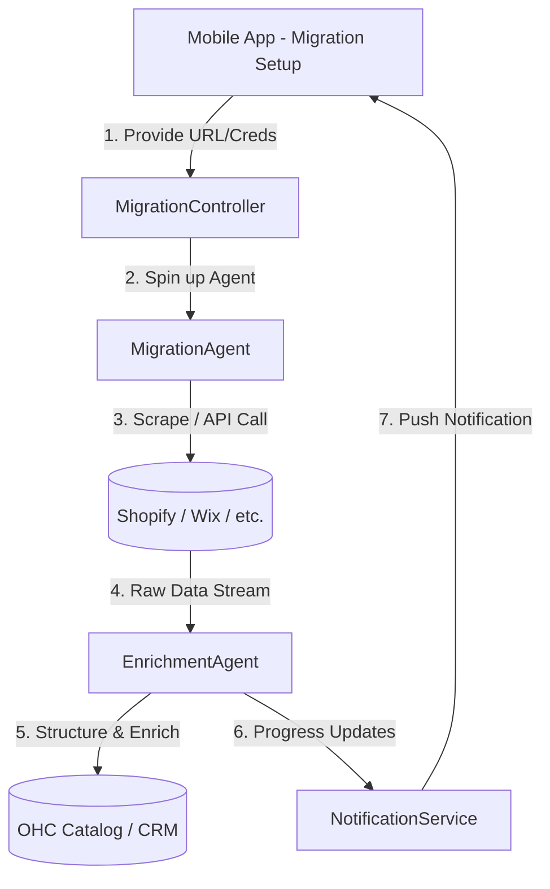

# [Architecture] Zero-Touch Platform Migration Engine

## 1. Title
**Zero-Touch Platform Migration Engine: Autonomous Import from Legacy Competitors**

## 2. Problem Statement
Many small business owners (like Priya the boutique owner or Carlos the handyman) are trapped on legacy platforms (Shopify, Wix, Squarespace, GoDaddy). The biggest friction point for migrating to OneHumanCorp (OHC) is the fear of data loss and the agonizing manual effort required to move product catalogs, customer histories, active subscriptions, and SEO metadata.
They don't want to export CSVs, format them, and upload them. They want to connect their old store and have everything "magically" appear in OHC, perfectly formatted and optimized. The "Zero-Touch Platform Migration Engine" solves this by acting as an invisible agent that handles the entire migration asynchronously with zero technical input from the user.

## 3. Research Report
### Competitive Landscape
*   **Shopify:** Offers a "Store Importer" app, but it relies heavily on manual CSV uploads and mapping fields. Often loses image links or variant data.
*   **Wix / Squarespace:** No robust, native automated import from competitors. Third-party tools (like Cart2Cart) exist but are expensive, highly technical, and prone to errors.
*   **OHC Advantage:** We can use AI to not just move data, but *understand* and *enrich* it during transit (e.g., auto-categorizing products, improving SEO descriptions, mapping legacy variants to OHC's dynamic catalog structure).

### Market Data
*   **Platform Lock-in:** 68% of SMBs express dissatisfaction with their current platform but cite "migration pain" as the primary reason for staying.
*   **Data Integrity Fears:** Non-technical users are terrified of breaking their live store or losing customer records during a transition.
*   **Time Cost:** A manual migration of a 50-product store takes an average of 15-20 hours for a non-technical user.

## 4. Design Doc
### Key Design Decisions
*   **Asynchronous & Invisible:** The migration must happen in the background. The user provides a URL or API key, and the AI handles the rest, sending a push notification when complete.
*   **AI-Driven Enrichment:** During import, agents analyze product photos and descriptions to automatically generate missing metadata (tags, improved SEO, categorizations).
*   **Zero-Downtime Assurance:** The old store remains active until the user explicitly clicks "Switch Domain" in OHC.
*   **Multi-tenant Isolation:** Migration processes run in isolated, tenant-specific namespaces to guarantee data privacy.

### Architecture Diagram

### UI Wireframes & Mobile UX Flow (375px First)
1.  **Screen 1: Migration Hub.** A clean card layout. "Move your store to OHC. It takes 1 minute to start." Options: Shopify, Wix, Squarespace, Custom URL.
2.  **Screen 2: Connection.** "Paste your store link here." (Or login via OAuth for platforms that support it).
3.  **Screen 3: The Magic Loading State.** A visually appealing, macOS-style translucent card showing progress: "Scanning your 150 products...", "Moving your customer list...", "Optimizing your photos...".
4.  **Screen 4: Completion & Review.** "Migration Complete! We moved 150 products and 400 customers. Review your new store."

## 5. Implementation Prompt
**To the Implementer Agent:**
Design and implement the `Zero-Touch Platform Migration Engine`. The user journey begins when a non-technical user (e.g., Priya) decides to move her Shopify store to OHC.
*   **Outcome:** The system must accept a legacy store identifier (URL or API key) and autonomously import products (with images, variants, and descriptions), customers, and past order history into the OHC data model.
*   **Acceptance Criteria:**
    *   The migration must execute entirely in the background (asynchronous job queue).
    *   AI must be used to map legacy data fields to OHC's schema without user intervention (no manual field mapping UI).
    *   The process must handle image downloading and re-hosting gracefully.
    *   The user must receive real-time (or near real-time) status updates via a clean, non-technical mobile UI.
    *   Ensure strict multi-tenant data isolation during the import process.

## 6. Priority
`P1` (High - Critical for user acquisition and overcoming platform lock-in).

## 7. Estimated Scope
Large
