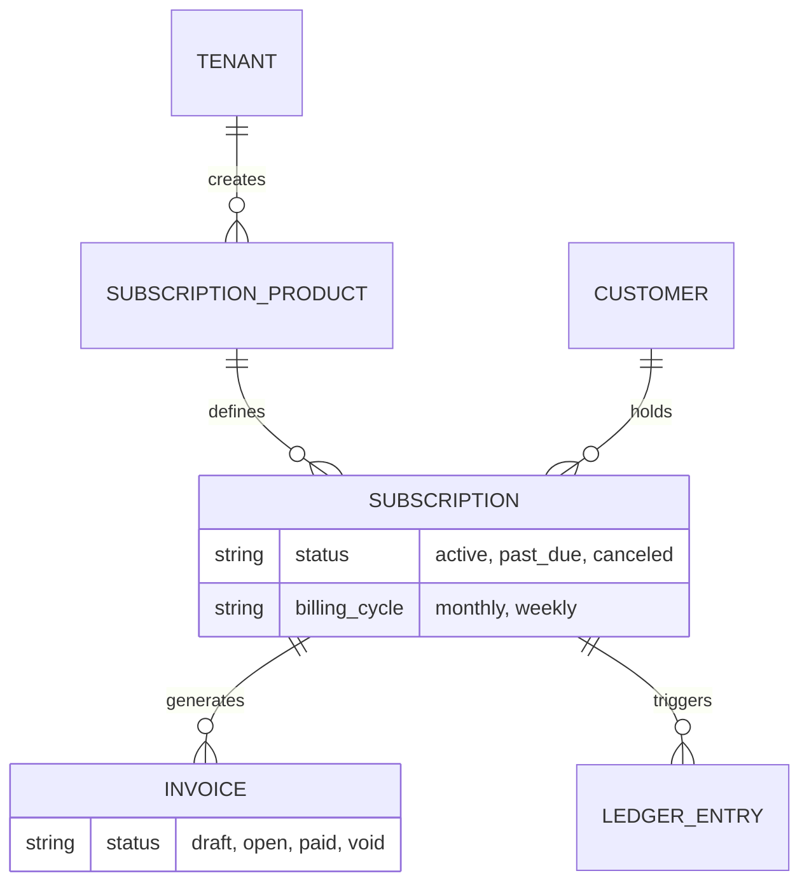
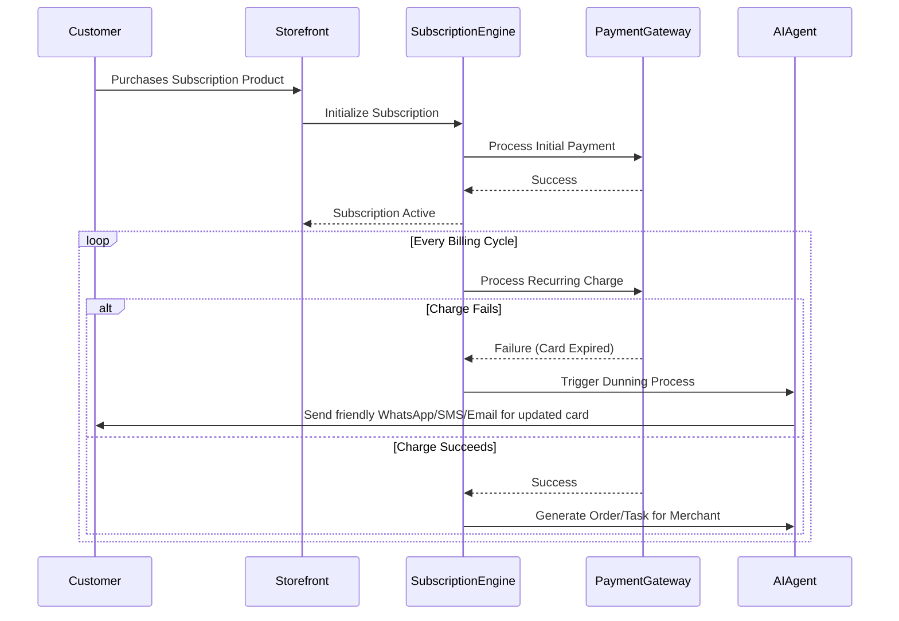

# [Architecture] Zero-Touch Subscription & Membership Engine

## Title
Implement Zero-Touch Subscription & Membership Engine

## Problem Statement
Leo (music tutor) wants to offer recurring monthly lesson packages. Maya (baker) wants a "cake of the month" club. Priya (boutique owner) wants a VIP membership that gives 10% off. Currently, small business owners have to manually track who paid for what this month, send reminder emails, chase down failed payments, and update spreadsheets. It's too complex and time-consuming. They need a system where they just toggle "Make this recurring" and the platform handles the billing, the failed payment retries, the customer portal, and the access rights automatically.

## Research Report
**Market Gap & Competitor Analysis:**
- **Shopify:** Requires third-party apps (like Recharge, Skio) which add $99/mo overhead, complex configuration, and disjointed checkout experiences. This is a huge barrier for non-technical users.
- **Wix:** Has built-in subscriptions but they are rigid and often hard to map to mixed business types (e.g., both physical goods and services).
- **Squarespace:** Good basic digital/physical subscriptions, but lacks deep AI integration for proactive churn management and dynamic membership perks.
- **Patreon / Substack:** Built only for digital creators, doesn't work for Maya's physical cakes or Leo's tutoring services.

**Opportunity:** By building a natively integrated, multi-tenant subscription engine with AI-driven churn management and flexible billing cycles, OneHumanCorp can offer a seamless "toggle-on" subscription experience for physical, digital, and service-based businesses, eliminating the need for expensive third-party apps.

## Design Doc

### Architecture Diagram

### UI Wireframes / Screen Flow Description (375px first)
1. **Product Creation/Edit View (Merchant):**
   - Clean card layout with Translucent Glass materials.
   - Standard inputs (Name, Price, Image).
   - A single, prominent toggle: `[ ] Offer as Subscription`.
   - When toggled, an inline, smooth expansion shows: "Deliver every: [ 1 ] [ Month ]".
   - "Offer discount for subscribing: [ 10 ] %".
2. **Customer Checkout View (Customer):**
   - Product details show "One-time purchase: $20" and "Subscribe & Save: $18/mo".
   - Clean, large tap targets. Apple Pay / Google Pay integrated for 1-tap checkout.
3. **Customer Portal (Customer):**
   - Simple mobile interface accessed via magic link.
   - Shows active subscriptions.
   - Buttons to "Skip a month", "Update Payment Method", or "Cancel".

### Mobile UX Flow
- The entire setup flows through native-feeling mobile interactions. No complex "cron job" settings.
- Maya just selects her product, taps the subscription toggle, and saves.
- Customers get mobile wallet-friendly receipts and SMS magic links to manage their subscription.

### AI Agent Integration Points
- **Finance Agent:** Monitors failed payments and automatically orchestrates retry logic (dunning).
- **CS Agent:** Sends conversational, personalized messages (SMS/WhatsApp/Email) to customers when payments fail ("Hey! Looks like your card expired. Tap here to update so you don't miss this month's cake!").
- **Marketing Agent:** Identifies customers likely to churn based on engagement and proactively offers a discount to stay.
- **Operations Agent:** For physical/service subs, automatically creates a task in the merchant's daily queue when a subscription renewal triggers an actual deliverable.

### Key Design Decisions
- **Unified Engine:** One central subscription engine handles physical goods, services, and digital access, reducing fragmentation.
- **AI-Led Dunning:** Instead of robotic "Payment Failed" emails, AI agents use conversational channels to recover failed payments, increasing success rates.
- **Zero-Configuration:** Complexities like proration, tax on recurring items, and retry schedules are abstracted away with sensible defaults. The merchant only configures the interval and price.

## Implementation Prompt
**Task:** Build the Zero-Touch Subscription & Membership Engine for OneHumanCorp.
**Context:** Small business owners need to offer recurring subscriptions for physical goods, services, and memberships without dealing with complex add-ons.
**Outcome:**
- A merchant can toggle any existing product/service to be a subscription.
- Customers can check out and manage their subscription via a magic-link portal.
- AI agents handle failed payment recovery invisibly.

**Acceptance Criteria:**
1. A subscription entity can be created and tied to any product type.
2. The system can schedule and trigger recurring billing cycles based on the defined interval.
3. AI agent hooks are established for payment failure (dunning) events.
4. All UI elements follow the mobile-first, grandmother-test standard with Translucent Glass materials.
5. Multi-tenant isolation guarantees that one merchant's subscriptions cannot bleed into another's.

## Priority
P0

## Estimated Scope
Large