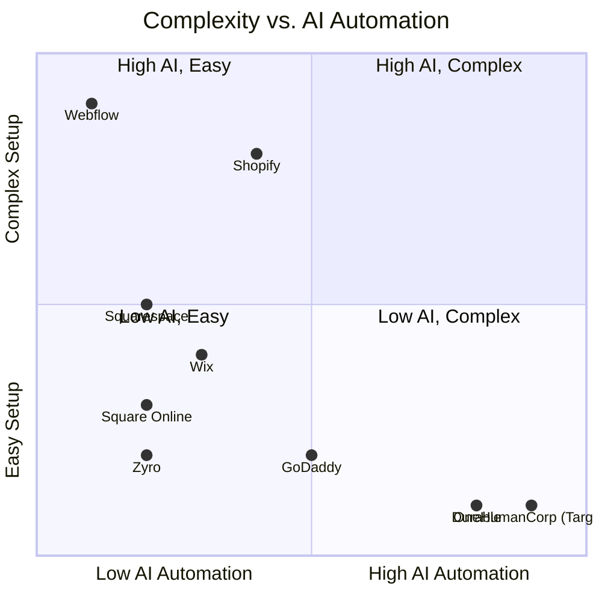

# [audit] Deep Competitor Audit

## Executive Summary
This document provides an exhaustive analysis of the competitive landscape for small business platforms, specifically focusing on the onboarding flow, time-to-live store, mobile app quality, AI features, pricing, free tier offerings, and the most common user complaints derived from App Store reviews, Trustpilot, and Reddit.

## 1. Shopify
### Overview
Shopify is the industry standard for e-commerce, but it is increasingly complex for beginners. It targets established businesses rather than first-time non-technical users.

### Features & Pricing
- **Onboarding Flow**: 15-20 steps. Users must configure shipping, taxes, and payment gateways manually before launching.
- **Time to Live Store**: 2-5 days for beginners.
- **Mobile App Quality**: Strong for managing existing stores (orders, inventory), but extremely poor for initial setup.
- **AI Features**: Shopify Sidekick (Chat-based AI assistant). Sidekick is a conversational bot, not an autonomous invisible agent.
- **Pricing**: No useful free tier. Starter plan is $5/mo (very limited), Basic is $39/mo.
- **User Complaints (Reddit/Trustpilot)**:
  - "Too many apps required to get basic functionality."
  - "Setup is overwhelming for a simple single-product store."
  - "Themes are difficult to customize without code."

## 2. Wix
### Overview
Wix provides an easier drag-and-drop setup, heavily relying on templates. However, it can become bloated and slow.

### Features & Pricing
- **Onboarding Flow**: Questionnaire-based setup using Wix ADI.
- **Time to Live Store**: 3-5 hours.
- **Mobile App Quality**: Wix Owner app is adequate, but the mobile editor is limited.
- **AI Features**: Wix ADI generates a website from questions. It is a one-time process, not an ongoing operational agent.
- **Pricing**: Free tier exists (with Wix branding). Core plan is $27/mo.
- **User Complaints**:
  - "Website loads too slowly."
  - "Mobile version often breaks and requires manual fixing."
  - "Hard to migrate away from Wix once established."

## 3. Squarespace
### Overview
Squarespace is design-focused, ideal for portfolios and restaurants, but less optimized for high-volume e-commerce.

### Features & Pricing
- **Onboarding Flow**: Template selection followed by manual customization.
- **Time to Live Store**: 1-3 days.
- **Mobile App Quality**: Good for basic edits and analytics.
- **AI Features**: Very basic text generation. No strong AI automation.
- **Pricing**: No meaningful free tier. Business plan is $23/mo.
- **User Complaints**:
  - "E-commerce features feel like an afterthought."
  - "Navigation customization is too rigid."

## 4. GoDaddy Website Builder / Airo
### Overview
A very simple but shallow builder known for aggressive upselling.

### Features & Pricing
- **Onboarding Flow**: Very fast, heavily templated.
- **Time to Live Store**: 1 hour.
- **Mobile App Quality**: Basic but functional.
- **AI Features**: GoDaddy Airo provides AI branding (logo, tagline, website draft). Quality is often generic. Limited post-launch AI.
- **Pricing**: Free plan exists. Paid plans start around $10/mo.
- **User Complaints**:
  - "Aggressive upselling and hidden renewal fees."
  - "Customer service is poor."
  - "Templates look outdated compared to competitors."

## 5. Zyro / Hostinger Builder
### Overview
A budget option with fast setup but very thin features.

### Features & Pricing
- **Onboarding Flow**: AI website builder or templates.
- **Time to Live Store**: 1-2 hours.
- **Mobile App Quality**: Minimal.
- **AI Features**: Very limited AI (basic text and logo generation).
- **Pricing**: Very aggressive introductory pricing (e.g., $2.99/mo).
- **User Complaints**:
  - "Missing basic e-commerce features."
  - "Limited customization options."

## 6. Webflow
### Overview
For developers and designers, not suitable for typical SMBs.

### Features & Pricing
- **Onboarding Flow**: Steep learning curve requiring knowledge of CSS box model.
- **Time to Live Store**: 1-2 weeks.
- **Mobile App Quality**: Non-existent for store management.
- **AI Features**: Limited to some design assistance.
- **Pricing**: Starts at $14/mo.
- **User Complaints**:
  - "Way too hard for beginners."

## 7. Framer
### Overview
Designer-focused, excellent for landing pages, but not a business management platform.

### Features & Pricing
- **Onboarding Flow**: Canvas-based design.
- **Time to Live Store**: Days to weeks.
- **Mobile App Quality**: N/A.
- **AI Features**: AI layout generation.
- **Pricing**: Free tier exists. Mini plan is $5/mo.
- **User Complaints**:
  - "No backend logic or database support."

## 8. Square Online
### Overview
Strong POS integration, excellent for restaurants and retail with an in-person presence.

### Features & Pricing
- **Onboarding Flow**: Fast, especially if already using Square POS.
- **Time to Live Store**: 2-4 hours.
- **Mobile App Quality**: Strong.
- **AI Features**: Limited.
- **Pricing**: Free tier exists (pay only processing fees). Plus is $29/mo.
- **User Complaints**:
  - "Customization is very restricted."

## Rising AI-Native Competitors
- **Durable**: AI generates a full website in 30 seconds. Very thin on business management. Quality has improved but still feels generic.
- **10Web**: AI WordPress builder. Niche but growing. Good for users familiar with WP.
- **Hocoos**: AI website builder for SMBs. Early stage.

## Visual Competitive Matrix

## OHC Advantage
OHC's opportunity lies in combining the ease of setup of Durable with the operational power of Shopify, driven by invisible AI agents rather than just conversational bots.
