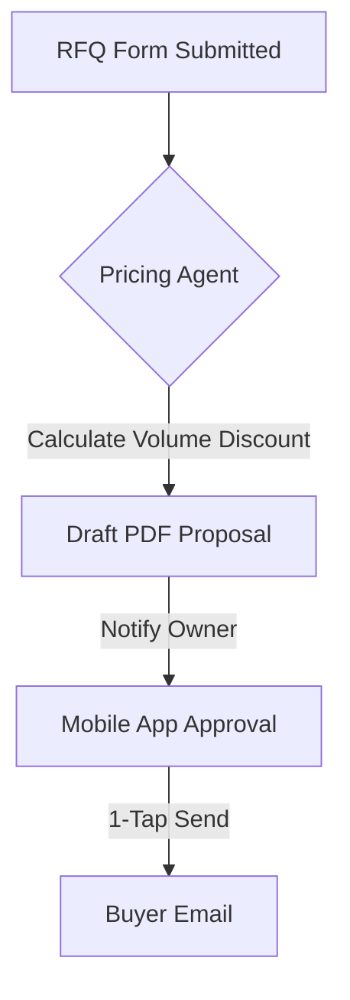

**Title**: Automated Request for Quote (RFQ) Handling
**Problem Statement**: B2B sales often begin with an RFQ process. Managing RFQs via email is slow and unscalable.
**Research Report**: B2B buyers expect consumer-like speed in responses. Delays in RFQ processing lead to lost deals.
**Design Doc**:
*   Architecture: RFQ Form Submission -> Pricing Agent -> Draft Proposal.

**Implementation Prompt**: Develop an automated RFQ pipeline. When a buyer submits a request for bulk quantities, an AI agent should calculate appropriate volume discounts based on the merchant's predefined margin rules, generate a professional PDF proposal, and prompt the owner for a 1-tap approval to send it back to the buyer.
**Priority**: P2
**Estimated Scope**: Large
