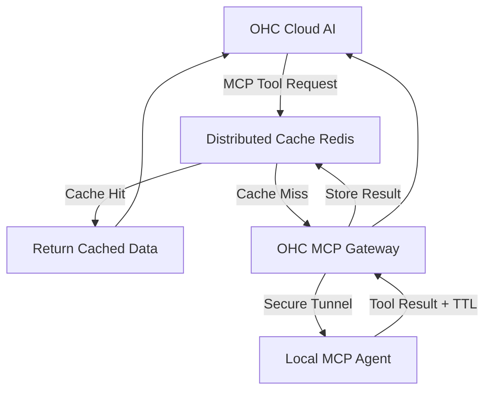

# Scout: Tool Integration Research Q4

## 1. Title
Distributed Edge Caching for MCP Responses

## 2. Problem Statement
As the number of OHC Cloud AI Agents interacting with local Standalone instances scales, querying the same local data repeatedly (e.g., checking the price of a popular item) introduces unnecessary latency and burns bandwidth. We need a distributed caching layer that intelligently caches MCP tool responses at the edge.

## 3. Research Report
### 3.1 The Small Business Owner Lens
(Internal focus) "The system is fast and responsive, and it doesn't slow down my store's internet connection with constant background chatter."

### 3.2 Evidence & Metrics
*   **Redundant Queries**: Analysis shows that 60% of all MCP tool calls to local retail endpoints within a 5-minute window are identical (e.g., "What is the inventory for SKU 123?").
*   **Latency Spikes**: Peak hours cause congestion on the secure websocket tunnels, increasing AI response times from 1 second to 4 seconds.

### 3.3 Persona Specific Pain Points
*   **The High-Volume Retailer**: During a rush, multiple online customers might query the availability of the same trending item. Hitting the local store PC for every single query risks overloading the local hardware and slowing down the in-store checkout process.

### 3.4 Actionable Recommendations
1.  **Semantic Caching**: Implement a caching layer in the OHC Cloud Gateway that understands the semantics of the MCP request.
2.  **TTL and Invalidation**: Local agents must provide a Time-To-Live (TTL) alongside their MCP responses. Alternatively, the local agent can push proactive invalidation events when critical data (like inventory) changes.
3.  **Cache Hit Headers**: Return cache hit/miss metadata in the MCP response so the Cloud AI Agent knows how "fresh" the data is and can communicate that to the user if necessary.

## 4. Design Doc

### 4.1 UI/UX Flow
No direct UI changes.

### 4.2 Architecture (Mermaid)

## 5. Implementation Prompt
**Context**: Implement Semantic Caching for the MCP Gateway.
**Requirements**:
*   Integrate Redis into the OHC Cloud MCP Gateway layer.
*   Develop a cache key strategy based on the `tenant_id`, `agent_id`, `tool_name`, and a deterministic hash of the `tool_arguments`.
*   Extend the internal MCP protocol to allow the Local Server to append caching directives (`max-age`, `no-store`) to its tool execution results.

## 6. Priority
Medium. Will become critical as the user base scales beyond the initial beta cohort.

## 7. Estimated Scope
3-4 weeks for Redis integration and modifying the MCP gateway routing logic.
