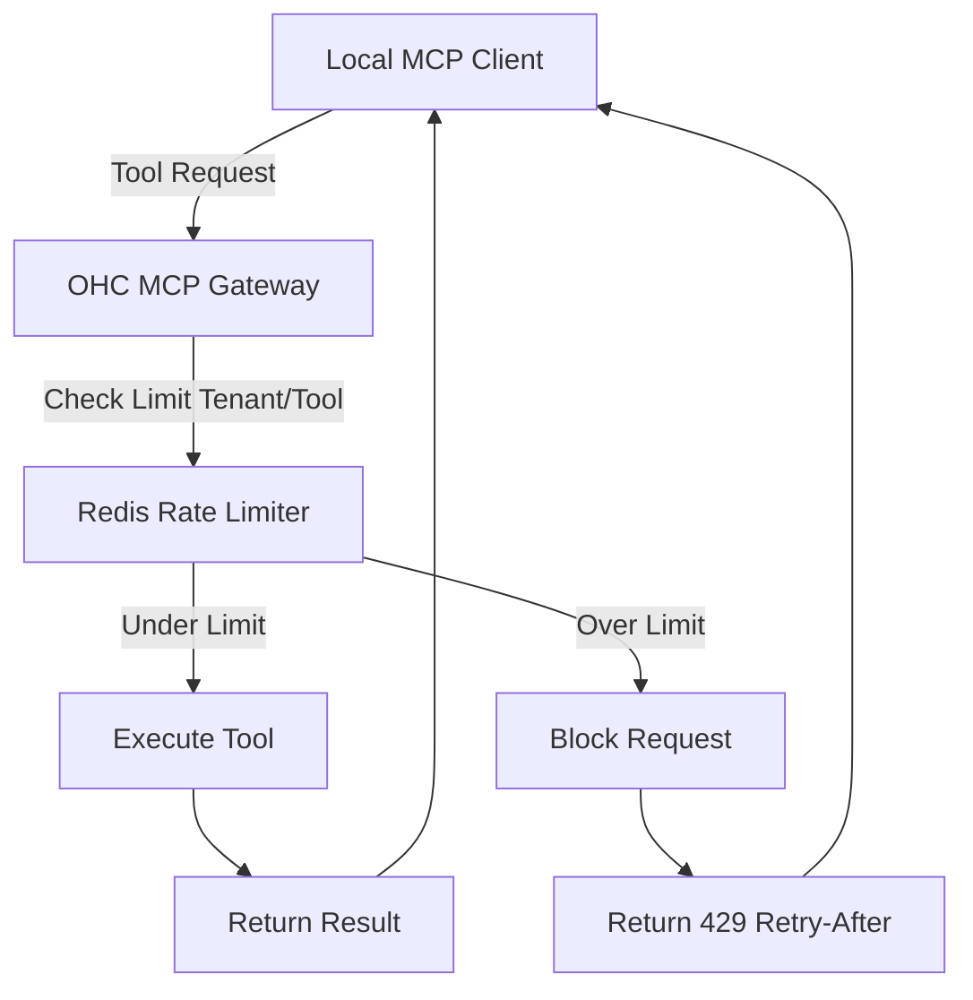

# Scout: Tool Integration Research Q4

## 1. Title
Distributed Rate Limiting for MCP Clients

## 2. Problem Statement
With the potential for thousands of standalone OHC instances connecting to the Cloud via MCP, a misconfigured local agent or a sudden burst of automated tasks could overwhelm the cloud infrastructure or trigger API limits on third-party integrations accessed via the Cloud MCP server.

## 3. Research Report
### 3.1 The Small Business Owner Lens
"My automated inventory sync stopped working because one of my plugins went crazy and tried to sync 10,000 times a second. The whole system shouldn't break because of one bad setting."

### 3.2 Evidence & Metrics
*   **Noisy Neighbors**: Without rate limiting, a single tenant consuming excessive resources impacts the latency and reliability of all other tenants in a multi-tenant cloud environment.
*   **Third-Party API Costs**: Unlimited egress to tools like OpenAI or external CRMs via MCP can result in unexpected, massive billing spikes.

### 3.3 Persona Specific Pain Points
*   **The Power User**: Sets up an aggressive auto-dream pipeline that queries an external CRM every 5 seconds. Without rate limits, this user risks getting OHC's global API key banned by the CRM provider.

### 3.4 Actionable Recommendations
1.  **Multi-Tiered Rate Limiting**: Implement rate limiting at both the Cloud Gateway level (to protect OHC infrastructure) and at the specific Tool level (to protect external API limits).
2.  **Token Bucket Algorithm**: Use a distributed Token Bucket algorithm (e.g., via Redis) to allow for short bursts of activity while maintaining a strict long-term rate.
3.  **Graceful Degradation**: When a limit is hit, the MCP server must return a standardized `429 Too Many Requests` error with a `Retry-After` header, which the local agent is programmed to respect.

## 4. Design Doc

### 4.1 UI/UX Flow
1.  **Settings**: Users on higher pricing tiers can see their current API usage and rate limits in a simple dashboard widget.
2.  **Feedback**: If a background task fails due to rate limiting, the user receives a notification: "Task delayed: You've hit your hourly limit for external data syncs. We will try again in 15 minutes."

### 4.2 Architecture (Mermaid)

## 5. Implementation Prompt
**Context**: Implement Distributed Rate Limiting for the MCP Gateway.
**Requirements**:
*   Integrate a Rust-based Redis client into the MCP Gateway.
*   Implement a Token Bucket or Leaky Bucket algorithm using Redis Lua scripts for atomic operations.
*   Define specific rate limit quotas based on the tenant's subscription tier, configurable via the database.

## 6. Priority
High. Crucial for protecting infrastructure and managing costs as the user base scales.

## 7. Estimated Scope
3 weeks for Redis integration, Lua scripting, and updating the MCP server error handling logic.
