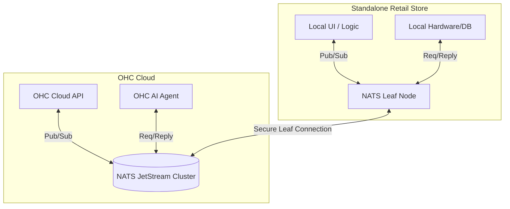

# Scout: Tool Integration Research Q4

## 1. Title
NATS as the Backbone for the Hybrid Event Mesh

## 2. Problem Statement
The OHC hybrid architecture requires reliable, low-latency communication between the cloud orchestrator, various internal microservices, and thousands of distributed standalone retail instances. Current ad-hoc REST and WebSocket connections are difficult to scale, monitor, and route dynamically. We need a unified event mesh.

## 3. Research Report
### 3.1 The Small Business Owner Lens
(Internal Infrastructure Focus - User impact is indirect via speed and reliability). "The system just feels faster and more stable, even when my internet is spotty."

### 3.2 Evidence & Metrics
*   **Connection Overhead**: Managing raw WebSocket connections for 10,000+ standalone clients introduces significant memory and CPU overhead on load balancers and application servers.
*   **Routing Complexity**: Routing an MCP request from a Cloud AI Agent to a specific Standalone instance currently requires complex, custom database lookups and state management.

### 3.3 Persona Specific Pain Points
*   **The OHC DevOps Engineer**: Struggles to trace events across the boundary between cloud microservices and standalone clients. Debugging "lost" messages is highly manual.

### 3.4 Actionable Recommendations
1.  **Adopt NATS**: Implement NATS (specifically JetStream for persistence where needed) as the core message bus for the entire OHC ecosystem.
2.  **Unified Addressing**: Use NATS subject-based routing to seamlessly route messages. e.g., `mcp.req.<tenant_id>.<agent_id>` can transparently route to a cloud service or a connected standalone client without the sender needing to know where the receiver is located.
3.  **Leaf Nodes**: Deploy NATS Leaf Nodes inside the Standalone binaries to handle local message routing and provide robust offline buffering before syncing with the Cloud cluster.

## 4. Design Doc

### 4.1 UI/UX Flow
No direct UI changes. System reliability and responsiveness improve globally.

### 4.2 Architecture (Mermaid)

## 5. Implementation Prompt
**Context**: Implement the NATS Leaf Node integration in the Standalone binary.
**Requirements**:
*   Embed a NATS server configured as a Leaf Node within the Rust Standalone binary.
*   Configure the Leaf Node to automatically establish a secure, authenticated connection to the OHC Cloud NATS cluster upon startup.
*   Refactor the local MCP server to listen on local NATS subjects instead of raw TCP/WebSockets, allowing the Cloud to reach it via the established NATS mesh.

## 6. Priority
High (Architectural). This is a foundational change required to safely scale the hybrid model to tens of thousands of users.

## 7. Estimated Scope
10-12 weeks. Significant refactoring of existing transport layers across the stack. Requires careful migration strategy to avoid downtime.
