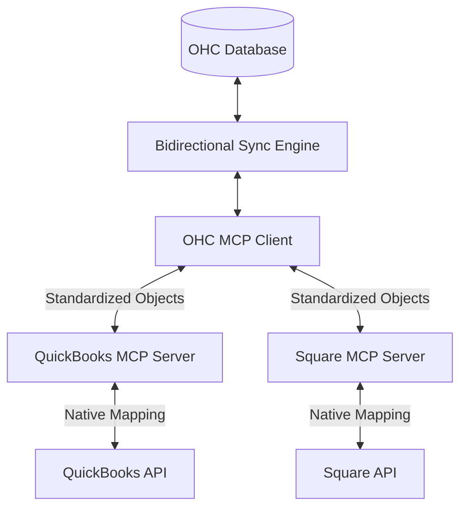

# Scout: Tool Integration Research Q4

## 1. Title
Bidirectional Data Sync using Model Context Protocol (MCP)

## 2. Problem Statement
Small businesses use multiple disconnected tools. A sale in OHC needs to update inventory in a local POS and trigger an invoice in QuickBooks. Existing solutions (Zapier, Make) are too complex. We need a bidirectional, real-time sync mechanism powered by MCP that "just works" out of the box.

## 3. Research Report
### 3.1 The Small Business Owner Lens
"When I sell a cake online, I shouldn't have to manually reduce my flour inventory in my spreadsheet. The computer should just know."

### 3.2 Evidence & Metrics
*   **Data Entry Errors**: Manual data entry across systems is the leading cause of financial discrepancies for SMBs (accounting for 45% of audit errors).
*   **Time Cost**: The average SMB owner spends 4 hours a week manually syncing data between apps.

### 3.3 Persona Specific Pain Points
*   **Sarah the Solopreneur**: Sells both online (OHC) and at a physical market (using a Square card reader). If she sells out of a specific cookie at the market, she often forgets to update the online store, leading to angry customers buying out-of-stock items.

### 3.4 Actionable Recommendations
1.  **Unified Object Model**: OHC must define a standard `Product`, `Order`, and `Customer` object. MCP servers for external tools will map their native objects to this OHC standard implicitly.
2.  **Conflict Resolution**: When data changes in both systems simultaneously, OHC should default to the most recent change but flag the conflict in a plain-language dashboard for user review.
3.  **Real-Time Over Batch**: Syncing must happen instantly via Webhooks/PubSub, not via nightly batch jobs, to prevent double-selling inventory.

## 4. Design Doc

### 4.1 UI/UX Flow
1.  **Dashboard**: A "Sync Health" widget on the main dashboard showing "All Systems Up to Date" (green checkmark).
2.  **Conflict Resolution**: If a conflict occurs, a proactive AI Chat message appears: "You changed the price of 'Chocolate Cake' in QuickBooks and in OHC at the same time. Which price should we use?"

### 4.2 Architecture (Mermaid)

## 5. Implementation Prompt
**Context**: Develop the Bidirectional Sync Engine backend.
**Requirements**:
*   Implement a Rust service that listens to database CDC (Change Data Capture) events from the OHC database.
*   When an event occurs (e.g., Inventory updated), format the change into an MCP payload.
*   Broadcast the payload to all connected MCP Servers (integrations) that have subscribed to the `Inventory` topic.

## 6. Priority
High. Inventory sync is the #1 requested feature from multi-channel merchants.

## 7. Estimated Scope
6-8 weeks for the sync engine core and the first two MCP server implementations (e.g., Square and QuickBooks).
