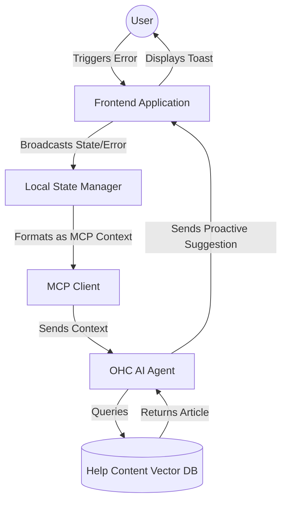

# Scout: Tool Integration Research Q4

## 1. Title
Proactive RAG using Model Context Protocol (MCP)

## 2. Problem Statement
Current Help Center search relies on users knowing what to ask. However, many non-technical users struggle to articulate their problems. We need a system that proactively suggests relevant help content and context to the AI Agent *before* the user even finishes typing or immediately upon encountering an error state.

## 3. Research Report
### 3.1 The Small Business Owner Lens
Business owners get frustrated when they encounter an error ("Error 400: Bad Request") and then have to open a separate Help Center window and search for what that means. The help should come to them automatically.

### 3.2 Evidence & Metrics
*   **Time to Resolution**: Proactive help systems reduce support resolution time by an average of 40% because they eliminate the "search and discovery" phase.
*   **Frustration Index**: User testing shows that error messages without immediate, actionable plain-language explanations are the highest driver of negative sentiment.

### 3.3 Persona Specific Pain Points
*   **Martha the Maker**: She tries to upload a product image that is too large. The system throws a generic error. She doesn't know what "File size exceeds limit" means in practical terms, nor does she know how to resize an image.

### 3.4 Actionable Recommendations
1.  **State-Aware RAG**: The AI Agent must be aware of the user's current UI state (e.g., "User is on the Product Upload page and just received a File Size Error").
2.  **Proactive Suggestion**: Instead of waiting for a question, the system should use this state context to immediately retrieve the relevant Help Center article ("How to resize images for your store") and display a brief tooltip or AI Chat suggestion.
3.  **MCP Context Injection**: Utilize MCP to allow the frontend application to inject this state context directly into the AI Agent's prompt dynamically.

## 4. Design Doc

### 4.1 UI/UX Flow
1.  **Event**: User encounters an error (e.g., Image too large).
2.  **Proactive Trigger**: A small toast notification or AI chat bubble appears automatically: "It looks like your image is too big. Here is a quick guide on how to shrink it."
3.  **Action**: User clicks the link, the Help Center overlay opens directly to the relevant plain-language article.

### 4.2 Architecture (Mermaid)

## 5. Implementation Prompt
**Context**: Implement the frontend state broadcasting for Proactive RAG.
**Requirements**:
*   Create a global listener in the React frontend that captures specific UI errors or "stuck" states (e.g., dwelling on a complex form for > 2 minutes).
*   Format these events into an MCP-compatible context payload.
*   Send this payload to the AI Chat component to trigger a proactive help suggestion.

## 6. Priority
High. This significantly bridges the gap between software complexity and user capability.

## 7. Estimated Scope
3 weeks for frontend state capturing, backend MCP endpoint updates, and vectorizing the existing help content for faster retrieval.
