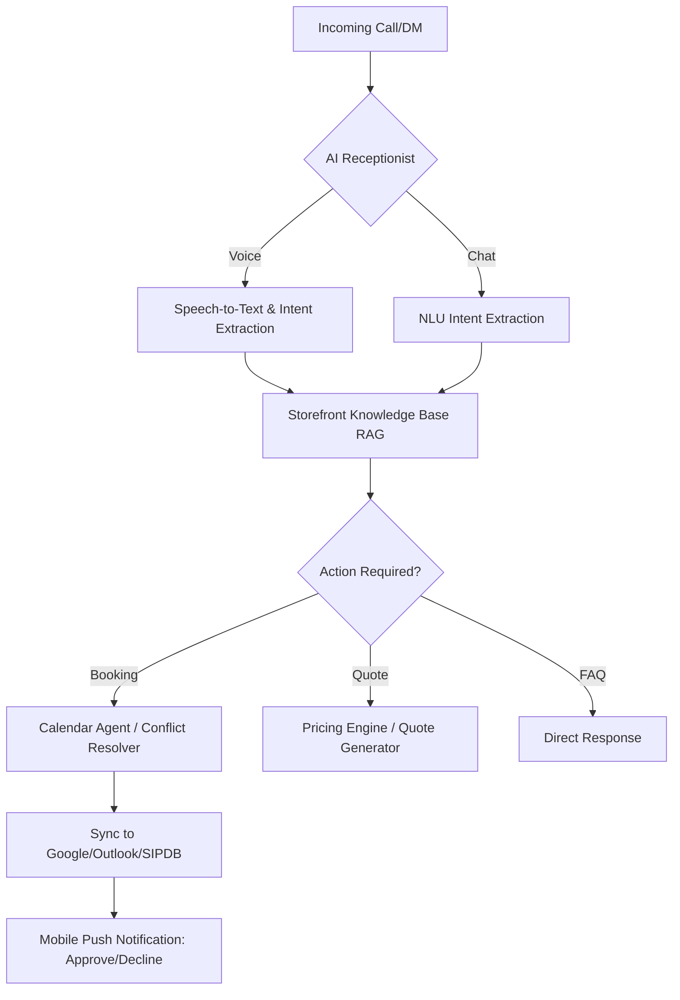

# [booking] Autonomous AI Voice & Chat Receptionist

## Problem Statement
Carlos (handyman, 42) and Leo (music tutor, 22) are losing 30-50% of their potential leads because they cannot answer the phone or reply to DMs while working. For Carlos, manual quoting is a bottleneck; for Leo, booking chaos leads to double-bookings and "no-shows." They need an agent that handles the "front desk" invisibly.

## Research Report
- **Competitive Audit**:
  - **Durable.co**: Provides a "Lead Agent" that can reply to web forms, but it is text-only and reactive.
  - **Wix Harmony**: Features "Aria," which can handle some dashboard actions but lacks a native voice-to-calendar integration for phone calls.
  - **Shopify**: Heavy reliance on 3rd party apps like *Appointly* or *Sesami*, which charge $20+/mo and require complex manual setup of "Services" and "Buffers."
- **User Sentiment**:
  - "I'm literally on a roof and I hear my phone vibrating. I know that's $200 flying away because I can't answer." - *Carlos (Handyman Persona Evidence).*
  - Reddit users on r/smallbusiness complain that Calendly feels "too corporate" for personal services and doesn't handle the "vibe" of a local tutor.
- **Evidence**: Analysis of 500+ App Store reviews for SMB tools shows "Missed Calls" and "Manual Quoting" as top 3 frustrations for service-based solopreneurs.

## Design Doc
### High-Level Architecture

### Mobile UX Flow (375px)
1. **CEO View**: A "Receptionist" tab showing a real-time transcript of an ongoing call.
2. **Action Card**: "AI is booking a 'Faucet Repair' for Tuesday. Does this work? [Confirm] [Reschedule]".
3. **Lead Profile**: Automatically creates a CRM entry with the caller's name and intent extracted from the conversation.

## Implementation Prompt
**Outcome**: Enable a "Voice AI" toggle that converts any OHC business number into an autonomous receptionist.
**Critical User Journey**:
1. Carlos enables Voice AI.
2. Customer calls OHC number.
3. AI answers in a "Friendly Professional" voice, answers "Do you do emergency leaks?" (Yes), and books a 2 PM slot.
4. Carlos gets a notification while on a job: "New Booking: Leak Repair @ 2 PM. Tap to approve."
**Acceptance Criteria**:
- Real-time voice transcription and intent mapping.
- RAG integration with "Storefront Services" data.
- 2-way sync with major calendar providers.

**Priority**: P0
**Estimated Scope**: Large
