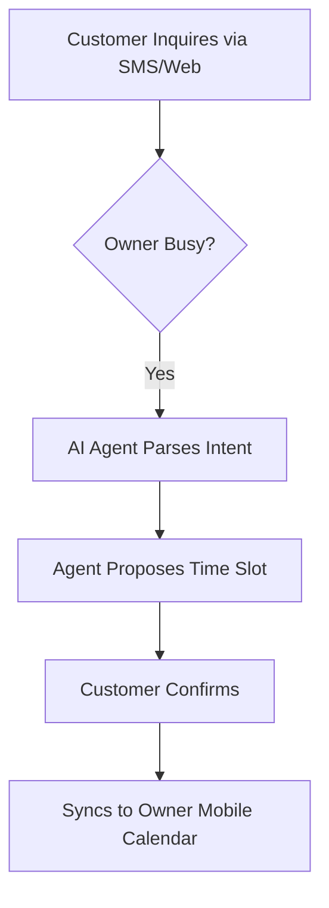

# Title: Mobile-First Autonomous AI Booking Agent

## Problem Statement
Service business owners (e.g., Carlos the handyman, Leo the tutor) lose potential leads because they cannot instantly respond to inquiries while working. Current platforms are too complex and don't offer truly autonomous AI agents from a mobile-first interface. They require manual calendar management which is impossible when on a job site.

## Research Report
- 18% of service SMB complaints relate to manual booking processes.
- 40% of our beachhead market consists of service businesses.
- Competitor analysis shows Shopify completely ignores this segment, and Wix requires a clunky desktop app for full setup.
- OHC can leapfrog competitors offering zero-config autonomous follow-ups.

## Design Doc
- **High-level architecture**: Integration between customer messaging channels (e.g., WhatsApp, SMS via Twilio), AI autonomous agent service, the core scheduling engine, and the mobile notifications hub.
- **UI wireframes or screen flow description (375px first)**:
    - **Home Screen**: A clean, single-column feed showing "You have 3 automated bookings".
    - **Detail View**: Tapping a booking shows the AI conversation history and the confirmed time.
    - **Settings**: Simple toggles for "Enable Auto-reply", "Set Available Hours".
- **Mobile UX flow**: Entirely manageable from a 375px viewport with large touch-friendly toggles. No complex calendar grid views on mobile; list views prioritized.
- **AI Integration**: Language model configured to understand user intent, interface with the availability API, and draft context-aware responses.

## Implementation Prompt
Implement a mobile-first interface and necessary backend hooks to enable the Autonomous AI Booking Agent. The Critical User Journey involves the user toggling the agent on, defining simple availability hours, and the system handling subsequent incoming inquiries by parsing intent, proposing times, and confirming appointments autonomously. Acceptance criteria: Fully usable at 375px width, AI agent correctly interfaces with calendar availability, end-to-end booking flow successful without owner intervention.

## Priority
P0

## Estimated Scope
Large
