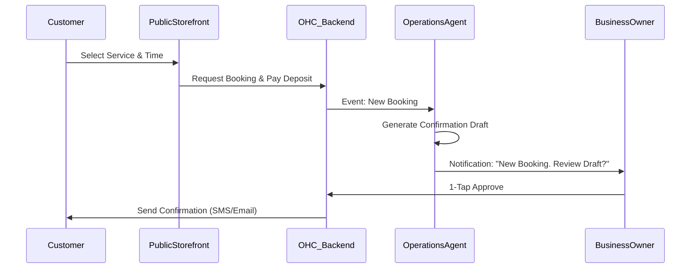

# Issue Brief: Unified Service Booking System

## Title
[Booking] Unified Service Booking System

## Problem Statement
Service professionals like Carlos (Handyman) and Leo (Music Tutor) juggle multiple tools (Calendly, Stripe, DMs) to book appointments. This fragmentation leads to lost leads, double bookings, and excessive manual overhead. The platform currently lacks a cohesive, mobile-first booking solution directly integrated with the business's data layer and AI agents.

## Research Report
Market research indicates that competitors heavily focus on physical products (e-commerce), leaving service-based businesses as a massive underserved segment. The primary beachhead market for OHC is the "Service & Booking" sector. This segment has fewer complex inventory needs but experiences high friction with scheduling and quoting. By providing an integrated, frictionless booking system, we can rapidly acquire users in this demographic.

## Design Doc

### Architecture
*   **Booking Entity:** A new `Booking` entity tied to the `Tenant`.
*   **Calendar Sync:** Integration with external calendar providers (e.g., Google Calendar) for real-time availability.
*   **AI Integration:** The Operations Agent monitors the calendar, suggests available slots, and automatically drafts confirmation messages.
*   **Payments:** Integration with the payment layer for handling deposits and final payments.

### UX Flow
1.  **Business Owner (Mobile-First):** Accesses a mobile-optimized calendar view. Can define service types, durations, and general availability rules.
2.  **Customer:** Views available time slots on the business's public booking page. Selects a slot, provides details, and pays a deposit.
3.  **Confirmation:** The Operations Agent automatically drafts a confirmation message (and calendar invite), which the owner can approve with 1-tap.

### Mermaid Diagram

## Implementation Prompt
Create a full-stack booking system where a user can define service types, durations, and availability. Customers should be able to book and pay a deposit. The final outcome is a live booking page that works seamlessly on mobile. Ensure strict tenant isolation and idempotent payment handling.

## Priority
P0

## Scope
Large
