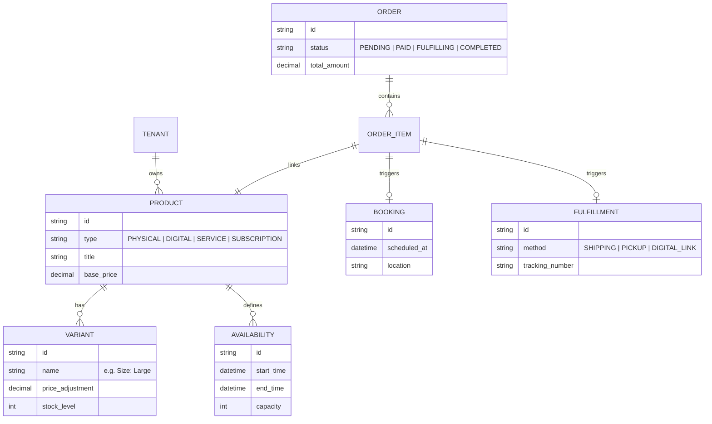

# Issue Brief: Unified Polymorphic Orders (Retail + Services)

## Problem Statement
Solopreneurs often mix physical goods and services. For example, Maya (the baker) sells pre-made cookies (retail) and custom cake consultations (service). Currently, most platforms treat these as separate silos (Shopify for retail, Calendly/ServiceTitan for services). This forces owners to manage two inventory systems, two checkout flows, and two sets of analytics. OHC needs a unified "Polymorphic" order system that handles physical items, digital downloads, and time-based bookings in a single checkout experience.

## Research Report
### Market Audit
- **Shopify**: Excellent retail support. Services require third-party apps like "Appointly" or "Sesami," leading to fragmented UX and high costs ($20+/mo extra).
- **ServiceTitan / Jobber**: Optimized for service dispatch (Carlos's use case), but poor at selling physical products directly via a storefront (Maya/Priya's use case).
- **Wix / Squarespace**: Offer both, but as separate "Apps" (Wix Stores vs. Wix Bookings). They don't support a unified cart where a user can buy a dress AND book a tailoring appointment in one transaction.

### Personas Alignment
- **Maya (Baker)**: Needs to sell "Dozen Cupcakes" (Physical) and "1-hour Decorating Class" (Service).
- **Carlos (Handyman)**: Needs to sell "Sink Repair" (Service) and "Premium Faucet" (Physical Product).
- **Leo (Tutor)**: Sells "Guitar Lessons" (Service) and "Sheet Music PDF" (Digital).

## Design Doc
### High-Level Architecture
The core innovation is a polymorphic `Order` and `Catalog` system. Every item in the catalog is a `Product`, but its `fulfillment_strategy` determines the checkout and post-sale flow.

#### Entity Relationship Diagram (ERD)

### Mobile UX Flow (375px First)
1. **Catalog View**: Unified list showing products and services. Services show a "Book" button; products show "Add to Cart."
2. **Unified Cart**: Displays both cupcakes and the decorating class.
3. **Smart Checkout**: If a service is in the cart, a "Pick your time" step is injected into the flow before payment.
4. **Owner Dashboard**: A single "Upcoming" feed showing both "Pickup: 2 Dozen Cookies (2 PM)" and "Appointment: Kitchen Repair (4 PM)."

## Implementation Prompt
Implement a unified `Order` processing engine that supports polymorphic items. The backend must handle different fulfillment logic based on the product type (Physical, Digital, Service) within a single transaction. Create a Flutter-based unified checkout flow that dynamically injects a scheduling step if the cart contains service-type products. The system must ensure that for services, an entry is created in the `BOOKING` table, and for physical goods, a `FULFILLMENT` record is generated, all linked to the same parent `Order`.

## Priority
P0

## Estimated Scope
Large
