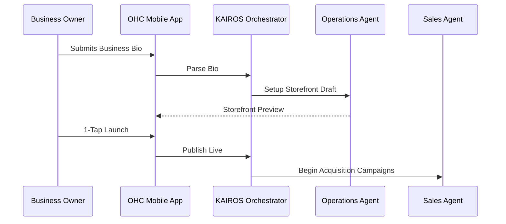

# Title: End-to-End Business Journey Architecture
## Problem Statement
The OHC platform must serve a diverse set of real-world small business owners (Maya, Carlos, Priya, Leo, Fatima). The gap is that currently, the onboarding and growth journeys are fragmented, requiring manual setup that causes high drop-off rates. A cohesive, AI-guided journey is required to move users from zero to a live business in under 10 minutes.

## Research Report
Small businesses require vastly different flows based on their category:
- **Maya (Baker, 28)**: Requires visual-heavy acquisition, simple deposit payments for custom orders, and AI DM management.
- **Carlos (Handyman, 42)**: Needs trust-building portfolio elements, quote generation, and service area definitions.
- **Priya (Boutique, 35)**: Heavily relies on inventory sync, point-of-sale integration, and multi-channel marketing.
- **Leo (Music Tutor, 22)**: Driven by schedule availability, recurring subscriptions, and Zoom/Meet integration.
- **Fatima (Food Cart, 50)**: Needs localized, simple UI, immediate order notifications, and offline-resilience.
Competitors like Shopify and Wix often present a monolithic dashboard that intimidates these users. OHC will instead use an AI-guided chat/wizard to build the business progressively.

## Design Doc
### Architecture Diagram

### UI Wireframes & Mobile UX Flow
- **375px First:** The primary interface is a chat-like feed. Users talk to "The Manager" to add products or adjust availability.
- **Onboarding Wizard:** Starts with a single text box: "Tell me about your business." The AI auto-generates the catalog, theme, and settings.
- **Progressive Disclosure:** Advanced settings (custom domains, complex shipping) are hidden until the user reaches specific milestones.

### AI Agent Integration Points
- **Acquisition:** The Sales Agent drafts social media posts automatically.
- **Activation:** The Operations Agent populates the first 5 products based on a photo of a menu.

### Key Design Decisions
- **Mobile-First Everything:** If it cannot be done on a 375px screen, it is not built.
- **AI as the Interface:** Forms are replaced by conversational inputs and 1-tap approvals.

## Implementation Prompt
**To Implementer Agent:**
Implement the progressive onboarding flow in the mobile application. Create the initial "Business Bio" input component and the backend orchestrator route that parses this text to generate a `DRAFT` storefront. Ensure the UI includes skeleton loaders while the AI generates the catalog. Do not prescribe specific database schemas; focus on the GraphQL/REST API contracts for the mobile client.

## Priority
P0

## Estimated Scope
Large
