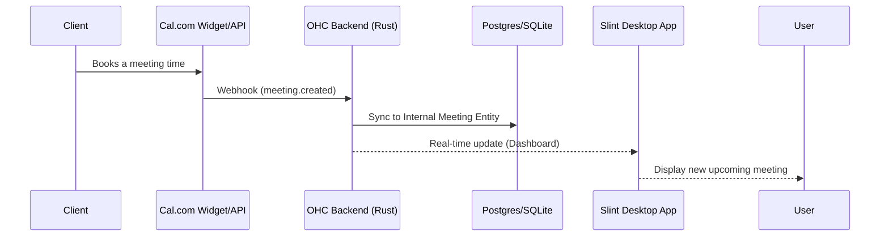

# Cal.com Integration

## Problem Statement
Manually scheduling meetings, dealing with calendar conflicts, and timezone math causes friction and lost bookings for small business owners.

## Research Report
Cal.com provides open-source scheduling infrastructure that handles the complex logic of availability and timezones.
* **Problem Addressed**: Eliminates the back-and-forth emails required to schedule a meeting.
* **User Benefit**: "Automated meeting scheduling with a simple booking link, auto-syncing with Google/Outlook calendars, and automatic timezone detection for your clients."
* **Ease of Use (for non-technical users)**: Very easy. The owner just shares a link, and clients pick a time.
* **Risks & Trade-offs**: Requires users to connect their personal Google or Outlook calendars, which raises privacy expectations.
* **Pricing Estimate**: Free tier available; $12/user/month for team features.
* **Compatibility**: Cloud & Standalone.

## Design Doc
The integration will utilize the Cal.com API to sync bookings into the OHC internal Task/Meeting entities.

## Implementation Prompt
**Outcome**: Implement the Cal.com integration to allow automatic synchronization of calendar bookings into the OHC platform.
**Acceptance Criteria**:
1. Users must be able to link their Cal.com account or embed their booking widget within their OHC-hosted websites.
2. The OHC backend must listen for Cal.com webhooks and automatically generate internal Meeting entities.
3. The UI must display upcoming appointments on the dashboard.
4. If an appointment is canceled via Cal.com, the OHC Meeting entity must be updated accordingly.

## Priority
P1 (High)

## Estimated Scope
Medium
