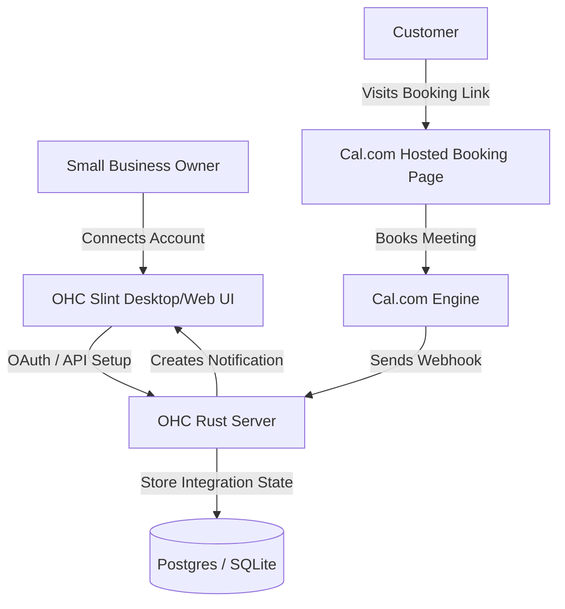

**Title**: Calendar & Scheduling Integration: Cal.com

## Problem Statement
Small business owners—whether they're running an online tutoring service, offering consultations, or managing a local service business—spend too much time coordinating schedules. Manually sending times back and forth over email or WhatsApp is inefficient and prone to double bookings. They need a simple, self-serve booking link that they can send to clients or put on their website, which seamlessly ties into their existing calendars without requiring deep technical setup.

## Research Report
**Tool Evaluated:** Cal.com
**Category:** Calendar & Scheduling
**Overview:** Cal.com is an open-source, highly customizable scheduling platform. It offers a free tier for individuals and premium features for teams ($12/user/month).

**Key Features for Small Businesses:**
*   **Free Individual Tier:** Includes unlimited event types, unlimited calendar connections, and basic email/SMS notifications.
*   **Payment Integration:** Connects with Stripe and PayPal directly from the free tier to charge for bookings.
*   **Built-in Video:** "Cal Video" is included natively, preventing the need to juggle Zoom links.
*   **Ease of Use:** Non-technical owners can easily create a `cal.com/theirbusiness` link, set basic rules (e.g., "no meetings before 10 AM", "30-minute buffer"), and start receiving bookings.

**Environment Compatibility:**
*   **Cloud Mode:** Perfect for a multi-tenant environment via their API and OAuth, or simply by letting users embed their personal Cal.com link on their OHC-hosted sites.
*   **Standalone Mode:** Works perfectly. Cal.com is SaaS, so the local desktop app just acts as the integration point without requiring complex local infrastructure beyond storing the user's API keys or generated links.

**Pros:**
*   Free for individuals (great for solo business owners).
*   Open-source and privacy-focused.
*   Built-in payments and video conferencing.

**Cons:**
*   Setting up advanced team routing (Round Robin) requires the paid tier, which might be too expensive for micro-businesses with a few casual helpers.

## Design Doc

The integration allows a business owner to manage their schedule directly through the One Human Corp (OHC) dashboard.

### High-Level UX Flow:
1.  **Integration Hub:** In the OHC dashboard, the user navigates to the Integration tab and selects "Connect Calendar (Cal.com)".
2.  **Configuration:** The user logs in via OAuth. OHC pulls their active "Event Types" (e.g., "30 Min Consultation").
3.  **Display:** OHC gives the user a clean widget to copy their booking link or generate an embed code for their website.
4.  **Notifications:** When a new booking is made via Cal.com, a webhook notifies the OHC backend, which pushes a notification to the Slint UI: "New booking from John Doe for Tuesday 2 PM."

## Implementation Prompt
**Objective:** Integrate Cal.com so business owners can manage their availability and receive booking notifications within OHC.
**Acceptance Criteria:**
- Create a UI component in Slint that allows users to initiate the Cal.com connection (OAuth or API Key).
- Display a list of the user's active event types with quick "Copy Link" buttons.
- Implement a backend webhook listener to receive "Booking Created" events from Cal.com and display them as notifications in the OHC dashboard.
- Ensure the user interface passes the "Grandmother Test" (e.g., button says "Connect My Calendar", not "Configure Cal.com Webhooks").

## Priority
P1

## Estimated Scope
Medium
