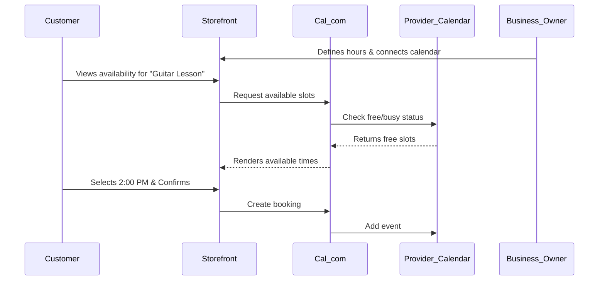

# Zero-Config Booking via Cal.com

## Problem Statement
Leo (Music Tutor) and Carlos (Handyman) waste hours every week going back and forth with clients over text message trying to find a time that works. They need a public booking link on their storefront that automatically reads their personal availability and allows customers to self-serve appointments, eliminating double-booking entirely.

## Research Report
- **Strategy**: Embed Cal.com infrastructure to power native scheduling capabilities.
- **Target Persona**: Service-based businesses (tutors, repairmen, consultants).
- **Advantages**: Cal.com is open-source, robust, handles complex timezone math natively, and prevents double-booking across multiple connected calendars.
- **Risks**: Managing external OAuth tokens for the business owner's personal Google or Outlook accounts.
- **Pricing**: Free tier for individuals; fits well with OHC's target market.
- **Compatibility**:
  - Cloud: SaaS integration.
  - Standalone: Self-hosted instance or direct API calls.

## Design Doc
- **User Experience Flow**:
  1. Business owner creates a "Service" product in OHC (e.g., "1 Hour Guitar Lesson").
  2. The AI Manager prompts the user to connect their personal Google/Outlook calendar.
  3. User defines their general working hours (e.g., 9 AM - 5 PM).
  4. The OHC storefront generates a booking widget dynamically using Cal.com's embed features.
  5. Customers view available slots and book. The event instantly appears on both the customer's and the business owner's calendars.
- **AI Integration**: The "Operations Agent" monitors the calendar and proactively warns the business owner if they are overbooked or lack transition time between on-site jobs.

### Mobile UX Flow
| Screen | Description |
|---|---|
| Service Setup | Toggle: "Require Booking". "Connect Calendar" button. |
| Calendar Settings | Simple sliders for working hours. List of connected personal calendars to check for conflicts. |
| Customer View | Clean date picker, followed by available time slots. Confirmation screen. |

## Implementation Prompt
Embed Cal.com's scheduling infrastructure to allow merchants to sync their personal calendars and provide a seamless public booking widget on their storefront. The solution must handle timezone conversions automatically and prevent double-booking.

- **Acceptance Criteria**: Merchant can connect a personal calendar. Customer can view accurate availability and book a slot. Event syncs to both parties' calendars.
- **Priority**: P0
- **Estimated Scope**: Medium
