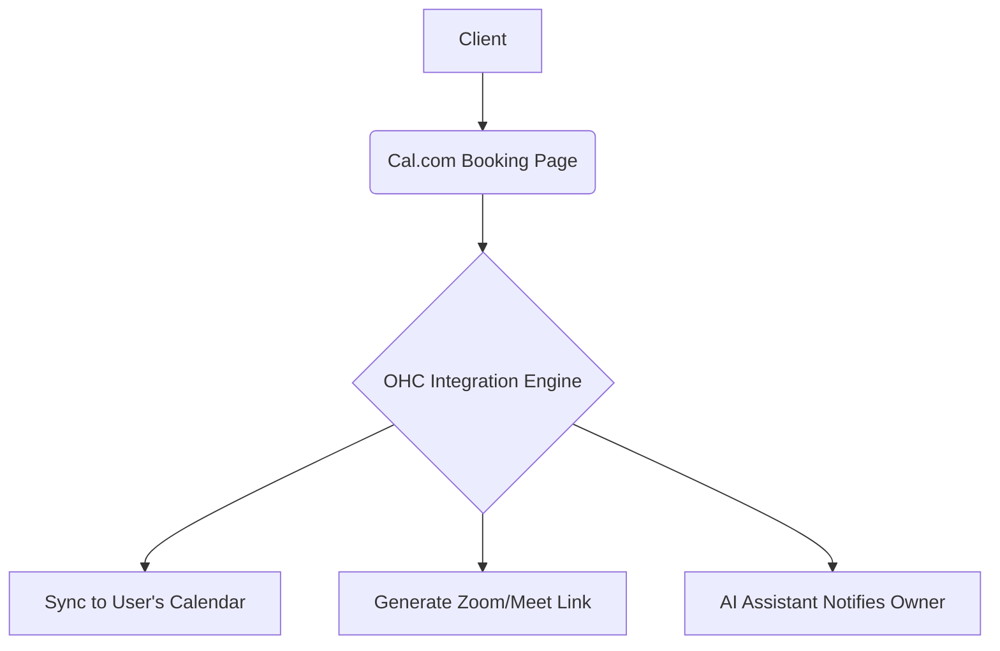

## [Calendar] Issue Brief: Cal.com Integration for Scheduling

**Title**: Scout 🔍: Integrate Cal.com for Automated Meeting Generation
**Problem Statement**:
Small business owners like Sarah (Freelance Consultant) spend too much time going back and forth over email or text trying to find a suitable time to meet with clients. They need a simple, professional way for clients to book consultations, seamlessly syncing with their existing calendar without double booking.
**Research Report**:
- **Tool**: Cal.com
- **Evaluation**: Cal.com provides an open-source, customizable scheduling infrastructure. It handles timezone conversions, calendar conflict resolution (Google, Outlook, Apple), and automatic video link generation.
- **Ease of Use**: Excellent. Users just share a link, and clients pick a time.
- **Pricing**: Free for individuals; affordable team plans. Open-source version available.
- **Cloud vs. Standalone**: Works well in both. The open-source nature means OHC could potentially self-host it or deeply integrate it for Standalone mode, though Cloud API is more straightforward for multi-tenant.
**Design Doc**:

- A user sets their availability in OHC, which pushes to Cal.com.
- OHC provides a customized booking link to the user.
- Clients book times via the link.
- OHC receives the webhook, updates the internal CRM, and notifies the AI agent to prepare for the meeting.
**Implementation Prompt**:
Integrate Cal.com API to allow seamless appointment scheduling. Build a UI for users to connect their calendars and define availability rules. Use Cal.com's webhooks to capture newly booked, rescheduled, or canceled meetings and reflect these changes in OHC's internal calendar and CRM systems. Ensure the AI assistant provides daily briefing summaries of upcoming appointments.
**Priority**: P1
**Estimated Scope**: Medium
