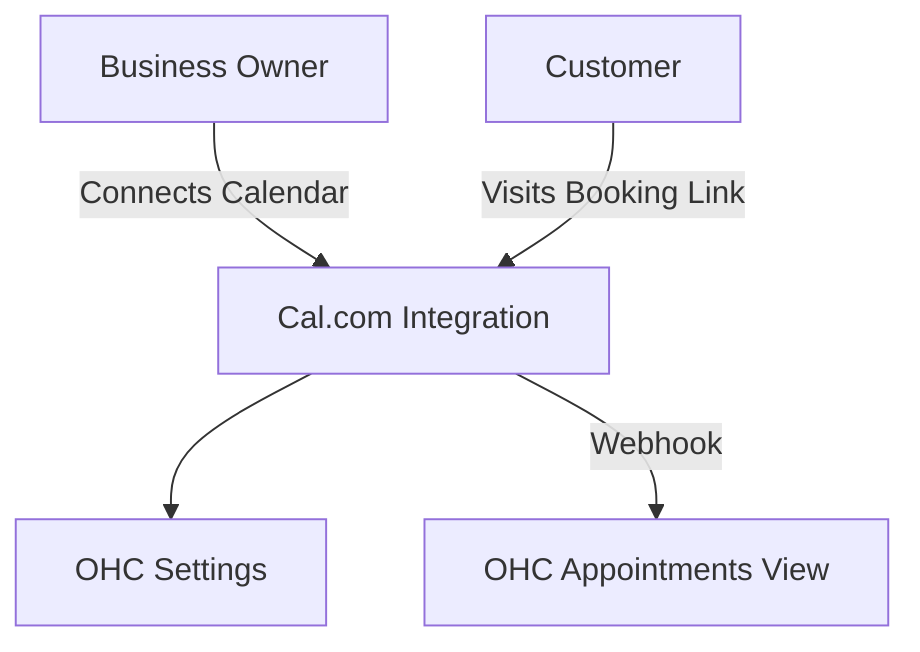

# Calendar & Scheduling: Cal.com

## Problem Statement
Small business owners spend too much time going back and forth via email or text to find a suitable meeting time with clients for consultations, lessons, or services. Double-booking is a constant fear, and managing timezones can be confusing.

### Persona-Specific Pain Point Summary
- **Tutor (Sarah):** "I accidentally booked two students at the same time because I forgot to update my paper calendar."
- **Consultant (Carlos):** "Sending 'when are you free' emails takes up 20% of my week."

## Research Report
**Tool:** Cal.com
**Ease of Use:** Open-source alternative to Calendly. Very easy for non-technical users to set up event types and share a link. (Source: GitHub, Product Hunt reviews)
**Pricing:** Free for individuals. Team pricing available. Self-hosting is an option (great for Standalone).
**Reputation:** Strong developer community, excellent privacy focus.
**Cloud/Standalone:** Excellent for both. Cal.com has a hosted Cloud version and can be self-hosted, aligning perfectly with OHC's Cloud/Standalone hybrid model.

### Comparative Table
| Feature | Cal.com | Calendly | OHC Fit |
|---|---|---|---|
| Self-Hosted | Yes | No | Excellent |
| Open Source | Yes | No | Good |
| Free Tier | Individuals Free | Basic Free | Essential |

## Design Doc
### Architecture

### UX Flow
1. User navigates to "Appointments" -> "Setup Scheduling".
2. User authenticates with Google Calendar or Outlook (via Cal.com infrastructure).
3. User generates a booking link (e.g., `cal.com/ohc-user/30min`).
4. Booked appointments automatically appear in the OHC Dashboard Calendar view.

## Implementation Prompt
Integrate Cal.com scheduling capabilities. Add a "Scheduling" tab where users can connect their primary calendar. OHC should display their personalized booking link that they can copy and send to clients. When a client books a slot, OHC should listen to the webhook and display the upcoming appointment in the dashboard's "Upcoming" widget.

## Priority
P1

## Scope
Medium
