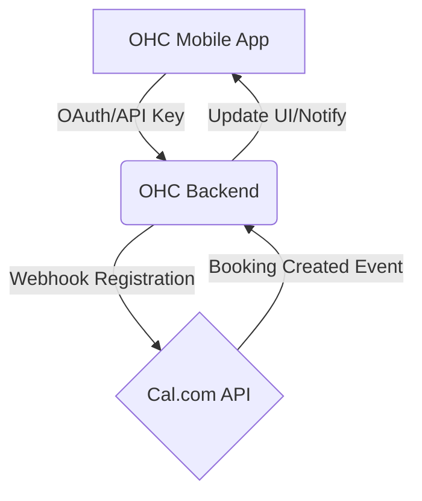

# [Calendar] Cal.com Integration

## Problem Statement
Small business owners like Fatima, who offer online consultations, tutoring, or professional services, struggle with managing appointments. Back-and-forth emails to find a suitable time are inefficient and unprofessional. Existing tools like Google Calendar are meant for personal use, not professional scheduling with clients. There is a strong need for an automated scheduling system that handles timezone differences, prevents double-booking, and integrates smoothly with their daily workflows, without requiring them to become technical experts.

## Research Report
### Market Evaluation
- **Cal.com**: Open-source, highly customizable scheduling platform. It offers a generous free tier for individuals (perfect for our target demographic) and a paid tier starting around $12/user/month for teams.
- **Calendly**: The industry leader, but closed-source and can become expensive quickly for premium features.
- **Acuity Scheduling**: Often seen as too complex and integrated heavily into Squarespace.

### Findings
Cal.com is uniquely positioned for OHC users because:
1. **Cloud & Standalone Support**: Being open-source, it seamlessly aligns with OHC's hybrid architecture. It can be easily integrated via API in Cloud mode and potentially self-hosted or bridged via webhooks in Standalone mode.
2. **Ease of Use**: The interface is clean, modern, and easily understood by non-technical users.
3. **Customization**: Offers a white-label approach which helps small business owners maintain their brand identity.

### Comparison Table
| Feature | Cal.com | Calendly | Importance for OHC Users |
| :--- | :--- | :--- | :--- |
| **Pricing (Individual)** | Free | Free (Limited) | High - Keeps costs low |
| **Open Source** | Yes | No | High - Aligns with OHC Standalone Mode |
| **White-labeling** | Strong | Paid only | Medium - Professional appearance |
| **Ease of Setup** | High | High | High - Non-technical users |

## Design Doc

### Mobile UX Flow
1. **Trigger**: User navigates to the "Settings" > "Integrations" screen on the OHC mobile app.
2. **Action**: User selects "Connect Calendar (Cal.com)".
3. **View**: A simple webview or deep link prompts the user to log in to Cal.com or create a free account.
4. **Result**: Upon successful connection, the user sees a "Calendar Connected" success screen with a toggle to "Auto-generate meeting links for new appointments."
5. **Daily Use**: When viewing an appointment in OHC, a "Share Booking Link" button allows them to send their personal Cal.com link via SMS or Email directly from the app.

### Architecture (High-Level)

### Integration Points
- **Settings**: A centralized integrations hub for connecting the account.
- **Inbox/CRM**: Contact views will feature a "Send Booking Link" quick action.
- **Dashboard**: Upcoming appointments fetched from Cal.com will appear in the daily agenda view.

## Implementation Prompt
**Outcome**: A small business owner should be able to connect their Cal.com account to OHC with 2-3 taps. Once connected, they can generate and share booking links from within their customer chats, and any bookings made via Cal.com will automatically appear on their OHC dashboard.
**Acceptance Criteria**:
- A new integration card for Cal.com exists in the Integrations screen.
- The user can authorize OHC to access their Cal.com account.
- Webhooks are established so OHC is notified of new bookings.
- New bookings are displayed on the user's daily dashboard.
- The workflow must be flawless on a 375px mobile viewport, utilizing premium visual tokens (Glassmorphism, clean typography).

## Priority
`P1` (High) - Scheduling is a core revenue-driving activity for service-based businesses.

## Estimated Scope
Medium
