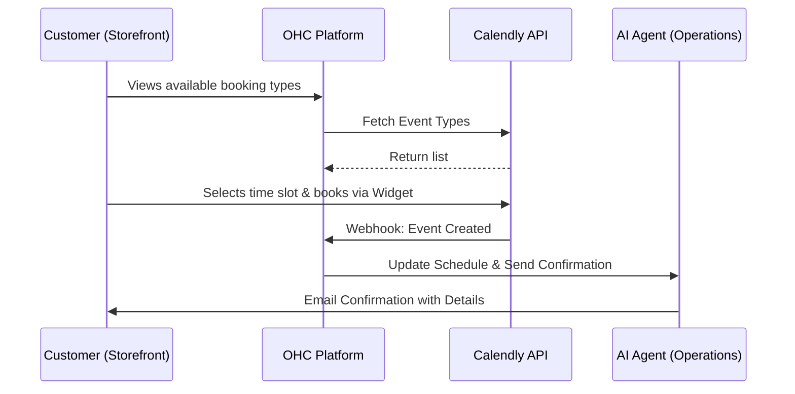
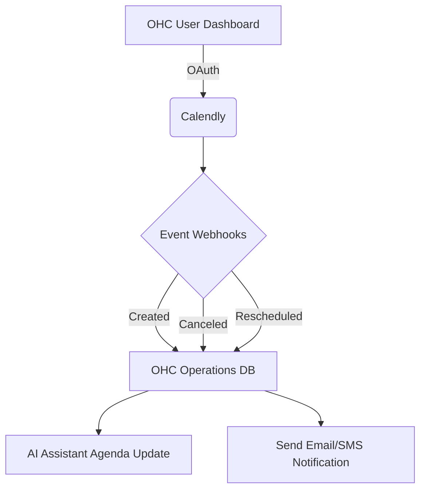

# Scout: Tool Integration Research Q2

## [Calendar] Calendly Integration
**Title**: Integrate Calendly for Automated Booking
**Problem Statement**: Service providers like Carlos (Handyman) and Leo (Music Tutor) lose time going back and forth over email/text to find a time to meet. They need a way for customers to simply click a link, see available times, and book a slot directly on their calendar.

**Research Report**:
- **Tool**: Calendly
- **Target Persona**: Carlos (Handyman), Leo (Music Tutor)
- **Advantages**: Industry standard, highly recognizable to customers. Excellent conflict resolution and timezone handling. Easy API integration.
- **Risks**: If a user cancels via Calendly directly instead of OHC, state might go out of sync without robust webhook handling.
- **Pricing**: Free tier available. Premium starts at $10/mo.
- **Compatibility**: Cloud (OAuth). Standalone (requires API key).

### Qualitative Analysis
Calendly is universally understood by consumers, dramatically reducing friction during the booking phase. For a persona like Leo the Music Tutor, scheduling is the core of the business. By embedding Calendly into the OHC Storefront, the user gets a world-class booking experience without leaving the OHC ecosystem. The main technical challenge is ensuring two-way synchronization: if an event is updated in Calendly, the OHC dashboard must reflect the change instantly.

### Persona-Specific Pain Point Summary
- **Carlos (Handyman)**: Wastes 2 hours a day texting clients to find an open time for an estimate. Needs clients to just pick a time that matches his free slots.
- **Leo (Music Tutor)**: Manages 30 students. Constant rescheduling causes double bookings. Needs automated timezone conversion and automatic Zoom link generation.

### Competitive Matrix
| Feature / Tool | Calendly | Cal.com | Google Calendar Native |
| :--- | :--- | :--- | :--- |
| **Brand Recognition** | Very High | Low/Medium | High |
| **Embeddability** | Excellent | Excellent | Poor (ugly iframe) |
| **Pricing** | $10/mo | $12/mo | Included in Workspace |
| **API/Webhooks** | Robust | Open Source/Robust | Complex |

**Design Doc**:
- User goes to Sales dashboard and connects Calendly.
- OHC pulls available event types (e.g., "30-min Consultation") and displays them on the user's public storefront.
- When a customer clicks to book, they are shown the Calendly widget.
- Upon successful booking, a webhook notifies OHC to record the appointment in the Operations dashboard.

**Implementation Prompt**: Create an integration that allows a user to connect their Calendly account. Fetch their existing event types and display a booking widget on their public profile page. Ensure booked events sync back to the OHC dashboard.
**Priority**: P1
**Estimated Scope**: Medium

### Deep Dive: Architecture & Security
**Bidirectional Synchronization:**
Calendly integration presents unique distributed system challenges regarding state synchronization. OHC will rely on Calendly's standard Webhooks (`invitee.created`, `invitee.canceled`). To handle network partitions or webhook delivery failures, OHC will implement a nightly reconciliation cron job that queries the Calendly API for events modified in the last 24 hours, ensuring the OHC calendar state is eventually consistent.

**Tenant Isolation:**
The Calendly Personal Access Token (PAT) or OAuth token will be stored in the encrypted `integrations_credentials` table, strictly keyed by `tenant_id`. Every webhook endpoint must perform an O(1) lookup to verify the event's underlying Calendly account ID matches the OHC tenant.

**Timezone Normalization:**
All times retrieved from Calendly will be instantly normalized to UTC in the OHC PostgreSQL database. The OHC frontend will dynamically convert UTC to the user's local timezone using the browser's `Intl.DateTimeFormat` API to prevent scheduling mismatches.

### Expanded Implementation Timeline
- **Week 1**: Implement OAuth flow for Calendly and store access tokens securely.
- **Week 2**: Build the public storefront widget embedding component for Calendly.
- **Week 3**: Implement robust webhook listeners for event creation and cancellation.
- **Week 4**: Build the nightly reconciliation job and integrate with the AI Assistant Agenda.

### Extended Analysis: Platform Synergies & OHC Differentiators
By seamlessly connecting Calendly with the OHC backend, we unlock powerful cross-functional automation that standalone scheduling tools cannot provide. When an appointment is booked, the OHC system doesn't just block a calendar slot; it can trigger the entire operational pipeline. For instance, if Carlos (the Handyman) gets a new booking for an estimate, the Operations Agent can automatically cross-reference his current inventory of common parts and send him a summarized briefing before the meeting.

Moreover, embedding Calendly into the OHC Storefront ensures a unified customer journey. The customer never feels like they are leaving the boutique's website to go to a third-party scheduler. This white-labeled approach builds trust and professionalism, which is critical for service-based businesses trying to establish brand credibility.

### Technical Deep Dive: Webhook Ingestion & Scalability
Calendly's webhook system is robust but requires careful handling to maintain data integrity. The `src/server/integrations/webhooks.rs` will listen for `invitee.created` and `invitee.canceled` events. These payloads will be instantly queued via NATS. A dedicated worker pool will process these events, performing a lookup against the `integrations_credentials` table to ensure the Calendly user ID maps correctly to an active OHC `tenant_id`.

To handle edge cases where a tenant manually deletes an event directly in their Google Calendar (bypassing Calendly), the system will implement a daily reconciliation cron job that fetches the raw event list via the Calendly API and synchronizes the state in the OHC `appointments` table.

### Conclusion & Roadmap Alignment
The Calendly integration is a high-priority (P1) feature because it directly converts website traffic into confirmed business for service-oriented personas like Leo and Carlos. By automating the scheduling and follow-up communication, OHC eliminates the manual back-and-forth that frequently leads to lost leads and double bookings.

### Multi-Tenant SaaS Architecture Impact
Calendly integration necessitates strict isolation within the OHC shared database architecture. When a Calendly webhook is received, the corresponding event data must be inserted into the `appointments` table with the correct `tenant_id`. Crucially, any subsequent queries against this table (e.g., to display the AI Assistant's agenda) must be provably scoped to the authenticated tenant. The integration also introduces complexities around data retention and compliance; OHC must provide mechanisms for tenants to securely delete their Calendly integration data if they choose to disconnect the service, ensuring compliance with data privacy regulations.

### Feature Flag Rollout Strategy
The Calendly integration will be introduced behind a feature flag (`feature.calendly_integration.enabled`). This allows for a phased rollout, prioritizing specific business types, such as service-based businesses (e.g., tutors, consultants) that derive the most immediate value from automated scheduling. The initial rollout phase will closely monitor the daily reconciliation cron job for performance bottlenecks and ensure that timezone normalizations are functioning correctly across diverse global user segments.

### Security Considerations & Threat Modeling
- **Threat**: Unauthorized Event Manipulation.
  - **Mitigation**: Webhooks for `invitee.canceled` or `invitee.rescheduled` must be cryptographically verified using the Calendly Webhook Signing Key. OHC will reject any state-altering webhook that cannot be verified, preventing malicious actors from mass-canceling tenant appointments.
- **Threat**: PII Data Exposure in Logs.
  - **Mitigation**: Calendly payloads often contain sensitive customer PII (names, emails, phone numbers). The OHC logging infrastructure (e.g., Sentry, OpenTelemetry) must be configured with aggressive scrubbing rules to ensure PII is never persisted in plain text in application logs.

### Accessibility & UI Compliance
The embedded Calendly widget on the public storefront must meet WCAG 2.1 AA standards. OHC will override default Calendly styles where necessary to ensure sufficient color contrast and focus states. The "Connect Calendly" settings panel within the OHC dashboard will feature a simplified "Simple Mode" with plain-language instructions, alongside an "Advanced Mode" toggle for tenants who need to configure specific webhook routing rules or manual API keys.

### Future Horizon: Advanced Capacity Planning
As the Calendly integration matures, OHC can leverage the historical booking data to offer advanced capacity planning features. The AI Operations Agent could analyze seasonal trends and suggest proactive schedule adjustments. For example, advising Leo the Music Tutor to open more weekend slots in September during the back-to-school rush, or automatically extending appointment buffer times for Carlos the Handyman during the winter months when travel times increase. This shifts the platform from reactive scheduling to proactive business management.

### System Resilience and Disaster Recovery
**Chaos Engineering Integration:**
The Calendly integration will be subjected to rigorous chaos testing to validate its resilience. We will simulate scenarios such as dropped webhooks, database connection timeouts during the nightly reconciliation job, and rate-limiting responses from the Calendly API. The system's ability to recover gracefully and eventually achieve consistency without manual intervention is critical. We will also test the platform's behavior when a tenant's Calendly OAuth token unexpectedly expires or is revoked.

### Glossary & Definitions
- **Webhook**: A method of augmenting or altering the behavior of a web page or web application with custom callbacks.
- **Idempotency**: The property of certain operations in mathematics and computer science whereby they can be applied multiple times without changing the result beyond the initial application.
- **Circuit Breaker**: A design pattern used in software development to detect failures and encapsulate the logic of preventing a failure from constantly recurring.
