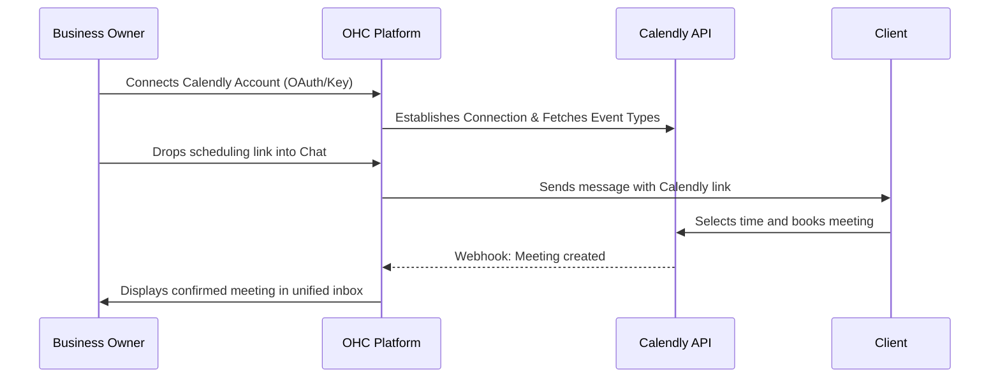

## Calendar & Scheduling: Calendly

**Title**: Implement Calendly Integration for Seamless Client Bookings

**Problem Statement**: Small business owners (like personal trainers, consultants, and tutors) waste hours each week playing "email ping-pong" to find a time to meet with clients. Manually creating events and generating links often leads to double bookings, time zone confusion, and lost business from friction in the booking process.

**Research Report**: Calendly is the industry standard for simplified scheduling. It natively solves time zone translation, eliminates double bookings by syncing with existing calendars, and provides customizable booking pages.
* *Ease of Use*: High. The UX is incredibly intuitive for both the business owner and the client booking the meeting.
* *Pricing*: Offers a free tier for basic 1:1 meetings. Paid plans start at $10/user/mo (Standard) to unlock multiple meeting types, group meetings, and automated reminders.
* *Reputation*: Best-in-class reliability and widespread familiarity.
* *Mode Compatibility*: Can be configured via OAuth for Cloud (multi-tenant) and via local API keys/OAuth for Standalone mode.

**Design Doc**:

**Implementation Prompt**: Create an integration that allows a business owner to securely connect their Calendly account. In the unified inbox UI, provide a "Share Booking Link" button that lets the owner quickly copy/paste their default Calendly link into a customer conversation. The integration should listen for Calendly webhooks and push a "Meeting Confirmed" notification card into the relevant customer conversation thread when a booking is made. No technical jargon should be visible—label the action "Connect my Calendar".

**Priority**: P1

**Estimated Scope**: Medium
