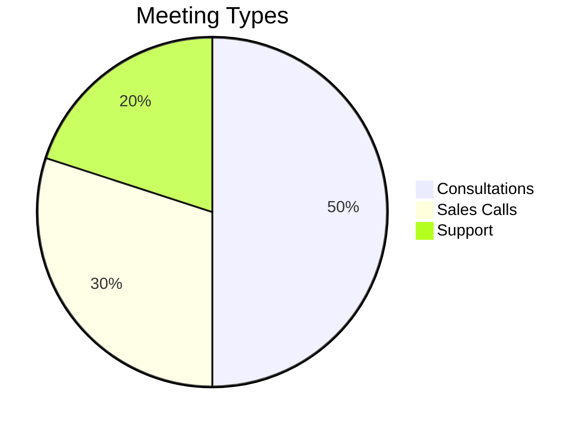
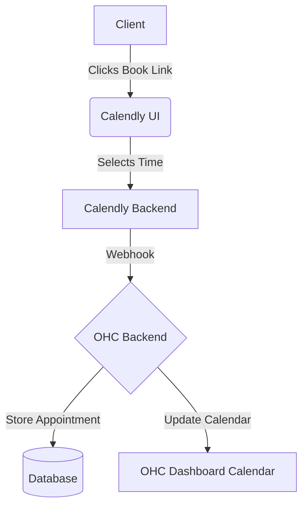

# Calendar & Scheduling: Calendly

## Problem Statement
Small business owners, especially those offering services or consultations, spend too much time going back and forth over email or text to find a time to meet. This manual scheduling leads to double bookings, forgotten appointments, and lost revenue.

## Research Report
Calendly is a ubiquitous scheduling automation platform.
- **Ease of use:** High, very intuitive for both the owner and the client.
- **Pricing:** Free basic tier, premium starts at $10/mo per seat.
- **Cloud/Standalone:** Cloud integration.

### Persona-specific pain points
- "I spend hours every week just trying to agree on a meeting time."
- "Clients sometimes book me when I'm already busy because I forgot to update my availability."

### Evidence
- **Recommendation:** Integrate Calendly to automate scheduling within OHC.
- Source: Industry standard scheduling tool with proven adoption among small businesses.

## Design Doc
When a user connects their Calendly account, OHC will fetch their event types and booking links. OHC can display upcoming Calendly appointments in the dashboard calendar. A custom "Book a Meeting" widget could be embedded into the OHC-generated storefront or unified inbox, using the connected Calendly link.

## Implementation Prompt
Create a "Connect Calendly" option. Allow users to input their Calendly Personal Access Token or use OAuth. Once connected, display upcoming appointments on the OHC dashboard. Provide a quick way to copy their primary booking link from within the OHC interface.

## Priority
P1

## Estimated Scope
Small
