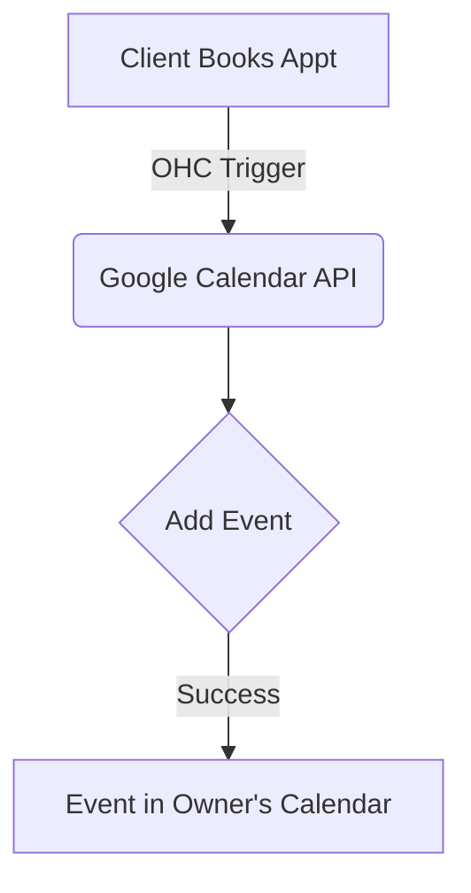

# [Calendar] Google Calendar Sync
## Problem Statement
Small business owners manually copy appointments between their personal calendar and their business booking system, leading to double-bookings and missed meetings.

## Research Report
- **Tool Evaluated**: Google Calendar API
- **Ease of Use**: Extremely familiar to users; OAuth flow is standard.
- **Pricing**: Free tier is very generous; basically free for small businesses.
- **Reputation**: Ubiquitous.
- **Cloud & Standalone**: Works in both, though OAuth redirect handling requires a cloud proxy for strict standalone modes.

### Pain Points Solved
- Eliminates double booking.
- Automatically blocks out personal time.

| Calendar Tool | Adoption Rate | API Ease |
| :--- | :--- | :--- |
| Google Calendar | Very High | High |
| Outlook Calendar| Medium | Medium |
| Apple Calendar | Low | Low |

## Design Doc
- **Integration**: OAuth 2.0 flow initiated from user settings.
- **Triggers**: Webhook on calendar event changes, and sync on OHC appointment creation.
- **User Flow**: User clicks "Connect Google Calendar", authorizes, and immediately sees their OHC appointments in Google Calendar.

## Implementation Prompt
Implement a Google Calendar integration where a user can authenticate their account. Once connected, new bookings should automatically appear on their Google Calendar, and existing Google events should block out availability in their booking page.

## Priority
P0

## Estimated Scope
Large
