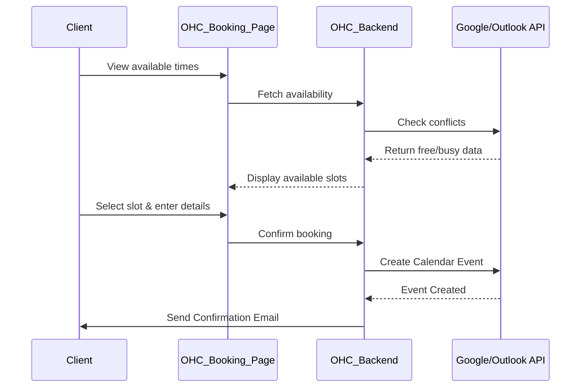

# [Calendar] Smart Scheduling & Sync

## Title
Enable Google Calendar and Outlook Integration for Automated Booking

## Problem Statement
As a small business owner offering services or consultations, I spend way too much time going back and forth with clients trying to find a time that works. When I do book something, I sometimes forget to add it to my personal calendar, leading to embarrassing double-bookings. I need a way for clients to just pick an available time themselves, which automatically blocks out time on my actual daily calendar without me doing anything.

## Research Report
**Tools Evaluated:** Cronofy, Nylas, Cal.com API, Direct Google/Microsoft APIs.

- **Cal.com API:** Open-source scheduling infrastructure.
  - *Ease of Use:* Very high for the end user. They just share a link.
  - *Pricing:* Generous free tier for individuals; API pricing is reasonable for platforms.
  - *Reputation:* Excellent, modern, developer-friendly.
  - *Cloud vs Standalone:* Strong support for both. Standalone users can even self-host the Cal.com instance if desired, or use the public API.
- **Nylas / Cronofy:** Enterprise-grade email/calendar aggregators. Powerful but expensive, and their UIs are more geared towards enterprise tools rather than simple SMB needs.
- **Direct APIs (Google/Microsoft):** Free, but handling the complexity of recurring events, timezones, and conflict resolution across different calendar providers is extremely high overhead to maintain.
- **Recommendation:** Use Cal.com's infrastructure or direct Google Workspace API for a simpler V1. Given the requirement for simplicity, building a native "Booking Page" powered by Google Calendar OAuth might be the fastest path to value for the majority of our users.

## Design Doc
A new "Scheduling" tab in the OHC dashboard.
- **Trigger:** The business owner connects their Google or Outlook account.
- **Action:** OHC creates a unique, public-facing booking URL (e.g., `ohc.app/book/my-business`).
- **User View:** The owner sees a calendar view showing their existing events (greyed out) and can set their "Working Hours". Clients visiting the link see available slots converted to their local timezone. When booked, an event is instantly added to the owner's Google/Outlook calendar and a confirmation email is sent to both.

## Implementation Prompt
Create a "Scheduling" feature that allows users to link their Google Calendar via a simple "Connect my Calendar" button. Once connected, generate a shareable public booking page. The booking page must read the user's availability in real-time to prevent double-booking and handle timezone conversions automatically for the viewer. When a client books a slot, the system must create an event on the owner's connected calendar and trigger confirmation notifications. Keep the settings simple: just working hours and meeting duration.

## Priority
P0

## Estimated Scope
Medium
