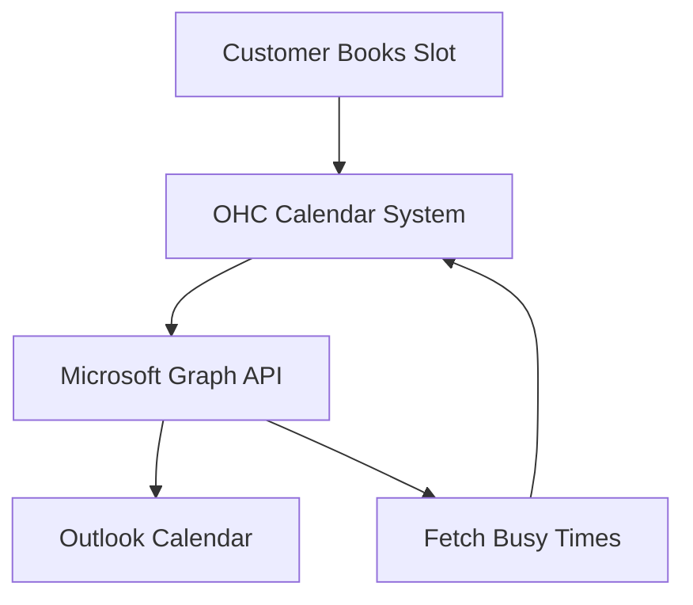

## [Calendar] Issue Brief: Outlook Calendar Sync

**Title**: Scout 🔍: Native Microsoft Outlook Calendar Integration
**Problem Statement**:
Many traditional small businesses run entirely on Microsoft Office 365 and Outlook. They need native booking synchronization without switching providers.
**Research Report**:
- **Tool**: Microsoft Graph API.
- **Evaluation**: Critical for capturing established small business segments.
- **Ease of Use**: Single-click OAuth sign-in to Microsoft.
- **Pricing**: Free API usage.
- **Cloud vs. Standalone**: Works in both Cloud and Standalone environments.
**Design Doc**:
- User navigates to "Sales" -> "Calendar Sync".
- Selects "Microsoft Outlook" and authenticates.
- OHC reads availability and blocks off busy times on the booking page.
- New appointments are pushed directly to the Outlook Calendar.

**Implementation Prompt**:
Integrate Microsoft Graph API to support Outlook Calendar. Provide an OAuth connection flow. Ensure the OHC booking widget respects Outlook free/busy times.
**Priority**: P1
**Estimated Scope**: Medium
