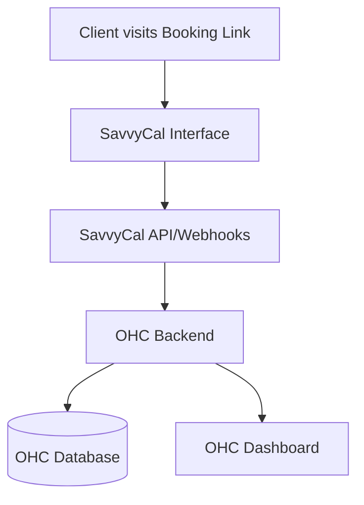

# Research: Calendar & Scheduling Integration with SavvyCal

## Title
Integrate SavvyCal for Streamlined Appointment Booking

## Problem Statement
Small business owners, especially consultants, freelancers, and service providers, lose significant time going back-and-forth over email or text to find a meeting time that works for everyone. Existing tools can feel impersonal or clunky. They need a simple, professional way to share their availability and let clients book appointments automatically, avoiding double-bookings.

## Research Report
SavvyCal is a modern scheduling tool designed to make finding a time to meet collaborative and easy.
- **Ease of Use**: SavvyCal excels in user experience. It offers a unique "Calendar Overlay" feature that allows recipients to overlay their own calendar on top of the sender's link, making it incredibly easy to spot mutual free time. The interface for creating links and setting availability is clean and intuitive.
- **Pricing**: Pricing starts at $12/user/month (Basic) which includes unlimited calendars and links. The Premium plan ($20/user/month) adds custom domains and paid bookings (via Stripe). There is no permanent free tier, only a trial.
- **Reputation**: It is highly regarded by users for its modern design and focus on reducing the friction of scheduling, often cited as a more recipient-friendly alternative to tools like Calendly.
- **Environment Support**: SavvyCal is a cloud-based SaaS product. Integration relies on their webhooks and API. It is well-suited for Cloud environments. For Standalone modes, it requires internet access to connect to the SavvyCal API.

## Design Doc
The integration will embed SavvyCal's booking experience into the OHC platform and sync appointment data.
1.  **Configuration**: The business owner connects their SavvyCal account via OAuth within the OHC settings.
2.  **Link Generation/Embedding**: OHC can automatically fetch the user's active scheduling links and allow them to easily embed a booking widget on their OHC-hosted storefront or share links via the OHC inbox.
3.  **Event Sync**: Webhooks from SavvyCal will notify OHC when a new meeting is booked, rescheduled, or canceled.
4.  **Dashboard Display**: Upcoming appointments will be displayed on the business owner's daily OHC dashboard.

## Implementation Prompt
Integrate SavvyCal to handle appointment scheduling. Provide a settings page where users can authenticate with their SavvyCal account. Once connected, display their upcoming appointments on the main OHC dashboard by listening to SavvyCal webhooks for new bookings and cancellations. Allow the user to easily copy their primary scheduling link or generate a generic embed code directly from the OHC interface to share with clients. Ensure graceful error handling if the SavvyCal API is unreachable.

## Priority
P1

## Estimated Scope
Medium
