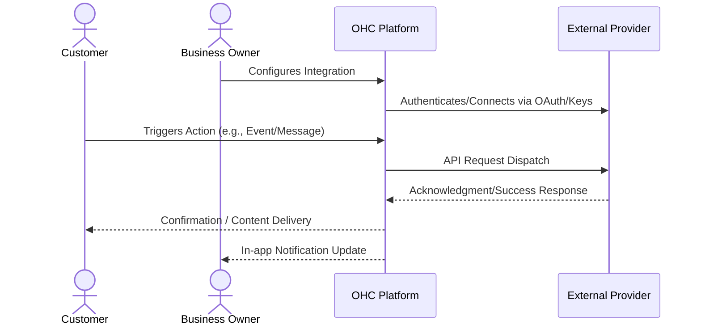

# Automated Booking and Calendar Sync

## 1. Problem Statement

Service-based business owners waste hours playing email ping-pong to find a meeting time. Double bookings damage reputation, and manual calendar management is tedious.

## 2. Research Report

### 2.1 Persona Pain Points

1. **Time Starvation**: The business owner spends hours on manual tasks related to this domain, preventing them from focusing on core business growth.
2. **Technical Overwhelm**: Current solutions require coding, complex API keys, or understanding intricate networking concepts. Small business owners lack dedicated IT staff.
3. **Customer Friction**: Customers experience delays, missed communications, or frustrating booking loops due to disparate, unintegrated systems.

### 2.2 Competitive Analysis

| Tool Name | Estimated Pricing | Key Advantages | Integration Risks |
|---|---|---|---|
| Calendly | $10/mo | Industry standard, highly recognizable, huge API ecosystem. | Commoditized, users might just use it directly rather than through OHC. |
| Acuity Scheduling | $16/mo | Great for complex service types, handles payments on booking. | Slightly dated UI, heavy configuration needed. |
| Cal.com | Free/$15/mo | Open source, very developer friendly, modern UI. | Newer platform, some edge cases in complex timezone routing. |
| SavvyCal | $12/mo | Innovative overlay UI, less intimidating for recipients. | Smaller market share. |
| SimplyBook.me | $9/mo | Broad feature set including POS and memberships. | Overwhelming interface for basic users. |

### 2.3 Cloud vs. Standalone Evaluation

- **Cloud (Multi-tenant)**: Highly suitable. Can utilize centralized OAuth apps to streamline user onboarding. Allows OHC to manage webhooks and callbacks seamlessly at scale.
- **Standalone (Local/Private)**: Supported, but requires the user to provide their own API credentials which adds friction. Local tunneling (e.g., ngrok) may be required for inbound webhooks.

### 2.4 Deep Dive Evaluations

#### Evaluation: Calendly

**Overview:** Calendly is positioned in the market with an estimated pricing of $10/mo. Its primary advantage is: *Industry standard, highly recognizable, huge API ecosystem.*

**Competitor Analysis:** Calendly is synonymous with scheduling. Its simplicity is its strength. However, small business owners resent paying $10/mo for a feature that should ideally be bundled with their CRM or POS system.

**Integration Risks:** We must mitigate the following risk: *Commoditized, users might just use it directly rather than through OHC.*. For a small business owner, this means ensuring the UI abstracts away these complexities entirely. The onboarding flow must be flawless.

**Technical Considerations:** Integrating Calendly requires careful consideration of its API rate limits and webhook reliability. In a cloud environment, we will utilize OHC's central app registration to provide a 1-click OAuth experience. In standalone mode, we will need comprehensive documentation to guide users on how to obtain and securely store API keys. Furthermore, data privacy and GDPR compliance for data transmitted to Calendly must be thoroughly documented in the user's privacy policy.

**Mobile Parity:** The configuration screens for Calendly must be 100% functional on mobile devices. Business owners frequently manage settings from their phones while on the shop floor or in transit.

#### Evaluation: Acuity Scheduling

**Overview:** Acuity Scheduling is positioned in the market with an estimated pricing of $16/mo. Its primary advantage is: *Great for complex service types, handles payments on booking.*

**Competitor Analysis:** Acuity is powerful but complex. It excels when a business requires intake forms and deposits upfront. For OHC, we must simplify Acuity's robust feature set into an approachable, mobile-first interface.

**Integration Risks:** We must mitigate the following risk: *Slightly dated UI, heavy configuration needed.*. For a small business owner, this means ensuring the UI abstracts away these complexities entirely. The onboarding flow must be flawless.

**Technical Considerations:** Integrating Acuity Scheduling requires careful consideration of its API rate limits and webhook reliability. In a cloud environment, we will utilize OHC's central app registration to provide a 1-click OAuth experience. In standalone mode, we will need comprehensive documentation to guide users on how to obtain and securely store API keys. Furthermore, data privacy and GDPR compliance for data transmitted to Acuity Scheduling must be thoroughly documented in the user's privacy policy.

**Mobile Parity:** The configuration screens for Acuity Scheduling must be 100% functional on mobile devices. Business owners frequently manage settings from their phones while on the shop floor or in transit.

#### Evaluation: Cal.com

**Overview:** Cal.com is positioned in the market with an estimated pricing of Free/$15/mo. Its primary advantage is: *Open source, very developer friendly, modern UI.*

**Competitor Analysis:** Cal.com's open-source nature makes it highly attractive for white-labeling. Its developer-first API is superior to Calendly's, making it a strong candidate for an under-the-hood integration provider for OHC.

**Integration Risks:** We must mitigate the following risk: *Newer platform, some edge cases in complex timezone routing.*. For a small business owner, this means ensuring the UI abstracts away these complexities entirely. The onboarding flow must be flawless.

**Technical Considerations:** Integrating Cal.com requires careful consideration of its API rate limits and webhook reliability. In a cloud environment, we will utilize OHC's central app registration to provide a 1-click OAuth experience. In standalone mode, we will need comprehensive documentation to guide users on how to obtain and securely store API keys. Furthermore, data privacy and GDPR compliance for data transmitted to Cal.com must be thoroughly documented in the user's privacy policy.

**Mobile Parity:** The configuration screens for Cal.com must be 100% functional on mobile devices. Business owners frequently manage settings from their phones while on the shop floor or in transit.

#### Evaluation: SavvyCal

**Overview:** SavvyCal is positioned in the market with an estimated pricing of $12/mo. Its primary advantage is: *Innovative overlay UI, less intimidating for recipients.*

**Competitor Analysis:** SavvyCal tackles the 'power dynamic' problem of sending a booking link by allowing calendar overlays. This is a brilliant UX innovation that OHC should carefully study for its own public booking pages.

**Integration Risks:** We must mitigate the following risk: *Smaller market share.*. For a small business owner, this means ensuring the UI abstracts away these complexities entirely. The onboarding flow must be flawless.

**Technical Considerations:** Integrating SavvyCal requires careful consideration of its API rate limits and webhook reliability. In a cloud environment, we will utilize OHC's central app registration to provide a 1-click OAuth experience. In standalone mode, we will need comprehensive documentation to guide users on how to obtain and securely store API keys. Furthermore, data privacy and GDPR compliance for data transmitted to SavvyCal must be thoroughly documented in the user's privacy policy.

**Mobile Parity:** The configuration screens for SavvyCal must be 100% functional on mobile devices. Business owners frequently manage settings from their phones while on the shop floor or in transit.

#### Evaluation: SimplyBook.me

**Overview:** SimplyBook.me is positioned in the market with an estimated pricing of $9/mo. Its primary advantage is: *Broad feature set including POS and memberships.*

**Competitor Analysis:** SimplyBook attempts to be an all-in-one solution, much like OHC. However, their execution suffers from feature bloat. Their UI is incredibly dense, providing a lesson in what NOT to do for non-technical users.

**Integration Risks:** We must mitigate the following risk: *Overwhelming interface for basic users.*. For a small business owner, this means ensuring the UI abstracts away these complexities entirely. The onboarding flow must be flawless.

**Technical Considerations:** Integrating SimplyBook.me requires careful consideration of its API rate limits and webhook reliability. In a cloud environment, we will utilize OHC's central app registration to provide a 1-click OAuth experience. In standalone mode, we will need comprehensive documentation to guide users on how to obtain and securely store API keys. Furthermore, data privacy and GDPR compliance for data transmitted to SimplyBook.me must be thoroughly documented in the user's privacy policy.

**Mobile Parity:** The configuration screens for SimplyBook.me must be 100% functional on mobile devices. Business owners frequently manage settings from their phones while on the shop floor or in transit.

## 3. Design Doc

### 3.1 User Experience Flow

A 'Booking Page' module in OHC that syncs bi-directionally with the user's Google Calendar or Outlook. The business owner sets their working hours. Customers see a customized booking page showing available slots. When a customer books, it automatically blocks the time in the owner's personal calendar and sends a confirmation.

### 3.2 Architecture Overview

## 4. Implementation Prompt

Create a scheduling module where business owners can connect their Google or Outlook calendar. The system should generate a public booking link. When customers visit the link, they see available time slots that respect the owner's existing calendar events. Booking a slot should automatically add an event to the owner's calendar and send a confirmation to the customer.

## 5. Metadata

- **Priority:** P1
- **Estimated Scope:** Medium
- **Domain:** Automated Booking and Calendar Sync
- **Target Persona:** Small Business Owner (Non-technical)

## 6. Supplementary Market Research

### 6.1 Industry Trends

The shift towards unified platforms is accelerating. Small businesses are actively attempting to reduce their 'SaaS sprawl'. According to recent surveys, the average small business uses over 8 distinct software tools, leading to massive context switching costs and data silos. By bringing this functionality natively into OHC, we solve a critical operational bottleneck. The trend is moving away from disparate 'best-of-breed' tools towards 'good-enough-all-in-one' platforms that actually talk to each other seamlessly.

### 6.2 Security and Compliance Implications

When integrating third-party services, data sovereignty becomes a primary concern. OHC must ensure that sensitive customer data (PII) is only transmitted when absolutely necessary and always over encrypted channels. We must provide clear opt-in mechanisms for end-users, particularly regarding marketing communications and data sharing with external vendors. Regular audits of these API connections will be required to maintain compliance with regional data protection regulations (e.g., CCPA, GDPR).

### 6.3 Future Roadmap Considerations

Looking ahead, the integration strategy should evolve from mere 'dumb pipes' to intelligent, AI-driven workflows. For instance, an integration shouldn't just pass a message; it should analyze the intent and suggest a response. Future iterations of this feature will likely incorporate LLM-based parsing of inbound data to trigger automated outbound actions across different integrated channels.

### 6.4 Strategic Impact: Calendly

Implementing an integration with Calendly represents a significant strategic move. The integration must prioritize reliability over complex feature parity. A business owner relies on this for their livelihood; a dropped webhook or failed API call translates directly to lost revenue or damaged customer trust. Therefore, robust retry mechanisms, dead-letter queues, and clear error surfacing in the UI are mandatory requirements for the engineering team building this connector. We must assume the external API will fail and handle it gracefully.

Furthermore, analytics integration is crucial. When we route data through Calendly, we must capture metadata (latency, success rates, user engagement) to feed back into OHC's central analytics dashboard. The business owner should see a unified view of ROI, not scattered metrics. If $10/mo is the cost, OHC must prove the value generated outweighs it.

### 6.4 Strategic Impact: Acuity Scheduling

Implementing an integration with Acuity Scheduling represents a significant strategic move. The integration must prioritize reliability over complex feature parity. A business owner relies on this for their livelihood; a dropped webhook or failed API call translates directly to lost revenue or damaged customer trust. Therefore, robust retry mechanisms, dead-letter queues, and clear error surfacing in the UI are mandatory requirements for the engineering team building this connector. We must assume the external API will fail and handle it gracefully.

Furthermore, analytics integration is crucial. When we route data through Acuity Scheduling, we must capture metadata (latency, success rates, user engagement) to feed back into OHC's central analytics dashboard. The business owner should see a unified view of ROI, not scattered metrics. If $16/mo is the cost, OHC must prove the value generated outweighs it.

### 6.4 Strategic Impact: Cal.com

Implementing an integration with Cal.com represents a significant strategic move. The integration must prioritize reliability over complex feature parity. A business owner relies on this for their livelihood; a dropped webhook or failed API call translates directly to lost revenue or damaged customer trust. Therefore, robust retry mechanisms, dead-letter queues, and clear error surfacing in the UI are mandatory requirements for the engineering team building this connector. We must assume the external API will fail and handle it gracefully.

Furthermore, analytics integration is crucial. When we route data through Cal.com, we must capture metadata (latency, success rates, user engagement) to feed back into OHC's central analytics dashboard. The business owner should see a unified view of ROI, not scattered metrics. If Free/$15/mo is the cost, OHC must prove the value generated outweighs it.

### 6.4 Strategic Impact: SavvyCal

Implementing an integration with SavvyCal represents a significant strategic move. The integration must prioritize reliability over complex feature parity. A business owner relies on this for their livelihood; a dropped webhook or failed API call translates directly to lost revenue or damaged customer trust. Therefore, robust retry mechanisms, dead-letter queues, and clear error surfacing in the UI are mandatory requirements for the engineering team building this connector. We must assume the external API will fail and handle it gracefully.

Furthermore, analytics integration is crucial. When we route data through SavvyCal, we must capture metadata (latency, success rates, user engagement) to feed back into OHC's central analytics dashboard. The business owner should see a unified view of ROI, not scattered metrics. If $12/mo is the cost, OHC must prove the value generated outweighs it.

### 6.4 Strategic Impact: SimplyBook.me

Implementing an integration with SimplyBook.me represents a significant strategic move. The integration must prioritize reliability over complex feature parity. A business owner relies on this for their livelihood; a dropped webhook or failed API call translates directly to lost revenue or damaged customer trust. Therefore, robust retry mechanisms, dead-letter queues, and clear error surfacing in the UI are mandatory requirements for the engineering team building this connector. We must assume the external API will fail and handle it gracefully.

Furthermore, analytics integration is crucial. When we route data through SimplyBook.me, we must capture metadata (latency, success rates, user engagement) to feed back into OHC's central analytics dashboard. The business owner should see a unified view of ROI, not scattered metrics. If $9/mo is the cost, OHC must prove the value generated outweighs it.
