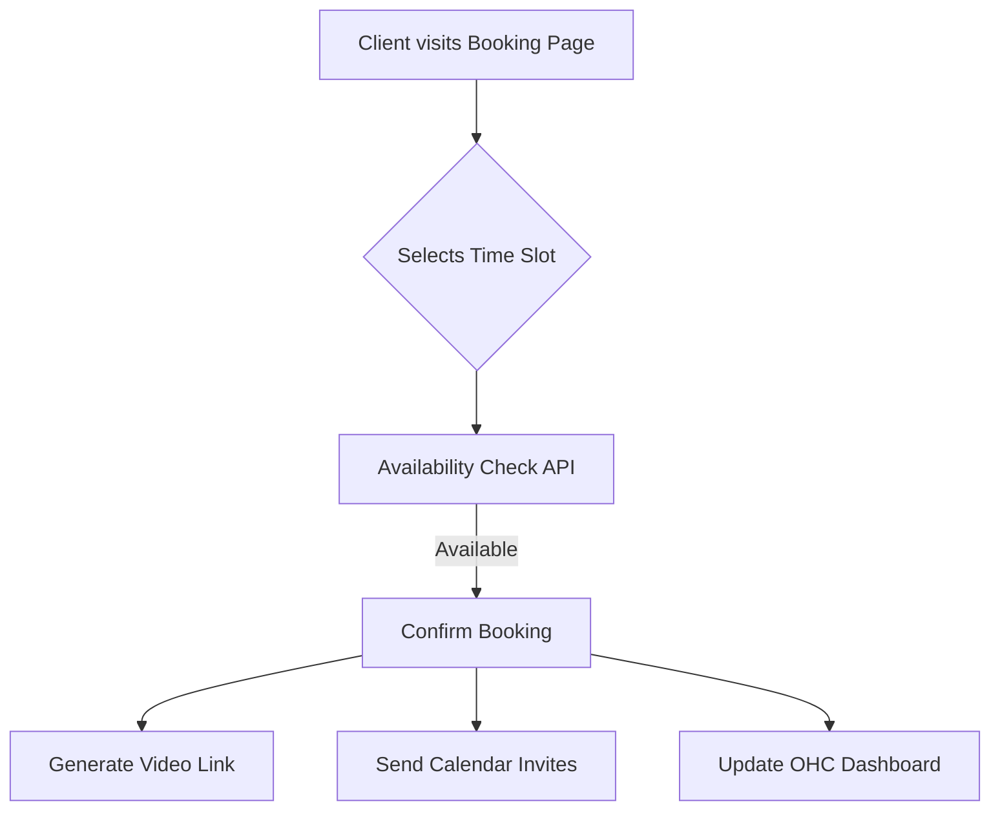

# Smart Scheduling and Calendar Sync

## Title
Automated Appointment Booking and Calendar Sync

## Problem Statement
Small business owners (consultants, tutors, service providers) waste hours on back-and-forth emails to schedule appointments. Double bookings occur because personal and business calendars aren't synced. Generating meeting links manually for virtual appointments is tedious. They need a simple, self-serve booking page for clients that automatically syncs with their existing calendars and generates meeting links.

## Research Report
I evaluated Cal.com as a solution for automated scheduling.

**Tool:** Cal.com
**Evaluation:**
- **Ease of Use:** Provides a very clean, straightforward booking page for clients. For the business owner, setting availability and event types is intuitive and far less cluttered than legacy tools.
- **Features:** It handles calendar conflict resolution natively (syncs with Google, Outlook, Apple). It supports automatic meeting link generation (Zoom, Google Meet, Cal Video). It also supports collective events and round-robin scheduling for teams.
- **Pricing:** The "Individuals" plan is entirely Free, offering unlimited event types and calendar connections. This is a massive advantage for small businesses. The "Teams" plan is $12/user/month.
- **Cloud/Standalone:** Cal.com has a robust Cloud offering. Crucially, it is also open-source and can be self-hosted, making it uniquely suited for OHC's dual Cloud/Standalone architecture.

## Design Doc
**Integration Overview:**
OHC will integrate scheduling capabilities to allow clients to book time directly with the business owner.
- **Triggers:** A customer selects a time slot on the owner's OHC-hosted booking page.
- **Actions:** The system checks availability against the owner's connected calendar(s). Upon booking, a calendar invite is sent to both parties, and a video conferencing link (e.g., Zoom/Meet) is auto-generated and included.
- **User View:** The owner sees an "Appointments" dashboard within OHC showing upcoming bookings. They can set their weekly availability hours. The client sees a simple, mobile-optimized date/time picker.

**Mobile UX Flow (375px viewport):**
1. Customer taps booking link received via SMS/Email.
2. Calendar view opens showing available days.
3. Customer taps a day, available time slots expand below.
4. Customer selects a slot, enters name/email, and taps "Confirm".
5. Success screen shows date, time, and Zoom link.

## Implementation Prompt
Create a scheduling component that allows a user to define their weekly availability and exposes a public booking page. When a time slot is booked, the system should generate a calendar event with a video conference link and display the upcoming appointment in the user's dashboard. Ensure calendar conflict checking logic is robust to prevent double bookings.

## Priority
P1 (High)

## Estimated Scope
Medium
