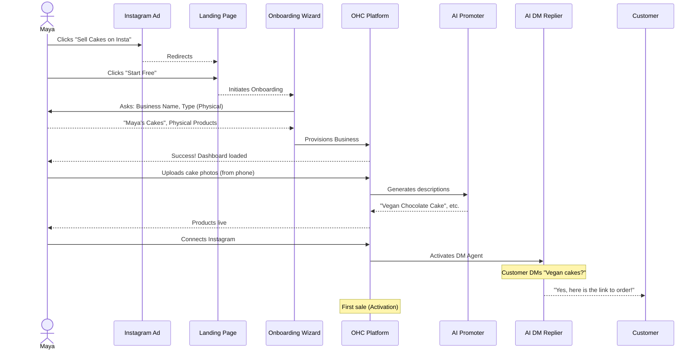
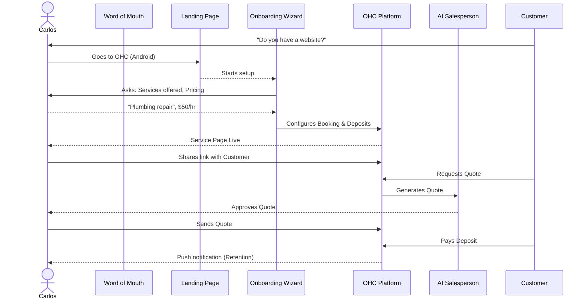
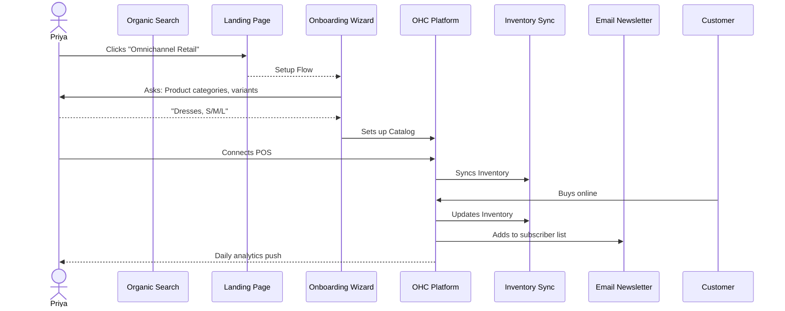
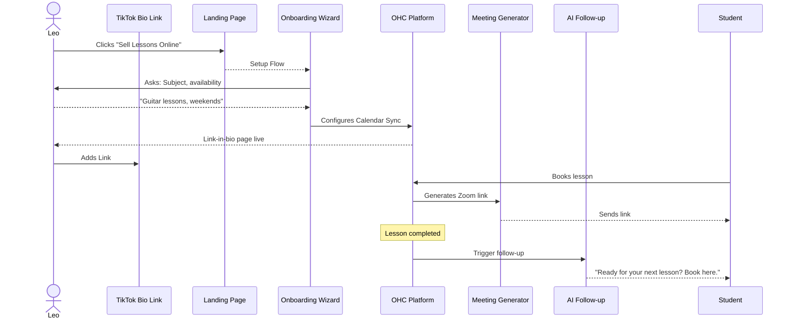
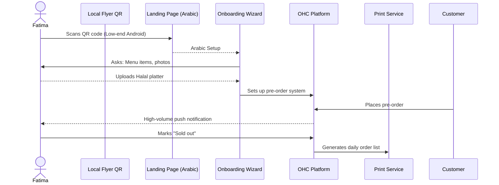

# Business Journey Architecture

## Problem Statement
Small business owners often face friction when setting up their online presence. The journey from "zero to live business in under 10 minutes" requires seamless onboarding, immediate value realization, and continuous engagement. We need a clearly defined, end-to-end user journey architecture for each target persona to ensure the platform meets their specific needs without overwhelming them with complexity.

## Research Report
The platform targets diverse user personas, each with unique requirements:
- **Maya (baker, 28)**: Needs a storefront, custom orders via deposits, and an AI agent for Instagram DM replies.
- **Carlos (handyman, 42)**: Needs service listings, booking calendar with deposits, customer inbox, and AI quote generation. Android only.
- **Priya (boutique owner, 35)**: Needs storefront, inventory sync, variants, in-person tap-to-pay, email newsletter, and daily mobile analytics.
- **Leo (music tutor, 22)**: Needs lesson booking with calendar sync, auto-generated meeting links, subscription packages, AI follow-up, and a portfolio page.
- **Fatima (food cart, 50)**: Needs photo menu, pre-orders/pickup, notifications, printable order lists, multi-language UI (Arabic/English), and support for low-end Android devices.

Comparing platforms like Shopify, Wix, Squarespace, and GoDaddy reveals that while they offer extensive features, their onboarding often requires significant configuration. OHC's competitive advantage lies in its AI-driven, hands-off setup.

## Design Doc

### Architecture Diagram

#### Maya (Baker)

#### Carlos (Handyman)

#### Priya (Boutique Owner)

#### Leo (Music Tutor)

#### Fatima (Food Cart)

### UI Screen Flow (375px Mobile First)
- **Screen 1: Landing / Entry** - Clear hero value proposition ("Live in 10 minutes"), large "Start Free" CTA.
- **Screen 2: Business Inference** - Minimal input (Name, primary category). AI auto-suggests modules.
- **Screen 3: Module Configuration** - Toggle options tailored to category (e.g., Inventory vs. Booking).
- **Screen 4: Preview & Publish** - Interactive preview of the storefront/booking page.
- **Screen 5: Activation Success** - Dashboard overview showing the generated live link and next action.

### Mobile UX Flow
The entire onboarding flow is linear, chunked into bite-sized steps to prevent cognitive overload on small screens. Navigation relies on bottom-sheet overlays for configuration rather than full-page reloads. Inputs utilize native mobile patterns (e.g., native date pickers, camera integration for product photos).

### AI Agent Integration Points
- **The Manager (Operations):** Auto-categorizes uploaded product photos and generates descriptions (Maya, Priya, Fatima).
- **The Promoter (Marketing):** Suggests daily social media posts based on inventory or availability.
- **The Salesperson (Acquisition):** Generates custom quotes from vague customer requests (Carlos).
- **The Ambassador (Success):** Replies to DMs and follows up after completed bookings (Leo).

### Key Design Decisions
- **Mobile-First Experience**: All flows are optimized for mobile devices, particularly low-end Androids for personas like Fatima.
- **AI-Driven Onboarding**: Minimal manual configuration. AI agents handle product descriptions, quotes, and follow-ups.
- **Persona-Specific Modules**: The platform dynamically configures itself (e.g., booking vs. inventory) based on the initial onboarding answers.

### Friction Points & Mitigations
- **Friction:** Taking professional photos. **Mitigation:** Allow quick phone snaps, AI enhances the background and lighting.
- **Friction:** Complex pricing setup. **Mitigation:** AI suggests local market averages based on the service/product type.
- **Friction:** Domain connection. **Mitigation:** Defer custom domain setup until *after* the user sees their working OHC subdomain site.

## Implementation Prompt
Implement the backend and UI scaffolding for the OHC Business Journey workflows.
- Create the core `BusinessJourney` and `OnboardingWizard` services.
- Define the data models for user personas and their respective feature toggles (e.g., `requires_inventory`, `requires_booking`).
- Implement the "Day 1 Activation" tracking logic to measure when a user achieves their first sale or booking.
- Ensure all UI flows are designed mobile-first, using the OHC design system.

## Priority
P1

## Estimated Scope
Large
