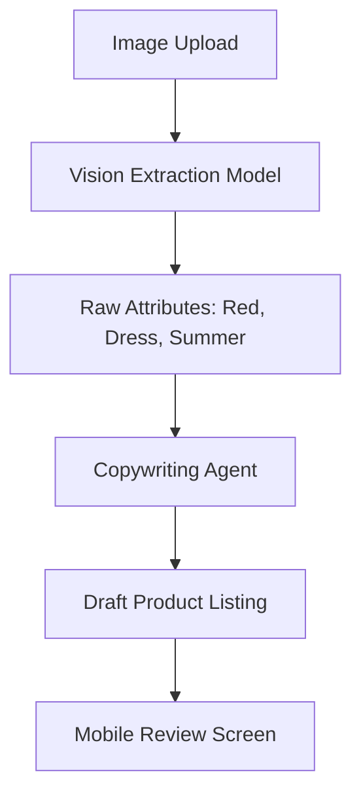

**Title**: Smart Catalog Content Agent
**Problem Statement**: New merchants (like Priya the boutique owner) find the process of creating product listings exhausting. Uploading photos, writing SEO-optimized descriptions, and categorizing items takes up to 30 minutes per product, acting as a massive barrier to launching or updating their online store.
**Research Report**: Reviews on Trustpilot and App Stores for Wix and Shopify highlight "adding products" as a tedious, friction-heavy process. While Shopify's "Magic Text" offers basic text generation, it requires the user to input prompts and context manually. OHC has a critical opportunity to eliminate this friction by generating the entire listing autonomously from a single photo upload.
**Design Doc**:
- **Architecture**: A pipeline triggered by a `Product Image Upload` event. The image is passed to a `Vision Model` to extract features (color, style, object type).
- **Key Relationships**: Extracted features are sent to the `Copywriting Agent` to generate titles, descriptions, and SEO tags. The data populates a drafted `Product` entity.
- **Mobile UX Flow (375px)**:
  1. User taps '+ Add Product' and snaps a photo with their phone camera.
  2. A skeleton loading screen shows 'AI is writing your description...'
  3. The drafted product page appears, fully populated with a catchy title, detailed description, and suggested price based on visual category.
  4. The user taps 'Publish'.
- **Mermaid Flow**:

**Implementation Prompt**: Create the Smart Catalog ingestion pipeline. The user-facing outcome is a near-instantaneous product creation experience on mobile. The Critical User Journey involves the user uploading a single image of an item, and the system returning a fully formed product draft (title, description, category, tags) within 5 seconds. Acceptance criteria demand that the generated text is contextually relevant, grammatically correct, and formatted suitably for an e-commerce storefront.
**Priority**: P1
**Estimated Scope**: Medium
