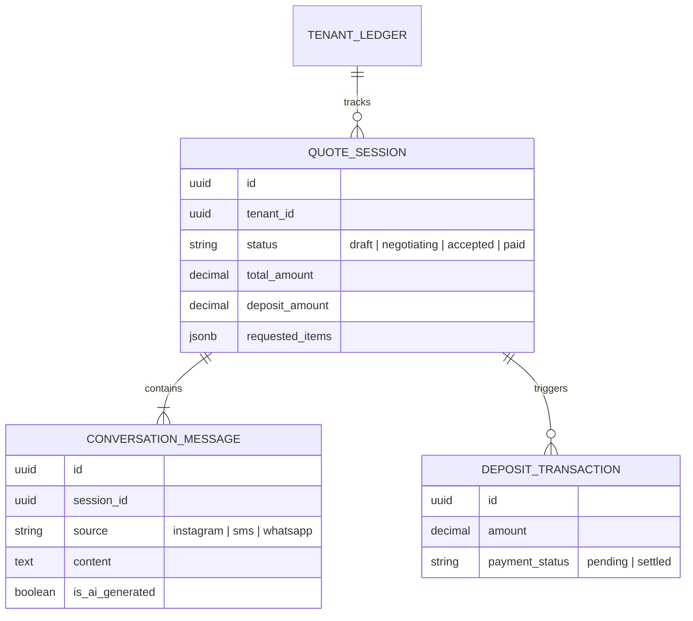
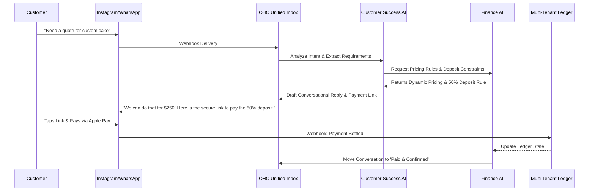

# AI-Powered Conversational Quoting & Custom Deposit Engine

## Problem Statement
Small business owners who provide custom products or services—such as Maya (baker) and Carlos (handyman)—rely heavily on social media DMs and text messages to receive custom requests. Currently, they spend hours each day in a tedious back-and-forth negotiating scope, delivery dates, and pricing. Once a price is agreed upon, they manually generate and send payment links (e.g., Venmo, Square, Stripe) to secure a deposit. This manual process causes delayed responses, lost sales, and significant administrative burden, pulling them away from doing the actual work. They need an intelligent, mobile-first system that negotiates on their behalf and automatically secures custom deposits seamlessly.

## Research Report
*   **Competitor Analysis**:
    *   *Shopify*: Offers invoicing and drafting orders, but requires manual intervention to adjust line items and request deposits. No native conversational AI quoting in DMs.
    *   *Wix/Squarespace*: Provides static forms for quotes, but lacks real-time conversational negotiation and instant dynamic deposit collection.
    *   *GoDaddy*: Basic appointment booking and quoting, heavily reliant on the merchant manually reading and responding to requests.
*   **Industry Trends**: Consumers increasingly expect instant, conversational commerce via Instagram, WhatsApp, and SMS. Drop-off rates spike if a merchant takes more than 15 minutes to reply to a DM quote request.
*   **The Opportunity**: OneHumanCorp can introduce a Zero-Touch Conversational Quoting Engine that securely integrates with our multi-tenant Ledgers and Identity structures, providing an invisible AI layer that handles the entire negotiation and deposit lifecycle.

## Design Doc

### Mobile UX Flow (375px Viewport Baseline)
1.  **Incoming Request**: A new message arrives in the OHC unified inbox from Instagram DMs ("How much for a 3-tier vegan cake next Saturday?").
2.  **AI Auto-Quote Generation Card**: The OHC app pushes a silent notification. When Maya opens it, she sees a glassmorphism "Suggested Quote" card summarizing the AI's intent: "3-tier vegan cake, $250, 50% deposit required."
3.  **One-Tap Approval**: Maya taps "Approve & Send" or simply lets the AI auto-reply (if fully autonomous mode is on).
4.  **Customer Experience**: The customer receives a natural conversational reply with an integrated Apple Pay/Google Pay deep-link button to pay the $125 deposit instantly within the DM or via a lightweight, edge-cached web receipt.
5.  **Deposit Confirmed**: The OHC dashboard updates automatically, moving the lead to "Deposit Paid - Action Required".

### Architecture Diagram

### AI Agent Integration Points
*   **Customer Success (CS) Agent**: Monitors social media webhook streams, maintains conversational context, and translates raw customer messages into structured product/service requirements.
*   **Finance Agent**: Interfaces securely with the Multi-Tenant Ledger and Payment Processor. Calculates dynamic pricing, enforces deposit rules (e.g., 50% upfront), and generates secure, single-use checkout sessions.
*   **Operations Agent**: Monitors the `QUOTE_SESSION` state machine and transitions the order to the fulfillment queue once the `DEPOSIT_TRANSACTION` is settled.

### Key Design Decisions
*   **Strict Multi-Tenant Isolation**: The `QUOTE_SESSION` and `DEPOSIT_TRANSACTION` entities must enforce row-level security mapped to the SPIFFE workload identity of the executing AI agent to prevent cross-tenant data leakage.
*   **Edge-Cached Payment Links**: The generated checkout URL must be globally distributed via edge caching to ensure instant load times even on poor 3G connections.
*   **Stateless Agent Deliberation**: The CS and Finance agents must operate statelessly, re-hydrating the negotiation context from the `QUOTE_SESSION` store upon each webhook event to ensure horizontal scalability.

## Implementation Prompt
**To the Implementer:**
Please implement the AI-Powered Conversational Quoting & Custom Deposit Engine. Focus on the end-to-end user journey (CUJ) where a customer messages a business (e.g., Maya's bakery) via a mock social channel requesting a custom order.
1. Build the backend state machine that tracks the quote negotiation and deposit lifecycle securely within the multi-tenant architecture.
2. Develop the AI coordination logic allowing the CS Agent to extract intent and the Finance Agent to generate a quote and a secure payment link.
3. Construct the mobile-first (375px) UI cards in the OHC unified inbox, allowing the business owner to review, approve, or override AI-generated quotes with zero friction.
Ensure the implementation adheres to the macOS-style translucent glass aesthetic and feels entirely intuitive for a non-technical user.

## Priority
P0

## Estimated Scope
Large
