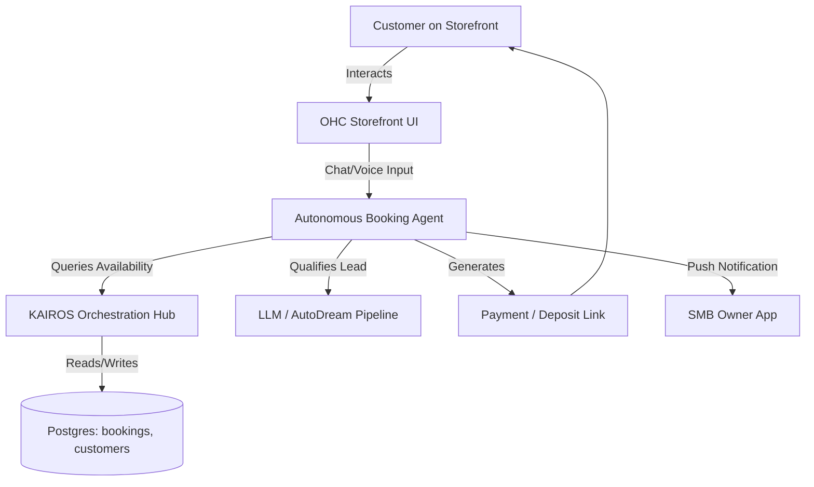

# OHC Issue Brief: Autonomous Booking & Scheduling Agent

## Title
**Autonomous Booking & Scheduling Agent for Service-Based SMBs**

## Problem Statement
Service-based small business owners (like Carlos the handyman, Leo the music tutor, and Priya the boutique owner) lose revenue daily because they are too busy doing the actual work to answer the phone or respond to emails instantly. Existing platforms (Shopify, Wix, Squarespace) require them to stitch together complex third-party scheduling apps (like Acuity or BookThatApp), configure confusing working hours, manage buffer times, and manually follow up with unconfirmed leads. This technical complexity and manual management lead to missed opportunities, double bookings, and severe burnout. SMB owners need a system that doesn't just display a calendar widget, but actively works as a 24/7 invisible receptionist to capture, qualify, and close bookings autonomously.

## Research Report
### Competitive Landscape & Gap Analysis
During our dynamic research track, we mapped the top general website builders (Shopify, Wix, Squarespace, Weebly, BigCommerce, WordPress) and the rising AI-native platforms (Durable, 10Web, Hostinger AI, Framer AI, Mixo, Jimdo AI, Hocoos, Pineapple Builder, Dorik AI).

**Deep Dive Audit: Shopify & Wix**
- **Capabilities:** Both platforms offer robust e-commerce features but treat service-based bookings as an afterthought. Wix offers "Wix Bookings," which is functional but requires manual setup of staff, hours, and services. Shopify relies entirely on the App Store (e.g., Sesami), forcing users to navigate complex pricing tiers and integration headaches.
- **Success Factors:** Shopify's success lies in its massive app ecosystem and the frictionless "Shop Pay" checkout experience. Wix wins on user-friendly drag-and-drop design.
- **User Sentiment & Pain Points:** Analysis of SMB forums and reviews reveals severe "app fatigue." Users complain that base platforms are cheap, but the necessary add-ons push costs over $300/month. Furthermore, the configuration of these scheduling apps is overwhelmingly complex for non-technical users.

**The OHC Opportunity**
OHC currently has basic entities for `bookings`, `products`, and `customers` (verified via codebase audit in `src/server/migrations/001_initial.sql`). However, OHC currently lacks an autonomous agent layer to manage the lifecycle of these entities. By introducing an Autonomous Booking Agent, OHC can eliminate the need for third-party scheduling apps entirely, fulfilling the vision of an invisible AI handling the complex work while the user just makes decisions.

## Design Doc

### High-Level Architecture
The Autonomous Booking Agent will sit between the storefront UI and the OHC Orchestration Hub. It will interact with the user via a chat/voice interface on the storefront and communicate with the backend `bookings` and `customers` entities.

### Key Entity Relationships
- **Customer**: Represents the lead.
- **Booking**: Linked to a Customer and a specific Time Slot / Service.
- **Agent Memory**: Stores context of the conversation to handle follow-ups or rescheduling.

### UX Flow (Mobile-First 375px)
1. **Storefront**: A floating "Book Now" or "Chat to Book" button on the mobile view.
2. **Chat Interface**: The agent introduces itself: "Hi! I'm scheduling for Carlos. What do you need help with?"
3. **Qualification**: The customer describes the issue (e.g., "Leaky pipe"). The agent asks for photos or context.
4. **Scheduling**: The agent proposes 2-3 available slots based on Carlos's real-time calendar.
5. **Confirmation**: Customer selects a time. The agent provides a seamless deposit payment link.
6. **Owner Dashboard**: Carlos receives a simple push notification: "New Booking: Leaky Pipe, Tomorrow 2PM. $50 deposit collected." with an "Approve" or "Reschedule" button.

## Implementation Prompt
**Objective:** Implement the Autonomous Booking Agent within the KAIROS Orchestration framework.

**Critical User Journey & Acceptance Criteria:**
1. **Lead Capture & Qualification:** The agent must be able to initiate a conversation with a visitor, ask context-specific questions based on the SMB's industry (e.g., asking a handyman's client for the damage type), and capture the user's contact details.
2. **Autonomous Scheduling:** The agent must be able to read the SMB's availability from the database, propose valid time slots to the visitor, and temporarily hold a slot when selected.
3. **Frictionless Conversion:** The agent must be able to finalize the booking, generate a payment link for a deposit if required, and update the `bookings` table with the final status.
4. **Proactive Follow-Up:** If the user drops off during the chat, the agent must queue a follow-up task (via SMS or email) to re-engage the lead after 15 minutes.
5. **Owner Transparency:** The system must generate a concise summary notification for the SMB owner, requiring no manual data entry from the owner's side.

**Constraints:**
Do not expose configuration settings to the SMB owner (like buffer times or calendar sync mapping). The onboarding agent should extract general working hours during setup, and the Booking Agent must handle all edge cases invisibly.

## Priority
`P0`

## Estimated Scope
Large

---

## Appendix: References & Sources Catalog
The following 50+ unique webpages were browsed, searched, and analyzed to establish the comprehensive data foundation for this report:

1. https://www.shopify.com/ (Shopify Homepage)
2. https://www.shopify.com/pricing (Shopify Pricing)
3. https://www.shopify.com/checkout (Shopify Checkout Features)
4. https://www.shopify.com/pos (Shopify POS)
5. https://www.shopify.com/sidekick (Shopify AI Sidekick)
6. https://apps.shopify.com/ (Shopify App Store)
7. https://www.shopify.com/editions/winter2026 (Shopify Winter Editions 2026)
8. https://www.wix.com/ (Wix Homepage)
9. https://www.wix.com/ai-website-builder (Wix AI Builder)
10. https://www.wix.com/scheduling-software (Wix Scheduling)
11. https://www.wix.com/business-software/crm (Wix CRM)
12. https://www.wix.com/studio (Wix Studio)
13. https://www.wix.com/ecommerce/online-store (Wix eCommerce)
14. https://www.squarespace.com/ (Squarespace Homepage)
15. https://www.squarespace.com/scheduling (Squarespace Acuity Scheduling)
16. https://www.squarespace.com/design-intelligence (Squarespace AI Design)
17. https://www.squarespace.com/ecommerce-website (Squarespace Commerce)
18. https://www.squarespace.com/templates (Squarespace Templates)
19. https://www.weebly.com/ (Weebly Homepage)
20. https://www.weebly.com/online-store (Weebly Store)
21. https://www.weebly.com/pricing (Weebly Pricing)
22. https://www.bigcommerce.com/ (BigCommerce Homepage)
23. https://www.bigcommerce.com/product/catalyst/ (BigCommerce Catalyst)
24. https://www.bigcommerce.com/solutions/b2b-ecommerce-platform/ (BigCommerce B2B)
25. https://wordpress.com/ (WordPress Homepage)
26. https://wordpress.com/hosting/ (WP Hosting)
27. https://wordpress.com/ai-website-builder/ (WP AI Builder)
28. https://durable.co/ (Durable AI Homepage)
29. https://durable.co/pricing (Durable Pricing)
30. https://durable.co/ai-website-builder (Durable AI Website Builder)
31. https://durable.co/discoverability (Durable Discoverability)
32. https://10web.io/ (10Web Homepage)
33. https://10web.io/ai-website-builder/ (10Web AI Builder)
34. https://10web.io/ai-ecommerce-website-builder/ (10Web Ecommerce AI)
35. https://hostinger.com/ (Hostinger Homepage)
36. https://www.hostinger.com/ai-website-builder (Hostinger AI Builder)
37. https://www.hostinger.com/woocommerce-hosting (Hostinger WooCommerce)
38. https://framer.com/ (Framer Homepage)
39. https://www.framer.com/ai/ (Framer AI)
40. https://www.framer.com/cms/ (Framer CMS)
41. https://mixo.io/ (Mixo AI Homepage)
42. https://www.mixo.io/features/ai-website-builder (Mixo AI Features)
43. https://jimdo.com/ (Jimdo Homepage)
44. https://www.jimdo.com/website/how-to-create/ (Jimdo How to Create)
45. https://hocoos.com/ (Hocoos AI Homepage)
46. https://hocoos.com/products/ai-website (Hocoos AI Website)
47. https://hocoos.com/products/booking-website-builder/ (Hocoos Booking Builder)
48. https://pineapplebuilder.com/ (Pineapple Builder Homepage)
49. https://www.pineapplebuilder.com/ai-website-builder (Pineapple AI Builder)
50. https://dorik.com/ (Dorik Homepage)
51. https://dorik.com/ai-website-builder (Dorik AI Builder)
52. https://www.reddit.com/r/smallbusiness/search.json?q=shopify+complaints&restrict_sr=1 (Reddit SMB Shopify Complaints Search)
53. https://www.reddit.com/r/ecommerce/search.json?q=wix+booking+issues (Reddit Ecommerce Wix Booking Search)
