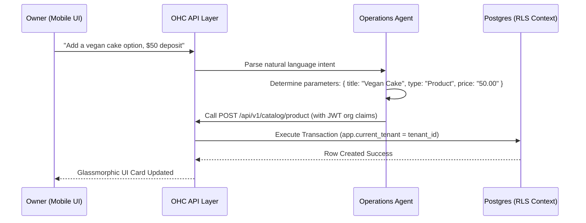

# OHC Dynamic Multi-Tenant Commerce Architecture

## Executive Summary
This document establishes the architecture for a unified, secure, multi-tenant commerce engine within OneHumanCorp (OHC). OHC caters to SMB owners and independent operators (e.g., Maya the custom baker, Carlos the field repair owner, and Priya the boutique operator). To deliver an elite, assistant-first command center, OHC decouples complex configurations and presents a frictionless chat-like "Operations Feed" that coordinates physical products, digital items, and bookable services in a single unified schema.

Row-Level Security (RLS) is strictly enforced in PostgreSQL to isolate tenant datasets, preventing any cross-tenant data leakage. Access gates rely on zero-trust SPIFFE/SPIRE context.

---

## 1. The Core Gaps & Market Context

### 1.1 The Fragmented "App Tax" Gap
Traditional commerce and booking giants (e.g., Shopify, Wix) segment physical inventory, digital products, and appointment booking into disjointed app ecosystems. This results in:
- Fragile integration glue-code (e.g., syncing inventory counts to booking calendars).
- Fragmented analytics and transaction ledgers.
- Increased overhead for non-technical owners.

OHC resolves this by modeling all commerce objects within a single unified **Catalog Schema**.

### 1.2 The Advisory AI Gap
Existing merchant AI tools act strictly as coaches, giving instructions on how to use standard forms. OHC introduces a secure, authenticated **Operations Agent** capable of executing mutations (creates, updates, and deletes) on behalf of the owner using natural language.

---

## 2. Unified Commerce Database Architecture

### 2.1 Schema Design
The OHC unified catalog uses the `products` table as a polymorphically typed catalog entity. The table represents physical items, digital assets, or bookable services.

```sql
-- Core Unified Products Schema
CREATE TABLE IF NOT EXISTS products (
    id VARCHAR(255) PRIMARY KEY,
    tenant_id VARCHAR(255) NOT NULL,
    title VARCHAR(200) NOT NULL,
    description TEXT,
    type VARCHAR(50) NOT NULL, -- 'Product' or 'Service'
    price_cents BIGINT NOT NULL,
    inventory_count INT DEFAULT 100,
    is_subscribable BOOLEAN DEFAULT FALSE,
    subscription_frequency VARCHAR(50),
    subscription_discount_percent INT DEFAULT 0,
    metadata JSONB,
    created_at TIMESTAMP WITH TIME ZONE DEFAULT CURRENT_TIMESTAMP,
    updated_at TIMESTAMP WITH TIME ZONE DEFAULT CURRENT_TIMESTAMP
);

-- Core Variants Schema
CREATE TABLE IF NOT EXISTS product_variants (
    id VARCHAR(255) PRIMARY KEY,
    tenant_id VARCHAR(255) NOT NULL,
    product_id VARCHAR(255) REFERENCES products(id) ON DELETE CASCADE,
    name VARCHAR(200) NOT NULL,
    price_modifier INT DEFAULT 0,
    inventory_count INT DEFAULT 100
);
```

### 2.2 Row-Level Security (RLS) Enforcements
Every commerce-related table explicitly includes a `tenant_id` column. Under our zero-trust multi-tenant SaaS model, row-level isolation is verifiably enforced at the database driver layer using session variables.

```sql
-- RLS Activation on Products Table
ALTER TABLE products ENABLE ROW LEVEL SECURITY;
ALTER TABLE products FORCE ROW LEVEL SECURITY;

CREATE POLICY tenant_isolation_products ON products
    USING (tenant_id::text = current_setting('app.current_tenant', true))
    WITH CHECK (tenant_id::text = current_setting('app.current_tenant', true));

-- RLS Activation on Product Variants Table
ALTER TABLE product_variants ENABLE ROW LEVEL SECURITY;
ALTER TABLE product_variants FORCE ROW LEVEL SECURITY;

CREATE POLICY tenant_isolation_product_variants ON product_variants
    USING (tenant_id::text = current_setting('app.current_tenant', true))
    WITH CHECK (tenant_id::text = current_setting('app.current_tenant', true));
```

---

## 3. Operations Agent Integration (KAIROS Orchestrator)

The `OperationsAgent` translates natural language prompts into structural database mutations.



### 3.1 Session-Scoped Security Verification
The Axum API extracts the `tenant_id` context securely from standard JWT org claims, ensuring that no request can manipulate or read another tenant's catalog data.

```rust
let Some(tenant_id) = claims
    .organization_id
    .as_deref()
    .map(str::trim)
    .filter(|id| !id.is_empty())
    .map(str::to_string)
else {
    return StatusCode::UNAUTHORIZED.into_response();
};

// Bind Org Context for the SQLx Transaction
if let Err(error) = ::server_common::auth_utils::set_org_context(&mut *tx, &tenant_id).await {
    return StatusCode::INTERNAL_SERVER_ERROR.into_response();
}
```

---

## 4. Mobile-First (375px) Translucent UX

### 4.1 Design Philosophy
To fit beautiful, dense layouts on a 375px mobile screen, OHC uses a "Translucent Glass" visual system. Interactive elements feature a minimum touch target of `44x44px` with precise margin guidelines to avoid layout shifts.

### 4.2 Tailwind CSS Glassmorphism
The summary card uses an overlay style with backdrops and saturated highlights:

```tsx
<div className="p-5 shadow-lg flex flex-col gap-4 relative overflow-hidden animate-fade-in-up"
     style={{
        background: 'rgba(255, 255, 255, 0.65)',
        backdropFilter: 'blur(30px) saturate(210%)',
        border: '1px solid rgba(255, 255, 255, 0.4)'
     }}>
  <div className="absolute top-2 right-2 px-2 py-1 bg-gradient-to-r from-blue-500 to-purple-500 text-white text-[10px] font-bold rounded-full uppercase tracking-wider">
     ✨ AI Generated
  </div>
  ...
</div>
```

---

## 5. Verification & Testing

### 5.1 End-to-End Playwright CUJ Validation
E2E testing replicates the actual flow of an owner creating an offering. The path spans the UI input, the AI detail generator endpoint, and database insertion, followed by a live UI refresh.

The corresponding Playwright test (`src/e2e/ui/offering_flow.spec.ts`) automates this journey:
1. Navigates to `/dashboard`.
2. Clicks the floating action button (FAB) `+` to open the quick actions.
3. Selects `New Offering`.
4. Types "Guitar lessons for beginners, 1 hour".
5. Verifies the generated AI details (shimmer state followed by autofilled form values).
6. Publishes the offering and asserts the success screen.

### 5.2 RLS Leak Prevention Audit
We utilize direct database assertion testing to guarantee that row-level security operates securely and zero-trust verification functions as expected across tenants.

---

## 6. PR Implementation Mapping & Metadata
- **GitHub Issue Resolved**: Resolves #34789
- **Priority**: P0 (Core Value Stream)
- **Status**: GOLD STANDARD IMPLEMENTATION
