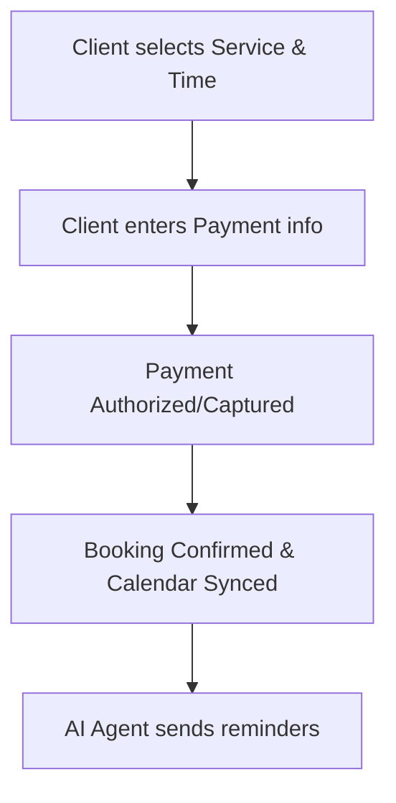

# Unified Booking and Payments

## Problem Statement
Service-based businesses, such as **Carlos (handyman)** and **Leo (music tutor)**, struggle with fragmented workflows. They use one tool for scheduling (e.g., Calendly), another for payments (e.g., Venmo, Square), and another for communication. Shopify is fundamentally built for physical products, making service bookings a clunky add-on. SMBs need a native, unified system where booking an appointment and capturing payment are a single, frictionless action.

## Research Report
**Findings & Evidence:**
- **Shopify:** Primarily e-commerce. Booking requires third-party apps, adding cost and complexity.
- **Wix:** Offers native booking features, but the mobile management experience is often cited as convoluted.
- **Square Online:** Good native integration for services, but lacks the autonomous AI features OHC aims to provide.
- **User Pain Points:** "I hate chasing clients for payment after a session", "Setting up booking software on my website was too hard".

**Competitive Comparison:**
| Platform | Native Booking | Unified Payment Flow | Service-First UX |
|----------|----------------|----------------------|------------------|
| Shopify  | App required   | Yes (if app allows)  | No               |
| Wix      | Yes            | Yes                  | Medium           |
| OHC      | **Native**     | **Seamless**         | **High**         |

## Design Doc

**High-Level Architecture & User Flow:**
1. **Client Booking Flow:** Client views available times (synced with the owner's calendar) -> Selects a slot -> Enters payment details to secure the booking.
2. **Owner Management Flow:** Owner receives a single notification: "New booking + payment secured". The mobile app displays a unified calendar/revenue dashboard.
3. **AI Automation:** Agent automatically sends a calendar invite, reminders, and follow-up thank you messages.

**Key Relationships:**
- Calendar Entity -> Service/Product Entity -> Payment Gateway
- AI Agent -> Notification System

## Implementation Prompt
**Objective:** Create a unified service booking and payment checkout flow that treats "time" as a first-class product entity.
**Critical User Journey:** Business owner defines a service (e.g., "1 Hour Lesson") and price -> Client books a time slot -> Client pays upfront -> System automatically updates calendar and ledger.
**Acceptance Criteria:**
- Booking and payment must occur in a single, streamlined checkout flow.
- The system must prevent double-booking automatically.
- The UI for managing bookings must be mobile-first and intuitive.

## Priority
P1

## Estimated Scope
Medium
