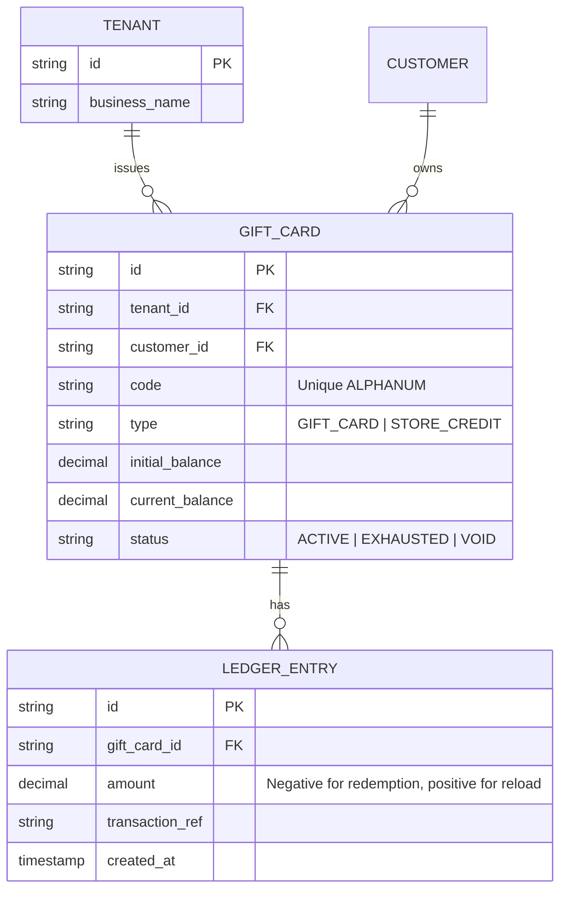
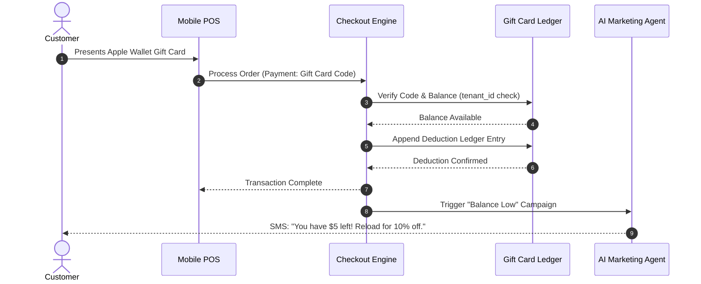

# Issue Brief: Universal Omnichannel Gift Card & Store Credit Engine

## Title
Build Universal Omnichannel Gift Card & Store Credit Engine

## Problem Statement
Small business owners like Priya (boutique) and Maya (baker) rely heavily on gift cards for holiday sales and customer retention. Currently, OHC lacks a unified system for selling, issuing, and redeeming digital gift cards or managing store credit. When a customer wants a refund for an in-store purchase or wants to buy a gift card for a friend online, the business owner must use external, disconnected tools or write it down on paper. This breaks the multi-channel experience and requires manual reconciliation, leading to lost revenue and bad customer experiences.

## Research Report
**Market Analysis & Competitor Benchmarks:**
- **Shopify:** Offers robust gift card capabilities, but requires higher-tier plans for advanced features. Their API allows omnichannel usage, but the UI is still backend-heavy.
- **Square:** Dominates in-person gift cards. Seamless integration with their POS, but less flexible for cross-platform online/offline blending without complex API work.
- **Wix/Squarespace:** Gift card features exist but often feel bolted on, with separate flows for physical vs. digital.

**OHC Opportunity:**
By building a native, multi-tenant Ledger for Gift Cards and Store Credit, OHC can instantly enable business owners to offer Apple Wallet/Google Wallet compatible digital gift cards. AI agents can autonomously handle the entire lifecycle: sending the gift card via SMS/email, tracking usage, and issuing automatic store credit for returns via the omnichannel inbox, requiring zero manual configuration by the business owner.

## Design Doc

### Architecture diagram

### UI wireframes or screen flow description
- **Dashboard & Creation:** Priya opens the OHC app and taps the "Gift Cards" card on the modular dashboard. A clean, translucent glass-styled screen shows active gift cards and a prominent "+ Issue New" button. The design uses standard OneHumanCorp design tokens (rounded corners, soft drop shadows, UniFi modular card layouts).
- **Refund to Credit:** During a return flow on the app, the UI presents a massive, easily tappable "Issue Store Credit" button alongside "Refund to Original Payment". No complex dropdowns.
- **Customer View:** The gift card receipt sent via SMS/Email opens a mobile-optimized webpage with a single "Add to Apple Wallet" / "Add to Google Wallet" button. No complex logins needed.

### Mobile UX flow
- **375px First Focus:** All interfaces prioritize a 375px mobile viewport.
- **Grandmother Test:** If Fatima the food cart owner or Maya the baker can't figure out how to issue a gift card in 30 seconds, the flow fails.
- **Interactions:** Tap "+ Issue New", enter amount (e.g. $50), enter customer phone number. The OHC Assistant handles the rest in the background. The app instantly confirms with a large green checkmark.

### AI agent integration points
- **Finance Department:** Monitors the append-only ledger for anomalies and reconciles gift card liabilities (unredeemed balances) for accounting without owner intervention.
- **Operations Department:** Auto-generates the unique alphanumeric codes and handles the Apple/Google wallet pass generation payload.
- **Customer Success (CS) / Marketing:** Automatically texts the recipient when the gift card is sent, and sends reminders if the card is unused for 6 months.

### Key design decisions and why
- **Append-Only Ledger:** Instead of updating a single balance field, balances are calculated from an immutable ledger of transactions. This ensures auditability, prevents race conditions during concurrent online/offline redemptions, and gives the Finance AI accurate historical data.
- **Unified Entity for Gift Cards & Store Credit:** Both share the exact same underlying primitive (a prepaid balance tied to a tenant). The only difference is the acquisition channel and tax treatment, simplifying the architecture.
- **Zero-Trust Multi-Tenancy:** The `tenant_id` is structurally baked into the primary key or strictly enforced at the data access layer, eliminating any possibility of a gift card from Maya's bakery being redeemed at Priya's boutique.

## Implementation Prompt
**Context:** Implement the backend ledger and mobile-first UI for the Universal Gift Card & Store Credit Engine.
**Outcome:** A business owner can sell, issue, and redeem gift cards across both online checkout and mobile Tap-to-Pay POS. Customers can receive and store these gift cards in their digital wallets. Returns can be processed instantly to store credit.
**Acceptance Criteria:**
1. Append-only ledger data model is implemented with strict multi-tenant (`tenant_id`) isolation.
2. Endpoints exist to create, redeem, and check the balance of a gift card.
3. Concurrent redemption attempts on the same gift card must safely resolve without negative balances (prevent double-spend).
4. The merchant UI uses the defined macOS-style translucent glass components on a 375px viewport.
5. All developer terms are hidden; the UI simply says "Gift Cards & Store Credit" - passes the "grandmother test".

## Priority
P1

## Estimated Scope
Large
