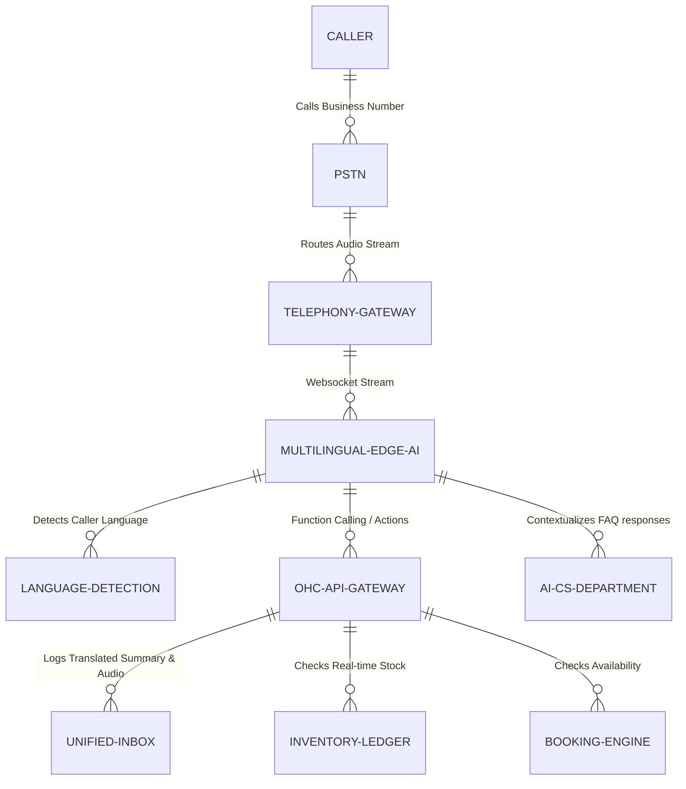

# Title: Autonomous Multilingual Voice Receptionist

## Problem Statement

Small business owners like Fatima (food cart operator in a diverse neighborhood) and Carlos (handyman scaling his business to non-native speakers) rely heavily on phone calls to capture leads and take orders. However, language barriers create immense friction. A missed call or a misunderstood order due to language differences leads directly to lost revenue and poor customer experiences. Traditional answering services or standard AI tools are strictly monolingual (usually English-first) and lack the cultural context and real-time translation capabilities required to serve a diverse customer base. Non-technical business owners need an invisible, highly resilient AI Voice Receptionist that can answer calls, seamlessly detect the caller's language, converse fluently in that language, take structured orders, provide localized quotes, and translate the result into the owner's preferred language within the OHC unified inbox.

## Research Report

- **Current Architecture Limits:** OHC's current asynchronous channels (Omnichannel Unified Inbox) handle text well, and the base voice receptionist handles English effectively. However, it lacks real-time, zero-latency language detection and dynamic multilingual translation tailored to the merchant's localized offerings.
- **Competitor Analysis:**
  - _Shopify/Wix/Squarespace:_ Provide no native telephony or AI voice reception. Merchants must piece together fragmented, third-party VoIP and translation services which cannot integrate natively into their unified order/calendar ledgers.
  - _Conventional Call Centers:_ Multilingual answering services are prohibitively expensive for a food cart or sole-proprietor handyman.
  - _General AI Voice APIs:_ Tools like Vapi or Twilio offer voice AI, but lack the pre-configured, zero-config multilingual routing and real-time unified inbox translation designed specifically for SMB workflows.
- **Discovery:** OHC requires a Telephony Order Engine upgrade that embeds multilingual capabilities directly into the AI Edge. The system must autonomously detect language at the start of the call, switch language models on the fly with sub-800ms latency, interact with the unified inventory ledger, and deposit a translated summary (in the owner's primary language) directly into the inbox.

## Design Doc

### Architecture Diagram

### UI Wireframes / Screen Flow (375px Viewport)

1. **Onboarding Card (Translucent Glass):** "Speak every language." A simple toggle: "Enable Multilingual Voice Receptionist."
2. **Language Preferences:** A clean modular card showing "My Primary Language" (e.g., English) and "Languages I Support" (e.g., "Auto-Detect All" or specific toggles for Spanish, Arabic, Mandarin).
3. **Active Call State:** A live, pulsing audio wave on the unified inbox screen indicating the AI is handling a call, with a badge showing the detected language (e.g., "🗣️ Arabic").
4. **Call Summary Card:** After the call, a card appears in the inbox in the _owner's_ language: "New Pre-order from Amir: 2 Halal Platters for 1 PM Pickup. [Approve & Send Payment Link]". An "Original Transcript" toggle is hidden behind an advanced setting.

### Mobile UX Flow

- **Setup:** Fatima opens the OHC app. She taps "Enable Multilingual Voice AI" and sets her primary dashboard language to English, but allows the AI to Auto-Detect caller languages. Time: 20 seconds.
- **Action:** A customer calls and speaks Arabic. The AI instantly detects Arabic, greets them contextually, answers a menu question ("Are the platters halal?"), and takes a pre-order. Fatima is cooking and doesn't touch her phone.
- **Post-Action:** Fatima checks her phone. The OHC Unified Inbox displays a clean summary in English, with a 1-tap "Confirm Order" button that triggers a translated SMS payment link back to the customer.

### AI Agent Integration Points

- **Customer Service (CS) Department:** Handles language detection, cultural greeting context, and localized FAQ answering (e.g., understanding localized terms for specific baked goods or handyman services).
- **Operations Department:** Checks real-time inventory (Fatima's cart) or calendar availability (Carlos's schedule) via function calls, ensuring no double-booking regardless of the language spoken.
- **Finance Department:** Generates a secure "Tap to Pay" link. It automatically localizes the checkout SMS text into the caller's detected language.

### Key Design Decisions

- **Zero-Config Multilingualism:** The merchant should not configure API keys for translation services. The platform handles detection and translation seamlessly at the edge.
- **Owner-First Translation:** All actionable summaries and UI elements generated from the call must be presented in the merchant's configured primary language, ensuring they never have to guess what was ordered.
- **Real-Time Data Access:** Synchronous access to unified inventory and calendar ledgers prevents the AI from confirming out-of-stock items, regardless of language.
- **Zero-Trust Boundaries:** Strict tenant isolation guarantees that Maya's bakery data cannot be accessed or inadvertently exposed to Carlos's handyman callers.

## Implementation Prompt

**To Implementer:** Implement the "Autonomous Multilingual Voice Receptionist" capability. Build upon the existing voice AI architecture by integrating real-time language detection and dynamic model switching at the edge (via providers like Vapi, OpenAI Realtime, or custom Twilio streams). The feature must be a zero-config toggle in the OHC mobile app. When enabled, the AI must answer incoming calls, detect the caller's language within the first 2 seconds, converse fluently to answer FAQs or take orders, and execute function calls (e.g., `create_draft_order`, `book_appointment`). Most importantly, the resulting call transcript, order details, and summary must be translated into the merchant's primary language before being deposited into the Omnichannel Unified Inbox. The Finance Agent must send any follow-up payment SMS in the caller's detected language. Maintain end-to-end latency under 800ms to ensure natural conversation. Do not prescribe specific database schemas or API endpoints, but ensure strict multi-tenant isolation.

**Acceptance Criteria:**

- User can enable Multilingual Voice Reception with a single tap on mobile.
- AI correctly detects non-primary languages, converses naturally, and executes business functions (booking/ordering).
- Call summaries and actionable order cards appear in the merchant's unified inbox translated into their primary language.
- Automated SMS follow-ups (like payment links) are sent in the caller's detected language.

## Priority

P0

## Estimated Scope

Large
