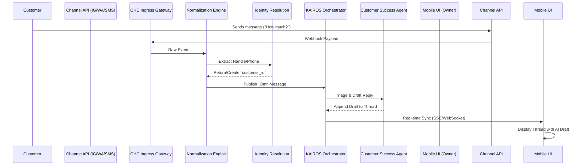
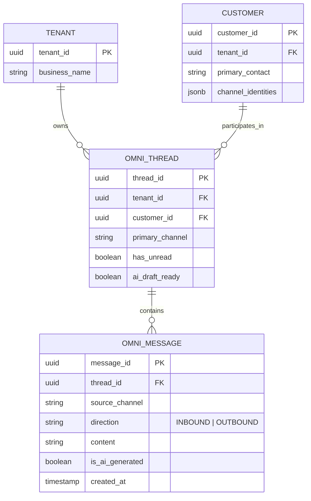

# [Architecture] Unified Omni-Channel Inbox System Design

## Problem Statement
Small business owners (our core personas like Maya, Carlos, Priya, Leo, and Fatima) experience severe communication fragmentation. They receive customer inquiries across a multitude of isolated platforms (Instagram DMs, Facebook Messenger, WhatsApp, Email, SMS, Web Chat). Managing these disjointed channels from a mobile device while simultaneously running a physical business results in dropped leads, delayed responses, and lost revenue. A 10-minute setup platform must eliminate this friction by centralizing all inbound and outbound communications into a single, cohesive, mobile-optimized experience, seamlessly augmented by an AI "Teammate" for triage and drafting.

## Research Report
*   **The Baseline Need**: Customers expect businesses to meet them where they are. SMBs cannot afford to miss a WhatsApp message because they were checking Instagram.
*   **Competitor Analysis**:
    *   **Shopify Inbox**: Primarily focused on web chat and basic email. Social channel integration often requires clunky third-party apps with distinct UIs.
    *   **Wix**: Basic consolidated inbox but lacks deep, autonomous AI integration that actively drafts persona-aware responses based on real-time business context.
    *   **GoDaddy**: Disjointed messaging tools that don't effectively normalize data across different social graph APIs.
*   **OHC Differentiation**: OHC's Unified Inbox is not just an aggregator; it is the central nervous system for the "Customer Success Agent." Messages are not just displayed; they are normalized, identity-resolved against the CRM, and pre-processed by AI to provide 1-tap reply drafts before the owner even opens the app.

## Design Doc

### 1. High-Level Architecture & Flow
The Omni-Channel Inbox operates through a pipeline of Ingestion, Normalization, Triage, and Routing.

### 2. Message Ingestion & Normalization
*   **Ingress Gateway**: Dedicated webhook endpoints for Meta (Instagram/FB), Twilio (SMS/WhatsApp), and SendGrid (Email inbound parsing).
*   **Normalization Engine**: Converts disparate JSON structures into a unified internal protocol buffer structure (`OmniMessage`).
    *   *Fields mapped*: `external_id`, `source_channel`, `timestamp`, `content_type` (text, image, audio), `raw_content`, `normalized_content`.
*   **Identity Resolution**: The engine checks the incoming identifier (e.g., `ig_handle: @maya_bakes`) against the tenant's CRM. If a match exists, the message is appended to the existing customer timeline. If not, a new anonymous lead profile is created.

### 3. AI Triage & Persona-Aware Drafting
*   **Customer Success Agent Integration**: When an `OmniMessage` enters the KAIROS event bus, the CS Agent activates.
*   **Context Retrieval**: The agent retrieves the business's system prompt (e.g., "You are Maya's assistant. Tone is cheerful and sweet.") and current context (inventory levels, operating hours).
*   **Draft Generation**: The AI generates a highly contextual reply draft. It does *not* auto-send unless the user has explicitly enabled "Full Autonomy" for specific intent categories (e.g., FAQ answers).
*   **State Management**: The thread is marked with `ai_draft_ready = true`.

### 4. The Human-in-the-Loop (HITL) Approval Flow
*   **Mobile Push Notification**: "New IG DM from Sarah. [AI Draft Ready: Tap to review]"
*   **Thread View**: The owner opens the thread. The AI's suggested reply is pre-filled in the text input box or displayed as a prominent chip above the keyboard.
*   **1-Tap Action**: The owner can tap "Send" to dispatch the AI draft instantly, tap into the box to edit, or delete the draft and write their own.
*   **Egress**: Sending the message triggers the Egress Gateway, which formats the payload for the specific destination API (e.g., Meta Graph API) and handles delivery receipts.

### 5. Mobile UX Flow (375px First Baseline)
*   **Global Inbox View**:
    *   A clean list view leveraging macOS-style translucent glass.
    *   Each row shows the customer avatar, preview text, a small source icon (WhatsApp, IG, Email), and a time indicator.
    *   Threads with AI drafts have a subtle "✨" sparkle indicator.
*   **Conversation View**:
    *   Standard chat bubble layout.
    *   **Context Pull-Down**: A thin handle at the top of the chat view. Pulling down reveals the CRM context: "Lifetime Spend: $150", "Last Order: Vegan Chocolate Cake (2 days ago)".
    *   Bottom input bar: Native mobile keyboard integration. The AI draft appears as a stylized bubble anchored to the input field, with a prominent "Approve ->" button.

### 6. Zero Trust & Multi-Tenant Data Model

*   **Invariants**: All database interactions must include the `tenant_id` to enforce Row-Level Security (RLS). External channel webhooks must be verified using HMAC signatures before processing.

## Implementation Prompt
**To the Implementer Swarm:**
Implement the Unified Omni-Channel Inbox core services.
-   **Backend**:
    1. Define the `OmniMessage` and `OmniThread` data models ensuring strict `tenant_id` isolation.
    2. Build the normalization pipeline that ingests standard text payloads and converts them into the unified format.
    3. Integrate the Customer Success Agent to listen for `NewMessage` events on the KAIROS bus, generate a contextual reply draft, and update the thread state.
-   **Frontend (Mobile 375px)**:
    1. Implement the Unified Inbox list view, ensuring clear indicators for different channels (IG, WhatsApp, etc.) and AI draft availability.
    2. Implement the Thread Detail view featuring the "Context Pull-Down" CRM integration and the 1-Tap AI Draft approval UI in the bottom input bar.
-   **Verification**: Ensure all operations update optimistically on the client and gracefully handle network disconnections. No external APIs should be mocked in E2E tests except via the designated testing harness.

## Priority
P1

## Estimated Scope
Large
