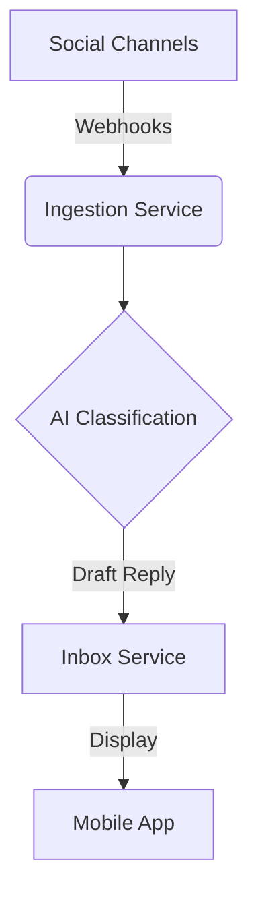

**Title**: Unified Social Inbox with Autonomous AI Auto-Responder
**Problem Statement**: Business owners lose leads because they can't manage messages across Instagram, WhatsApp, and email simultaneously. They spend hours answering repetitive questions.
**Research Report**: Fragmented communication is a top 3 pain point. Users heavily rely on Instagram DMs but struggle to convert them to sales systematically.
**Design Doc**:
*   Mobile UX flow (375px first): Single "Inbox" tab. Messages from all channels appear in one thread list. AI-generated draft responses are visible below the input field for 1-tap sending. A toggle enables "Auto-Pilot" for common questions.
*   Architecture: Webhook ingestion for social channels -> AI processing for intent classification -> Inbox service.

**Implementation Prompt**: Create a unified inbox interface that aggregates messages. Implement an AI layer that automatically drafts responses to incoming messages based on the business's FAQ and inventory status, allowing the user to send the reply with one tap.
**Priority**: P1
**Estimated Scope**: Large

### Additional Context: The Fragmented Communication Crisis
During our deep dive into the daily operations of users like Carlos (handyman) and Fatima (food cart), we observed a critical operational bottleneck: the "Fragmented Communication Crisis."

Small business owners do not have dedicated customer support teams. They are acting as CEO, manufacturer, and support agent simultaneously. A typical day involves juggling:
1.  **Instagram DMs**: Where discovery happens (e.g., "Do you make custom cakes?").
2.  **WhatsApp Messages**: Where relationship building and ordering happens (e.g., "I'm outside, where is the cart?").
3.  **Emails**: Where formal inquiries or vendor communications arrive.
4.  **SMS/iMessage**: Personal numbers mixed with business queries.

This fragmentation leads to:
*   **Missed Leads**: A DM gets buried, and a potential sale is lost.
*   **Burnout**: The constant context switching between 4-5 apps.
*   **Repetitive Effort**: Typing "Yes, we are open until 6 PM" 20 times a day across different platforms.

### AI Auto-Responder: Beyond Basic Chatbots
Legacy platforms (like Shopify's chatbot integrations) rely on rigid, rule-based decision trees ("Press 1 for hours, 2 for shipping"). These feel robotic and frustrate users.

The proposed OHC Autonomous AI Auto-Responder must be context-aware. It should:
1.  **Understand Intent**: Read an incoming WhatsApp message ("Do you have the red dress in size M?") and classify the intent as 'Inventory Check'.
2.  **Access Real-Time Data**: Query the OHC Catalog Service to confirm inventory status.
3.  **Draft Human-Like Replies**: Generate a drafted response ("Hi! Yes, we have 2 left in size M. Would you like me to hold one for you?").
4.  **1-Tap Approval**: Present the draft to the business owner in the unified inbox, requiring only a single tap to send.

This approach maintains the authentic voice of the small business while removing the manual typing effort.
